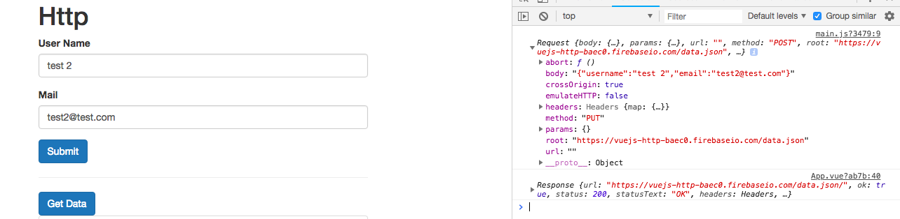
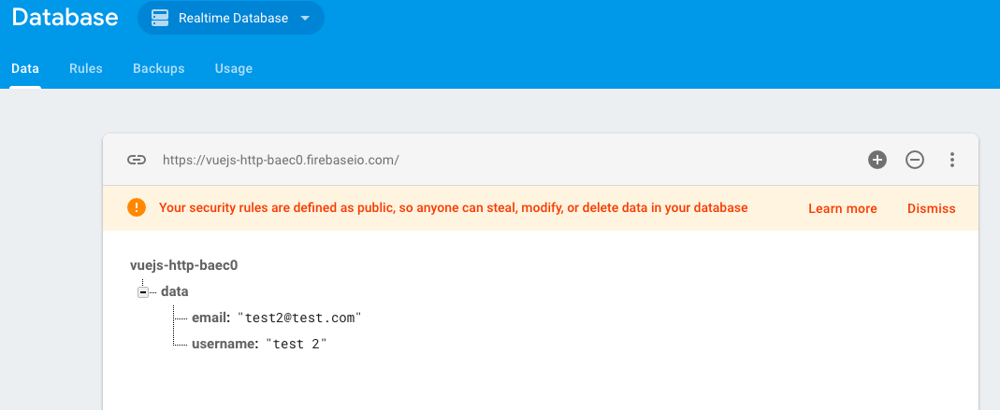

# Intercepting Requests

Sometime we wanna step in a `request` or in a `response` and intersept it. Vue-resourse allows us to setup such `interceptors` which are executed upon each `request` or each `responce`. The place to create such intercepter is there where we configure our vue-instance. There on the `http object` again we can access `interceptors`, which is an `array of functions` we wanna execute on each `request`. Here we can `push()` a new `interseptor` on this `array` and then the `function` has the following structure: it gets a `request` as a `first argument`, and a `second argument` let's call it "next", cos this is a `function` we then can execute to allow the `request` to continue on, because most of the time we don't want let our `request` end in this `function`, but in order to allow it to travel on we need some `callback function` to get execute once we are done doing things with the `request`. And in this `next()` function we may do whatever we like, for example we can print the `request` to the console, or modify it, we could change the `request`, we could change `request method` to "PUT" for example. And thereafter we have to execute `next()`

**main.js**
```js
import Vue from 'vue'
import VueResource from 'vue-resource'; 
import App from './App.vue'

Vue.use(VueResource); 

Vue.http.options.root = 'https://vuejs-http-baec0.firebaseio.com/data.json'      

Vue.http.interceptors.push( (request, next) => {
    console.log(request);
    if(request.method == 'POST'){
     request.method = 'PUT'
    }
    next();
});

new Vue({
  el: '#app',
  render: h => h(App)
})
```
So, now if we create a `new user`, `submit` the `data` and check the `console`, we'll see the `request` with the type `"PUT"`.



If we look at the `firebase console` we'll see that our `data` changed, it no longer has the `cryptic id`, instead we immediately see the `email` and `user name`. So, this is the difference between `put` and `post` on `firebase`. `post` - creates new resourses and appends it to the existing ones; `put` - always overwrites the `old data`. 

