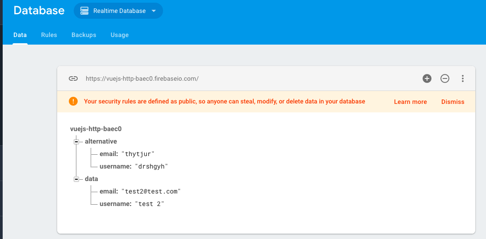

# Creating Custom Resources

It becomes more powerful if we create our own actions. So, in our `created()` lifecycle hook we'll create a constant `customActions`. Here in `customActions` we'll create an `action` with the name "saveAlt" - and this will be an `object` where we configure this `action`. Inside the `object` we'll setup the `method`, this shall be `post` in our case, and then we'll also setup the `URL`, and we wanna have the URL of `alternative.json`, instead of `data.json`. 

**App.vue**
```html
<template>
    <div class="container">
        <div class="row">
            <div class="col-xs-12 col-sm-8 col-sm-offset-2 col-md-6 col-md-offset-3">
                <h1>Http</h1>
                <div class="form-group">          
                <label>User Name</label> 
                <input class="form-control" type="text" v-model="user.username"> 
                </div>
                <div class="form-group">          
                <label>Mail</label> 
                <input class="form-control" type="text" v-model="user.email"> 
                </div>
                <button class="btn btn-primary" @click="submit">Submit</button>   
                <hr>
                <button class="btn btn-primary" @click="fetchData">Get Data</button>  
                <ul class="list-group">
                <li class="list-group-item" v-for="(u, index) in users" :key="index">{{u.username}} - {{u.email}}</li>
                </ul>
            </div>
        </div>
    </div>
</template>

<script>
    export default {
        data: function(){
            return{
                user:{
                    username: '',
                    email: ''
                },
                users: [],
                resource: {}         
            };
        },
        methods:{              
            submit(){
            //     this.$http.post('data.json', this.user) 
            //     .then(response => {       
            //      console.log(response)
            //     }, error =>{
            //      console.log(error)
            //     });
            this. resource.save(this.user);             
            },
            fetchData(){       
             this.$http.get('data.json')   
             .then(response =>{         
              return response.json(); 
             })
             .then(data =>{
              const resultArray = [];
              for(let key in data){
              resultArray.push(data[key])
              }
              this.users = resultArray;
             });
            }
        },
        created(){    
                const customActions = {                             //create actions here 
                 saveAlt: { method: 'POST', url: 'alternative.json' }
                };            
                this.resource = this.$resource('data.json')
            }
    }
</script>

<style>
</style>
```

With that setup we can  go to our `submit()` method, and use `this.resource`. Then in order to use our `custom method` we have to pass a new `arguments` to our `recource` setup in the `created()` hook. The second `argument` will be empty, this will allow us to pass the `variable data` into the URL, and the third `argument` is our `customActions`. With this we can access our `resource`in `submit` method, and call `saveAlt()`, inside we pass `this.user`. 

**App.vue**
```html
<template>
    <div class="container">
        <div class="row">
            <div class="col-xs-12 col-sm-8 col-sm-offset-2 col-md-6 col-md-offset-3">
                <h1>Http</h1>
                <div class="form-group">          
                <label>User Name</label> 
                <input class="form-control" type="text" v-model="user.username"> 
                </div>
                <div class="form-group">          
                <label>Mail</label> 
                <input class="form-control" type="text" v-model="user.email"> 
                </div>
                <button class="btn btn-primary" @click="submit">Submit</button>   
                <hr>
                <button class="btn btn-primary" @click="fetchData">Get Data</button>  
                <ul class="list-group">
                <li class="list-group-item" v-for="(u, index) in users" :key="index">{{u.username}} - {{u.email}}</li>
                </ul>
            </div>
        </div>
    </div>
</template>

<script>
    export default {
        data: function(){
            return{
                user:{
                    username: '',
                    email: ''
                },
                users: [],
                resource: {}         
            };
        },
        methods:{              
            submit(){
            //     this.$http.post('data.json', this.user) 
            //     .then(response => {       
            //      console.log(response)
            //     }, error =>{
            //      console.log(error)
            //     });
            //this. resource.save(this.user);    
             this.resource.saveAlt(this.user);            //access resource
            },
            fetchData(){       
             this.$http.get('data.json')   
             .then(response =>{         
              return response.json(); 
             })
             .then(data =>{
              const resultArray = [];
              for(let key in data){
              resultArray.push(data[key])
              }
              this.users = resultArray;
             });
            }
        },
        created(){    
                const customActions = {                           
                 saveAlt: {method: 'POST', url: 'alternative.json' }
                };      
                this.resource = this.$resource('data.json', {}, customActions)            //add new arguments 
            }
    }
</script>

<style>
</style>
```
If we enter some new `data` and hit `submit` button we should see that the `new node` gets created on the `firebase`. 



This is the way how we can create multiple `resources` in the `created()` hook and use them in different places, like we used in `submit()` method, having the highes degree of flexibility without hardcode eveyrhing iver and over again. 