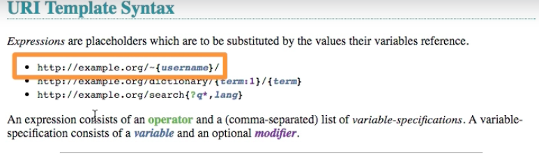
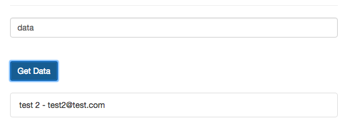
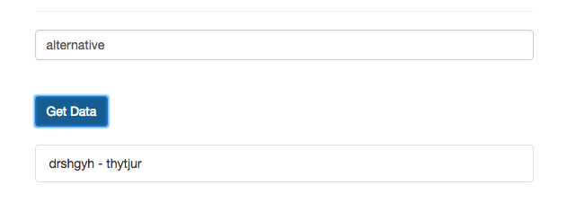

# Understanding Template URLs

Now it's time to learn how we can make our `URL` more flexible. For example, in our `created()` hook we have our `data.json` hardcoded `this.resource = this.$resource('data.json', {}, customActions)`. What if wanna replace tjis dynamically? We could simply wrap it in curly braces and name it `node` for examle - `this.resource = this.$resource('{node}.json', {}, customActions)`, now this is a `variable` we can replace. 
For now we leave everything as it is here, our URL `saveAlt: {method: 'POST', url: 'alternative.json' }` will overwrite it for the `saving` action. But for getting, maybe we wanna get form the `alternative node` or the `data node` in the `firebase`, so it would be great if we could exchange this. Therefore we first add a new `input field` above our `get data` button, and then we need to bind our `input` with `v-model` to our `node property`, which we surely need to create in the `data object`, and which should be `data` by default. 

**App.vue**
```html
<template>
    <div class="container">
        <div class="row">
            <div class="col-xs-12 col-sm-8 col-sm-offset-2 col-md-6 col-md-offset-3">
                <h1>Http</h1>
                <div class="form-group">          
                <label>User Name</label> 
                <input class="form-control" type="text" v-model="user.username"> 
                </div>
                <div class="form-group">          
                <label>Mail</label> 
                <input class="form-control" type="text" v-model="user.email"> 
                </div>
                <button class="btn btn-primary" @click="submit">Submit</button>   
                <hr>
                <input class="form-control" type="text" v-model="node">   <!--bind input to node-->
                <br><br>
                <button class="btn btn-primary" @click="fetchData">Get Data</button>  
                <ul class="list-group">
                <li class="list-group-item" v-for="(u, index) in users" :key="index">{{u.username}} - {{u.email}}</li>
                </ul>
            </div>
        </div>
    </div>
</template>

<script>
    export default {
        data: function(){
            return{
                user:{
                    username: '',
                    email: ''
                },
                users: [],
                resource: {},
                node: 'data'      //create node property
            };
        },
        methods:{              
            submit(){
            //     this.$http.post('data.json', this.user) 
            //     .then(response => {       
            //      console.log(response)
            //     }, error =>{
            //      console.log(error)
            //     });
            //this. resource.save(this.user);    
             this.resource.saveAlt(this.user);           
            },
            fetchData(){       
             this.$http.get('data.json')   
             .then(response =>{         
              return response.json(); 
             })
             .then(data =>{
              const resultArray = [];
              for(let key in data){
              resultArray.push(data[key])
              }
              this.users = resultArray;
             });
            }
        },
        created(){    
                const customActions = {                           
                 saveAlt: {method: 'POST', url: 'alternative.json' }
                };      
                this.resource = this.$resource('{node}.json', {}, customActions)      //use a variable which then can be replaced
            }
    }
</script>

<style>
</style>
```

Well, we want a `user` to enter any `node` here, and of cource if it exists, the `http request` will be sent to this `end point` fetch the `data` from there.  To achieve this we need to change the way we fetch our `data` and make this more flexible. We'll use the `resource` for this again. In our `customActions` we'll create the `object` let's name this `getData`, this should have a `method` property with the `value` of `GET`. 

And now `vue-resource` genarally supports the setup of our `URLs` as `templates`. To learn more about this, go to official docs, and read more about [`URI Templates`](https://medialize.github.io/URI.js/uri-template.html), it's explained how we can setup flexible pieces in the `URLs` which may be changed, and all of the features described here will work with `vue-resource`. 

We'll use a simple usecase, a `variable` in the `URL`, which we can exchange for some real `data`. 



So, we need to replace `node` variable dynamically. For this first let's replace our `http request` in our `fetchData()` method, and instead we wanna use `this.resource` and call `getData()`. Now `getData()` doesn't have its own `URL`, it uses `default URL`, (and we could use this with `this.$http.get` request as well), but here in this `resource URL`, we setup for all resources, we have a flexible piece in our `URL` - `node`. We can overwrite this, by passing in the `getData()` an `object` as the first `argument`, where we then specify each `variable` we have in our `URL` - `node` for example as a `key` and then as a `value`, the `value` that should really be entered in the `URL` once it is sent - this is in our case `this.node`, referring to the `node` property in our `data object`, where we store the `user input`. Well, what this will do - it will take our `URL` in `resource` - `this.resource = this.$resource('{node}.json', {}, customActions)`, and replace the `node` key in the URL with the `value` we setup in `fetchData() / getData()`.   

**App.vue**
```html
<template>
    <div class="container">
        <div class="row">
            <div class="col-xs-12 col-sm-8 col-sm-offset-2 col-md-6 col-md-offset-3">
                <h1>Http</h1>
                <div class="form-group">          
                <label>User Name</label> 
                <input class="form-control" type="text" v-model="user.username"> 
                </div>
                <div class="form-group">          
                <label>Mail</label> 
                <input class="form-control" type="text" v-model="user.email"> 
                </div>
                <button class="btn btn-primary" @click="submit">Submit</button>   
                <hr>
                <input class="form-control" type="text" v-model="node">   
                <br><br>
                <button class="btn btn-primary" @click="fetchData">Get Data</button>  
                <ul class="list-group">
                <li class="list-group-item" v-for="(u, index) in users" :key="index">{{u.username}} - {{u.email}}</li>
                </ul>
            </div>
        </div>
    </div>
</template>

<script>
    export default {
        data: function(){
            return{
                user:{
                    username: '',
                    email: ''
                },
                users: [],
                resource: {},
                node: 'data'      
            };
        },
        methods:{              
            submit(){
            //     this.$http.post('data.json', this.user) 
            //     .then(response => {       
            //      console.log(response)
            //     }, error =>{
            //      console.log(error)
            //     });
            //this. resource.save(this.user);    
             this.resource.saveAlt(this.user);           
            },
            fetchData(){       
            //  this.$http.get('data.json')   
            //  .then(response =>{         
            //   return response.json(); 
            //  })
            //  .then(data =>{
            //   const resultArray = [];
            //   for(let key in data){
            //   resultArray.push(data[key])
            //   }
            //   this.users = resultArray;
            //  });
            this.resource.getData({node: this.node });     //change dynamically 
            }
        },
        created(){    
                const customActions = {                           
                 saveAlt: {method: 'POST', url: 'alternative.json' },
                 getData: {method: 'GET'}                     //create getData object here 
                };      
                this.resource = this.$resource('{node}.json', {}, customActions)      
            }
    }
</script>

<style>
</style>
```

In `fetchData` we surely will use `then()` and for now we just copy the code we had before in our `fetchData`. With this in place this should now work well, it's the same functionality as before, but now with our own `resource`, which has a great advantage of being flexible.  

**App.vue**
```html
<template>
    <div class="container">
        <div class="row">
            <div class="col-xs-12 col-sm-8 col-sm-offset-2 col-md-6 col-md-offset-3">
                <h1>Http</h1>
                <div class="form-group">          
                <label>User Name</label> 
                <input class="form-control" type="text" v-model="user.username"> 
                </div>
                <div class="form-group">          
                <label>Mail</label> 
                <input class="form-control" type="text" v-model="user.email"> 
                </div>
                <button class="btn btn-primary" @click="submit">Submit</button>   
                <hr>
                <input class="form-control" type="text" v-model="node">   
                <br><br>
                <button class="btn btn-primary" @click="fetchData">Get Data</button>  
                <ul class="list-group">
                <li class="list-group-item" v-for="(u, index) in users" :key="index">{{u.username}} - {{u.email}}</li>
                </ul>
            </div>
        </div>
    </div>
</template>

<script>
    export default {
        data: function(){
            return{
                user:{
                    username: '',
                    email: ''
                },
                users: [],
                resource: {},
                node: 'data'      
            };
        },
        methods:{              
            submit(){
            //     this.$http.post('data.json', this.user) 
            //     .then(response => {       
            //      console.log(response)
            //     }, error =>{
            //      console.log(error)
            //     });
            //this. resource.save(this.user);    
             this.resource.saveAlt(this.user); 
             .then();          
            },
            fetchData(){       
            //  this.$http.get('data.json')   
            //  .then(response =>{         
            //   return response.json(); 
            //  })
            //  .then(data =>{
            //   const resultArray = [];
            //   for(let key in data){
            //   resultArray.push(data[key])
            //   }
            //   this.users = resultArray;
            //  });
            this.resource.getData({node: this.node })
            .then(response =>{         
              return response.json(); 
             })
             .then(data =>{
              const resultArray = [];
              for(let key in data){
              resultArray.push(data[key])
              }
              this.users = resultArray;
             });   
            }
        },
        created(){    
                const customActions = {                           
                 saveAlt: {method: 'POST', url: 'alternative.json' },
                 getData: {method: 'GET'}                     
                };      
                this.resource = this.$resource('{node}.json', {}, customActions)      
            }
    }
</script>

<style>
</style>
```

Now we can get the `data` from the `firebase database`, as well as from `alternative node`. 




