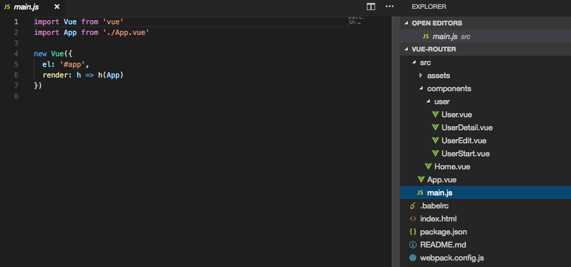

# Setting up the VueJS Router (vue-router)

How to create a `single-page application` with VueJS? The `router` is the important thing in the one-page application, cos `single-page` application means: technically we have only one page, which is the `index.html` file we load, which hosts our VueJS application, and then we use this `single page` to simulate `navigation` for the user, so the `URL` changes, but we catch all these changes and only re-render this `single page` so that it looks like as if we visit many different pages, but still behind the scenes it is always the same page. 

Well, from the start we have a couple of `components`, cos concerning the `routing` it is all about switching these `components`, they are kind of represent our pages if we look at them this way. 

For setting our application we need the `vue-router`, it's not included by VueJS by default, and we need install this, we can do this via `npm` - `npm install --save vue-router`. 