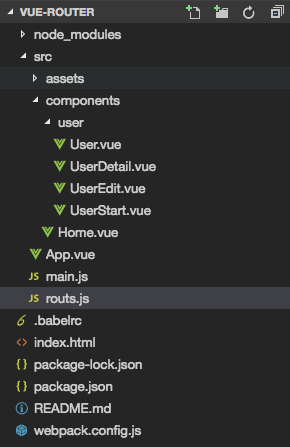
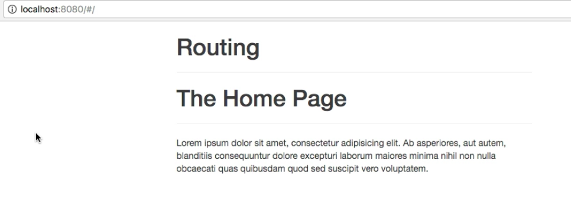

# Setting up and Loading Routes

Let's now add a `router` to our application and then setup some `routs`. First we need to add it in our `main.js` file: we import it, and then we'll use `Vue.use()` to add a new plugin to Vue, and there we'll add our `VueRouter`. That is all, with that `routing` is added to the application. 

**main.js**
```js
import Vue from 'vue'
import VueRouter from 'vue-router'  //import 
import App from './App.vue'

Vue.use(VueRouter);  //add to plugin

new Vue({
  el: '#app',
  render: h => h(App)
})
```

The next step we should setup some `routes` so that we can see them. We could set them up in a separate file and then import this file to `main.js` file. Important - it is definatelly better to register it in the root `vue-instance` in `main.js` file, created with the new `keyword`. Especially when creating a `single-page application`, we'll only have the one `root instance`, and thereafter it's only about switching the `components`. Let's set it in the separate file and then register in `main.js`. Let's setup `routes.js` file. 



In this `routes.js` file, we'll export a `constant` named "routes", which should hold our `routes`. Holding `routes` means it has an `array` and in this `array` we have a couple of `objects`, each `object` will represent a `rout` as soon as we register it. Each `route` need a `path`, this is what will be appended to the `URL` after our domain. If a `path` for example `/user` (slash and the name - whatever will be displayed in the url) then it will trigger whenever we visit `example.com/user`. Then in the `object` we need to setup the `component` we wanna load when we visit this `path`. Since we visit `user` in our example we need to display `User.vue` component. For that we first need import it to our `routes.js` file. And then we simply add it in the `object` in the `routes array`. 

This now will tell VueJS: whenever we visit our `domain/user` load this `component`. The same way let's add other `components` also. For `Home` component let's have the `path` empty, so it will be our `root route` what gets loaded first. 

**routes.js**
```js
import User from './components/user/User.vue'; //import User component
import Home from './components/Home.vue';  

export const routes = [
{ path: ' ', component: Home },
{ path: '/user', component: User }    //add a user component 
];
```

Now, with these two `routs` setup lets register them in `main.js`. First we import our `routes.js` file, and since we name the `constant` with `routes` we should use `{}` syntax. Now after using our `vue-router` we can create a new `router` also stored in a `constant`, let's name it "new VueRouter" (using the package we imported). In this `new VueRouter` we have to pass an `object` where we setup our `routes` (we imported from routes.js). This will now pass our `routes` to the `VueRouter`. 

**main.js**
```js
import Vue from 'vue'
import VueRouter from 'vue-router'  
import App from './App.vue'
import {routes} from './routes.js' //import routes 

Vue.use(VueRouter);  

const router = new VueRouter({
routes        //routes: routes - we have here shortcut cos the name of the key and a value is the same 
});

new Vue({
  el: '#app',            
  render: h => h(App)
})
```

The final step  is to go to our `vue-instance` and add `router` ( router: router ) to it, and again we use the same shortcut where the `key` and the `value` are the same. 

**main.js**
```js
import Vue from 'vue'
import VueRouter from 'vue-router'  
import App from './App.vue'
import {routes} from './routes.js' 

Vue.use(VueRouter);  

const router = new VueRouter({
routes        
});

new Vue({
  el: '#app',     
  router,                  //add router to vue-instance       
  render: h => h(App)
})
```

With that our `routes` are registered, now we also need a place to render them. So, we ned a place in our `html code` where VueJS should actually load this `component`, cos thankfully it will not replace our whole page with this `component`, so we have to tell it where to load it then. In the `App.vue` file, which holds our main `template` we mark the place where the `component` of the current `route` should be loaded with `<router-view>`. 

**App.vue**

```html
<template>
    <div class="container">
        <div class="row">
            <div class="col-xs-12 col-sm-8 col-sm-offset-2 col-md-6 col-md-offset-3">
                <h1>Routing</h1>
                <hr>
                <router-view></router-view>  <!--render router here-->
            </div>
        </div>
    </div>
</template>

<script>
    export default {
    }
</script>

<style>
</style>
``` 

With that we'll automatically see the `Home` page, cos this is our `root route`. 



