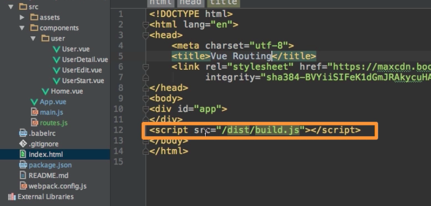

# Understanding Routing Modes (Hush vs History)

After adding `routers` we saw, that we have `#` in the URL, which was added automatically by the `vue-router`. It was added cos it is the default setup the `vue-router` uses, it's the style we see as usual in `single-page` applications. If we had normal URL without `#`, then each request once we hit "enter" on our keyboard, gets sent to the `server`, this is how the browser works. The problem with sending to the `server` is that we want to handle the `routing` in our `single-page` application, we don't want to get the `route` to the `server`, we want to handle it to our local page. Though if we visit our page for the first time, in this case we want to get it to the `server` because we need to get the `single` page. But if we for example visit `localhost:8080/user` without `#` we would like to get our `single page`, the `index.html` file and then takeover and have the rest of the URL (`/user`) with our `single page` instead of the `server`. The `#` alowws us to do the following: `localhost:8080/#/user` - the part in front of the `#` is sent to the `server` so to say, this will give us back our `index.html` file, and the part after the `#` is then handled over our running JS application and maybe handled by that application. 

Still it would be nicer if we have normal URLs without `#` and still be able to use our `single-page` application as we used to do. The thing we will have to do on our `server` - we need to return our `index.html` file in all cases, evn if `404 error` cases, cos in this `index.html` file our `VueJS application` gets launched.  



In order to tell VueJs `router` that we want to use this way of setting up our URLs and then our `server` is configured correctly is simply to go to our `router`, which we created in `main.js` and not only pass the `routes` but also the `mode property`, which may set to "history" - that is the name for the `no #` style - `history mode`. The default mode is `hash mode`.

**main.js**
```js
import Vue from 'vue'
import VueRouter from 'vue-router'  
import App from './App.vue'
import {routes} from './routes.js' 

Vue.use(VueRouter);  

const router = new VueRouter({
routes,
mode: 'history'                  //set the mode property
});

new Vue({
  el: '#app',     
  router,                     
  render: h => h(App)
})
```

Well, it navigates correctly, and that of course works because our `development server` we are using now here in the `webpack project` is automatically setup in a way to give us back `index.html` file in all circumstances, otherwise this would not work and we'll need to configure our `server` appropriately. To learn more about that visit the [official documentation](https://router.vuejs.org/), there we'll find [HTML History Mode](https://router.vuejs.org/guide/essentials/history-mode.html), which explains how we may setup owr own server.