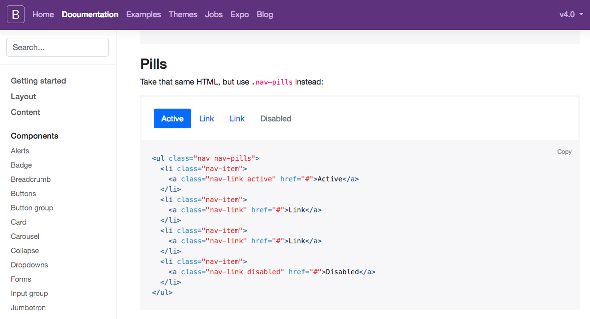
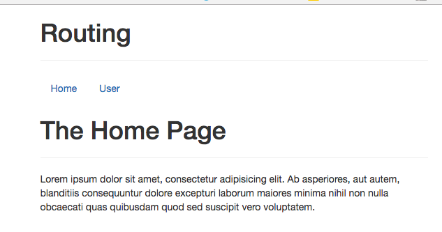
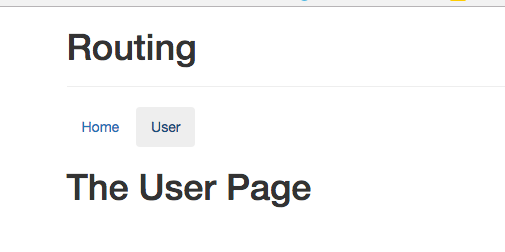
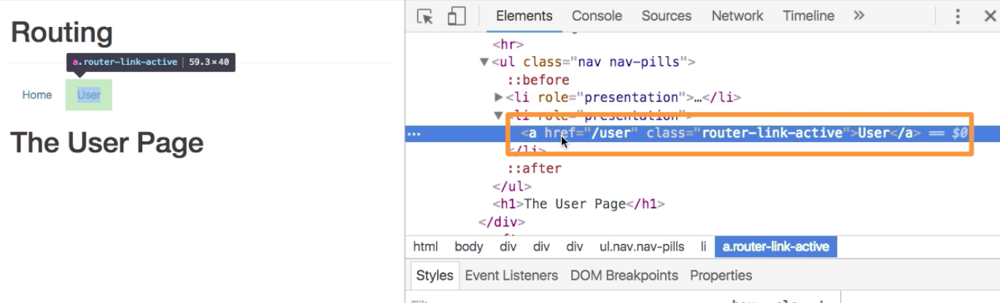

# Navigating with Router Links

In order to be able to navigate we need to include some `links` and for that to be included let's create a new `component` and name it `Header.vue`. Now we'll grab some links from [Bootstrap](https://getbootstrap.com/)/ [Components/Navs](https://getbootstrap.com/docs/4.0/components/navs/), and copy `Pills` from that to our `Header.vue` file. 



**Header.vue**

```html
<template>
<ul class="nav nav-pills">
  <li class="nav-item">
    <a class="nav-link" href="#">Home</a>
  </li>
  <li class="nav-item">
    <a class="nav-link" href="#">User</a>
  </li>
</ul>
</template>
```
So, now we got `links` with `anchor tags`, though we don't wanna use the `href=` attribute, cos that would always send the `request` to the `server` and even that would be handled correctly we don't wanna do it like this, because first of all it will limit the way how we can setup the `links` we visit, and it will also mean that we always send the request, but if we are already on the page and we click on this it would be better if the `request` doesn't get sent in the first place, cos we don't want to leave the `application`. 

For this VueJS gives us an alternative of using the `anchor tag` at all. So, we are going to remove the `anchor tag` and instead use a component the `vue-router` ships with. It is called `<router-link>` and it will render the `anchor tag` in the end, so we wrap the content in this `router`. 

**Header.vue**

```html
<template>
<ul class="nav nav-pills">
  <li class="nav-item"><router-link>Home</router-link></li>      <!--use router-link-->
  <li class="nav-item"><router-link>User</router-link></li>
</ul>
</template>
```

What we do setup in the `<router-link>` is the `to=` attribute (we can surely bind it dynamically with a colon `:`), and this `to=` is simplyy the path we want to navigate to. We'll use `to=/` for the `Home page` to append it to the end of our `domain` instead of the end of our current URL, and `to=/user` for the `User` page. 

**Header.vue**

```html
<template>
<ul class="nav nav-pills">
  <li class="nav-item"><router-link to="/">Home</router-link></li>      <!--use "to" attribute to show the path-->
  <li class="nav-item"><router-link to="/user">User</router-link></li>
</ul>
</template>
```
Now, let's quickly import it in our `App.vue` file, and register it as a local `component`, and add it to the `template`. 

**App.vue**

```html
<template>
    <div class="container">
        <div class="row">
            <div class="col-xs-12 col-sm-8 col-sm-offset-2 col-md-6 col-md-offset-3">
                <h1>Routing</h1>
                <hr>
                <app-header></app-header>          <!--add a component to the template-->
                <router-view></router-view>  
            </div>
        </div>
    </div>
</template>

<script>
    import Header from './components/Header.vue'      //import here 
    export default {
        components:{                  //register here 
            appHeader: Header
        }
    }
</script>

<style>
</style>
``` 

Now. we see our `links` and can navigate them .




If we inspect such `links`, we'll see the `anchor tag`, even though we used `<router-link>` in our code. We also see this `router-link-active` class attached, but only if it is active, and we can get advantage of it. 



The interesting thing is, if we click these `links` we actually don't reload the page, it doesn't do that because since we used `<router-link>` there is implicit `click listner` attached to it. It simply listens to the `click` and loads the correct `router`. 