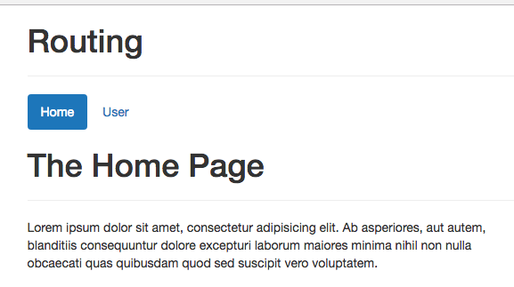
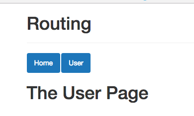
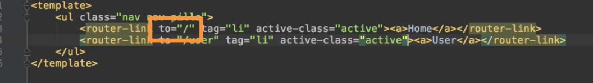
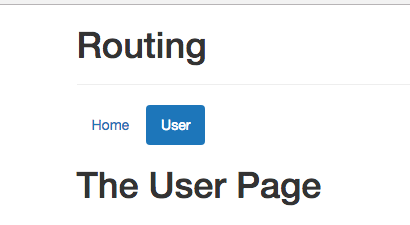

# Where am I? - Styling Active Links

It would also be nice if we could style the `link` if it is active. We can achive this by removing `list items` and use just `<router-link>` and then overwriting what this `router-link` shall be like. 

**Header.vue**

```html
<template>
<ul class="nav nav-pills">
  <router-link to="/">Home</router-link>   <!--remove list items-->
  <router-link to="/user">User</router-link>
</ul>
</template>
```

We can add the `tag=` property to the `router-link` and set it to `li` to create a `list item` instead of the `anchor tag`. And then we nest an `anchor tag` inside the `router-link`, with no `attributes`, just `anchor tag`. 

**Header.vue**

```html
<template>
<ul class="nav nav-pills">
  <router-link to="/" tag="li"><a>Home</a></router-link>   <!--create list item inside, add anchor tag-->
  <router-link to="/user" tag="li"><a>User</a></router-link>
</ul>
</template>
```
Now `router` will setup the `link` on the `list item`, now the real `link` is the `list item` we setum inside the `router-link`, we can also overwrite the `class` we want to use by setting the `active-class=` attribute here as well, and now we can set the `link` to `active`. This will make sure that now instead `router-link-active` it will attach `active` class to the active `link`. 

**Header.vue**

```html
<template>
<ul class="nav nav-pills">
  <router-link to="/" tag="li" active-class="active"><a>Home</a></router-link>   <!--set active-class attribute-->
  <router-link to="/user" tag="li" active-class="active"><a>User</a></router-link>
</ul>
</template>
```

  

Now, it works, though `Home` stays selected all times. This happens because the default behaviour for the `active class` is that it look at where this `link` leads to, so lust `/` and then it looks at our `URL`:



And by default it marks `link` as active whenever our `URL` starts with the `to=` path. Clearly all our `URLs` starts with the `/` slash after the `domain`, all our paths start with `/`, well that's a great behavior when we have `nested routes`, like a `user` and then `id` and we always want to keep selected a `user` in our `navbar`. It's not the desired behavior though in a case when we don't want to mark `root route` as active all the time. So,to our `root route` we can add another configuration, which is called `exact`, and by adding it like this we overwrite the default. 

**Header.vue**

```html
<template>
<ul class="nav nav-pills">
  <router-link to="/" tag="li" active-class="active" exact><a>Home</a></router-link>   <!--set exact-->
  <router-link to="/user" tag="li" active-class="active"><a>User</a></router-link>
</ul>
</template>
```




