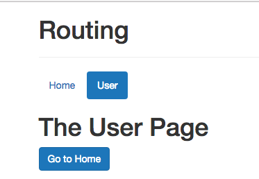

# Navigating from Code (Imperative Navigation)

Sometimes we wanna trigger our `navigation` from the JS code, because some operation finished and we wanna navigate away let's say. 
Let's simulate this in our `User.vue` component. Here we first setup the `method` to which we will be able to bind a `button` thereafter. Let's name this `method` - `navigateToHome` and all we wanna do is navigate to our `Home page`. And let's add a `button` to our template, and surely add to this `button` a `click listner` and execute our `navigateToHome()` method. 

**User.vue**
```html
<template>
    <div>
    <h1>The User Page</h1>
    <button class="btn btn-primary" @click="navigateToHome">Go to Home</button>     <!--add a button, add click listner-->
    </div>

</template>

<script>
export default{
    methods:{              //create method here 
    navigateToHome(){

    }
    }
}
</script>
```

Now, how do we navigate from within our code? In our `navigateToHome()` method we can access our `vue-instance`, and there we'll have the `$router` available. On this `router` we can now trigger a `navigation` by calling `push()` method, and push we use because we wanna push it on the stack on existing `routes`, so that our `back` and `forwards` buttons will work fine because we would have the `old route` saved as well. And `push()` method in simple cases simply takes the `path` we want to go to, we could also pass an `object`. 

**User.vue**
```html
<template>
    <div>
    <h1>The User Page</h1>
    <button class="btn btn-primary" @click="navigateToHome">Go to Home</button>     
    </div>

</template>

<script>
export default{
    methods:{              
    navigateToHome(){
    this.$router.push('/')           //acces the router and call push 
    }
    }
}
</script>
```

Now if we click on the `go to Home` buton on the `User` page, we'll get to the `Home` page. 




