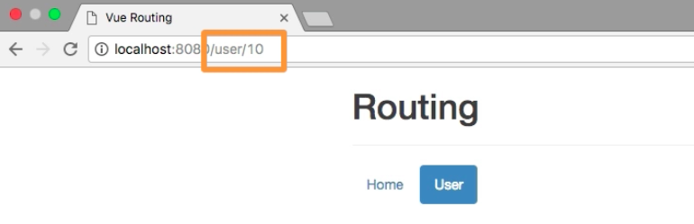

# Setting Up Route Parameters

So far all our `routes` were static, we didn't have any dynamic pieces in these `routes`. It would make sense if we pass and `id` in our `user URL` path. And then we use (load) this `id` on the `component` which gets loaded. To pass any dynamic segment in our `path` we simply add at with one more `/` slash and the `:` colon after it,a dn then the name of our choice. This will now tell the `router` that the `User` component should be loaded whenever we use `user/something` - where `something` will be interpreted as the `id`. 

**routes.js**
```js
import User from './components/user/User.vue';
import Home from './components/Home.vue';

export const routes = [
{ path: '', component: Home },
{ path: '/user/:id', component: User }    //pass dynamic segment to the router 
];
```
Now we simulate it by hardcoding `10` for example for the `user` path. 

**Header.vue**

```html
<template>
<ul class="nav nav-pills">
  <router-link to="/" tag="li" active-class="active" exact><a>Home</a></router-link>   
  <router-link to="/user/10" tag="li" active-class="active"><a>User</a></router-link> <!--pass dynamic segment to the link-->
</ul>
</template>
```

Now if we click the `user`, we'll see `10` in our `URL`, and we still load the `User` page, cos it mathces this path. 



Well, since it it dynamic it would also make sence if we retrieve it dynamically, look at => 008_Fetching and Using Route Paramaters