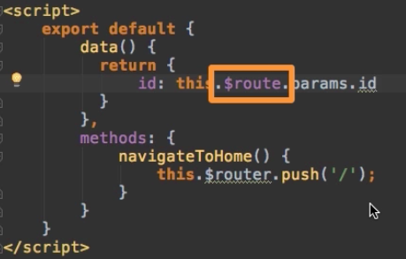
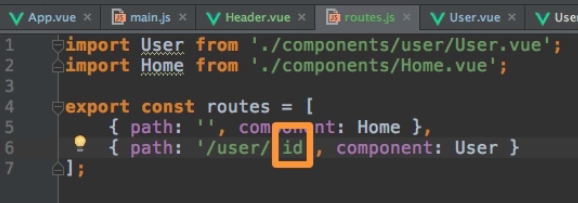
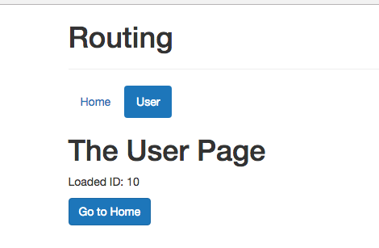
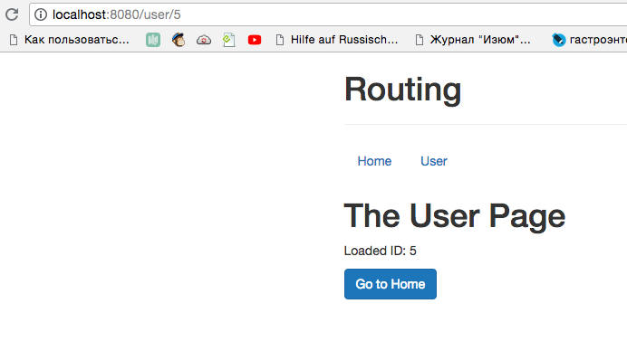

# Fetching and Using Route Paramaters

To retrieve a `dyamic parameter` we should go to our `User` component; let's say we wanna output "Loaded ID" - so we add a paragraph; and in the `data object` we need to create a `property` (id) and this shall be `this.$route.params.id` - this is how we access our `data`. 

**User.vue**
```html
<template>
    <div>
    <h1>The User Page</h1>
    <p>Loaded ID: </p>   
    <button class="btn btn-primary" @click="navigateToHome">Go to Home</button>  
    </div>

</template>

<script>
export default{
    data(){
        return{
         id: this.$route.params.id  //access data 
        }
    },
    methods:{              
    navigateToHome(){
    this.$router.push('/')           
    }
    }
}
</script>
```

So, we access `route object` (`$route` provided by VueJS).



it is the active `route`, the `route` which was loaded. And this `route` happens to have a `params object` (to learn more properties available on the route object - visit official docs). `params` is an `object` which holds `key value pairs` of the `parameters` we are passing in the `route`. 

Now we have only one `key` setup. All this allows us to output it using string interpolation. 



**User.vue**
```html
<template>
    <div>
    <h1>The User Page</h1>
    <p>Loaded ID: {{id}} </p>   <!--ouput here-->
    <button class="btn btn-primary" @click="navigateToHome">Go to Home</button>  
    </div>

</template>

<script>
export default{
    data(){
        return{
         id: this.$route.params.id  
        }
    },
    methods:{              
    navigateToHome(){
    this.$router.push('/')           
    }
    }
}
</script>
```


If we change it manually in the link on the page, it will be changed. 



This is how we can access the `parameter` we are passing, how we can pass it dynamically in a first place and then output it in the `template`.