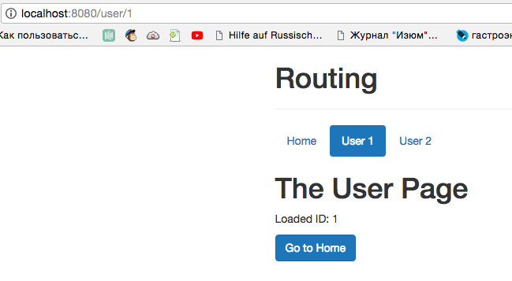

# Reacting to Changes in Route Parameters

We looked at how to send and use `parameters`, but there is a problem. In order to be able to see the problem, which might occur, lets'a adjust our code a bit. In our `Header` component, let's have `User 1` and `User 2`, with two different `IDs` passed. 

**Header.vue**

```html
<template>
<ul class="nav nav-pills">
  <router-link to="/" tag="li" active-class="active" exact><a>Home</a></router-link>   
  <router-link to="/user/1" tag="li" active-class="active"><a>User 1</a></router-link>  <!--id 1-->
  <router-link to="/user/2" tag="li" active-class="active"><a>User 2</a></router-link>  <!--id 2-->
</ul>
</template>
```
Now, if we load `User 1` - we see `User 1` id , but if we load `User 2` the `id` will be still `1`.



The reason is that, the `User` component isn't recreated, if we are already on that `component` and then only the `path` changes, but we would load the same `component` again, VueJS would not recreate this `component`, it will save these resources and keep the existing `component`. That of cource is the issue if some pieces of that `component` have to change, like in our example with the `id`. 

Therefore we have to watch for these `route.params` to change, and if they change we need to update the pieces on our page which need to be updated, depending on our `parameters`. For this we can setup a `watcher` and watch our `$route` (Keep in mind that `route` does change, the `id` doesn't). `$route()` is actually a `function` and here we can execute any code we want. We'll get two `arguments` passed to this `function`: `from` - which `route` are we coming from, and `to` - to which `route` are we going. Well, of course this is the same `route`, but there is one important thing - we have our `new params` stored in our `"to" route`. 

**User.vue**

``html
<template>
    <div>
        <h1>The User Page</h1>
         <p>Loaded ID: {{ id }}</p>  
         <button class="btn btn-primary" @click="navigateToHome">Go to Home</button>
    </div>

</template>

<script>
export default{
    data(){
        return{
         id: this.$route.params.id 
        }
    },
    watch:{           //setup a watcher 
    '$route' (to, from) {
        this.id = to.params.id
    }
    },
    methods:{
        navigateToHome(){
        this.$router.push('/')
        }
        
    }
}
</script>
``` 