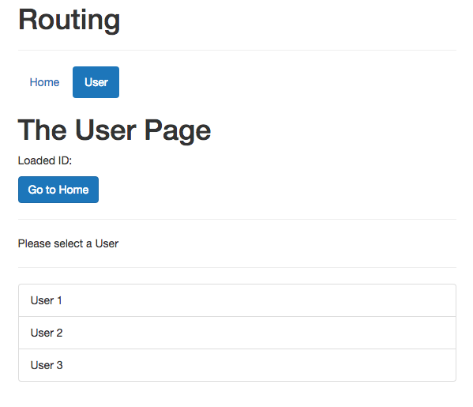

# Setting Up Child Routes (Nested Routes)

Until now we loaded our `users` in a `header`, by having two different links where we hardcoded the `user id`, that is not very realistic. It would be more realistic to have like a list of users we can choose from and click them. Well, we also have our `UserStart.vue` component we haven't used yet, and here in this `component` we have this `users list`. Let's use this. 

**UserStart.vue**

```html
<template>
    <div>
        <p>Please select a User</p>
        <hr>
        <ul class="list-group">
            <li class="list-group-item" style="cursor: pointer">User 1</li>
            <li class="list-group-item" style="cursor: pointer">User 2</li>
            <li class="list-group-item" style="cursor: pointer">User 3</li>
        </ul>
    </div>
</template>
```

In our `Header.vue` we'll remove the link with the `second user`, and in the link with the `first user` we leave just `user` in the link. 

**Header.vue**

```html
<template>
<ul class="nav nav-pills">
  <router-link to="/" tag="li" active-class="active" exact><a>Home</a></router-link>
  <router-link to="/user" tag="li" active-class="active"><a>User</a></router-link> <!--one user link here-->
</ul>
</template>
```

And for that we also need to adjust `routes.js` component, to just use a `user` as a path again.

**routes.js**

```js
import User from './components/user/User.vue';
import Home from './components/Home.vue';

export const routes = [
{ path: '', component: Home },
{ path: '/user', component: User }    //remove id from here, leave just user 
];
```

In the `User.vue` file we'll delete all the code in the script exept navigating to home.

**User.vue**

```html
<template>
    <div>
        <h1>The User Page</h1>
         <p>Loaded ID: {{ id }}</p>  
         <button class="btn btn-primary" @click="navigateToHome">Go to Home</button>
    </div>

</template>

<script>
export default{        //no data here 
    methods:{
        navigateToHome(){
        this.$router.push('/')
        }
        
    }
}
</script>
```

Now we wanna implement some `nested routes`, because all the other `User` components (`UserStart.vue`, `UserEdit.vue`, `UserDetail.vue`) should be nested inside the `User.vue` component. They all belong to the `User` feature. We wanna have `subroutes` in the `User.vue` component so that we can load different components inside there.  To do this we need to configure our `subroutes` in the `routes.js` file. And we can do this by adding a new `property` to the `route` which should have some nested routes - this is called `children` and this is again an `array of routes`, which will now be nested in the `root route`. Therefore inside this `array` we again specify `js objects`, where each ahs a `path`. The **important thing** here is - if we'll start this `path` with a slash `/`   - this will be appended after our domain, like `example.com/...`, but if we leave away this shash `/`, it will be appended to the `path` of our `parent route`. We can choose any variant depending on our goals. 
Here in our case we wanna load just empty `path` actually to load our `UserStart` component, which of course we need also to import in `routes.js` file. We'll also import `UserEdit` and `UserDetal` and have two more `routes`, the first one will have a specific `id`, the second one also uses the `id` but also loades the `edit` page. 

**routes.js**

```js
import User from './components/user/User.vue';
import UserStart from './components/user/UserStart.vue'  //import here 
import UserEdit from './components/user/UserEdit.vue';
import UserDetail from './components/user/UserDetail.vue';
import Home from './components/Home.vue';

export const routes = [
{ path: '', component: Home },
{ path: '/user', component: User, children: [         //add children property
{ path: '', component: UserStart },                   //load UserStart component 
{ path: ':id', component: UserDetail},                //route with id 
{ path: ':id/edit', component: UserEdit}               //loads edit page 
] }    
];
```

Now we have our three `sub-components` to and we also need a place to load them, because they won't be loaded in our `router` in the `App.vue` file   - cos that is our `root router`, but now we got `nested routes`. We have to setup a new `router view` in our `User.vue` file. This will allow us to load the `sub routes`. 

**User.vue**

```html
<template>
    <div>
        <h1>The User Page</h1>
         <p>Loaded ID: {{ id }}</p>  
         <button class="btn btn-primary" @click="navigateToHome">Go to Home</button>
         <hr>
         <router-view></router-view>      <!--add router-view-->
    </div>

</template>

<script>
export default{        
    methods:{
        navigateToHome(){
        this.$router.push('/')
        }
        
    }
}
</script>
```



Now we wanna make the `list items` clickable to actually load another `nested component`. 