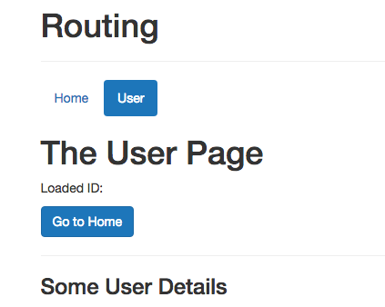
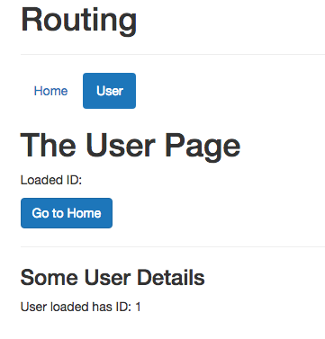
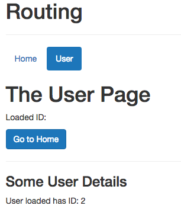
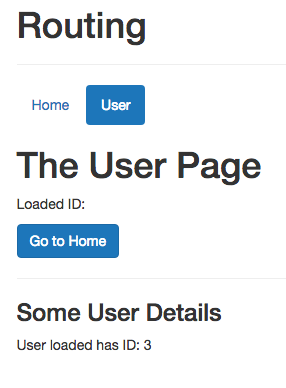

# Navigating to Nested Routes

Well, we wanna be able to click to our `list items` and load the appropriate `UserDetail component` and pass the `parameter` to it. In our `UserStart` file, where we have our `list items`, we'll replace `li` with `router-link`. And of course we still wanna use `list items` therefore we'll add a `tag=li`for the `router-link`. Of course we need to add `to=` attribute here also, and the first `attribute` shall navigate to `/user` - this is our main route, and then for `user 1` it should add `/1` to it. Surely in a reall application we can dynamically add this form a n `array`, keep in mind we can bind this dynamically by using `:to` to a `property` which contains this path. 

**UserStart.vue**

```html
<template>
    <div>
        <p>Please select a User</p>
        <hr>
        <ul class="list-group">
            <router-link tag = 'li' to='/user/1' class="list-group-item" style="cursor: pointer">User 1</router-link> <!--replace with router-link, add attributes--> 
            <router-link tag = 'li' to='/user/2' class="list-group-item" style="cursor: pointer">User 2</router-link>
            <router-link tag = 'li' to='/user/3' class="list-group-item" style="cursor: pointer">User 3</router-link>
        </ul>
    </div>
</template>
```
And now we have three different `routes`. 



Now, let's also extract the `data` in the `UserDetail` component. To do this we go to the `UserDetail` component and add paragraphs and output `id`. We could again store this in a `property`, but since this actually is a `route` which will not be updated without navigating back to another `route`, we can say `$route.params.id`. 

**UserDetail**

```html
<template>
<div>
    <h3>Some User Details</h3>
    <p>User loaded has ID: {{ $route.params.id }}</p>
</div>
</template>
```




There we don't need setup things where we watch changes in the `route params` because that could not happen, the `component` will get re-created anyways because we have to havigate away and then reload it by clicking a new link. 