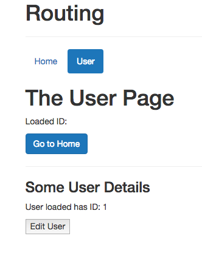

# Making Router Links more Dynamic

Let's add a `button` on the `UserDetail` so that we load the `UserEdit` component in such a case. So in our `UserDetail` component we need to setup a `router-link`, which shall use a `button` as a `tag` and it should navigate to `Edit`. Well, we need to go to out `edit route`


so, we need to navigate to `/user/id/edit`. So, we say `/user` and then we need to pass the `id`, to do so we'll bind `to=` dynamically by adding a colon `:`, and this allows us to pass other things not just a simple string, and pass `$route.params.id` and `/edit`. 

**UserDetail**

```html
<template>
<div>
    <h3>Some User Details</h3>
    <p>User loaded has ID: {{ $route.params.id }}</p>
    <router-link tag="button" :to="'/user/' + $route.params.id + '/edit'" class="btn btn-primary">Edit User</router-link>  <!--navigate to edit-->
</div>
</template>
```

Now, if we click a `loaded user` button we loaded `user/1/edit` and we are on the `edit user` page. 




This is how we can pass a `parameter` dynamically. 
