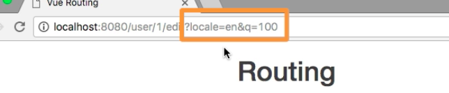
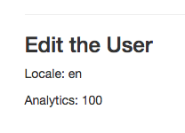

# Using Query Parameters

Sometimes we also have `query parameters`, `query parameters` are the paremeters we have at the end of the `URL`, separated with the question `?` mark `a=`, and this is mostly `optional data` we pass with a `route`. To pass these `query parameters` we can either go to route `to=` attribute, where we setup the `path` directly and add `?` question mark and `a=100` for example: 

`<router-link to="/?a=100" tag="li" active-class="active" exact><a>Home</a></router-link>`. 

Or if we use the `object syntax`, like we did in our case in `UserDetail`, and add another property to this `object` which is called `query`, this takes an `object` as a `value` and here we setup `key=value pairs` where we setup our `parameters`: 

**UserDetail**

```html
<template>
<div>
    <h3>Some User Details</h3>
    <p>User loaded has ID: {{ $route.params.id }}</p>
    <router-link tag="button" :to="{name='userEdit', params: {id: $route.params.id}, query: {locale: 'en', q: 100}}" class="btn btn-primary">Edit User</router-link> <!--set query parameter-->
</div>
</template>
```

Now these parameters will be added to the `userEdit` route. 



To extract this extra `data` let's go to `UserEdit` component, where we wanna output `locale` which we again access on our `loaded route` then `query` and we know we stored it in a key name `local` - `{{ $route.query.locale}}`.  

**UserEdit**
```html
<template>
<div>
    <h3>Edit the User</h3>
    <p>Locale: {{ $route.query.locale}}</p>   <!--output locale-->
    <p>Analytics: {{ $route.query.q}}</p>      <!--output q-->
</div>
</template>
```


