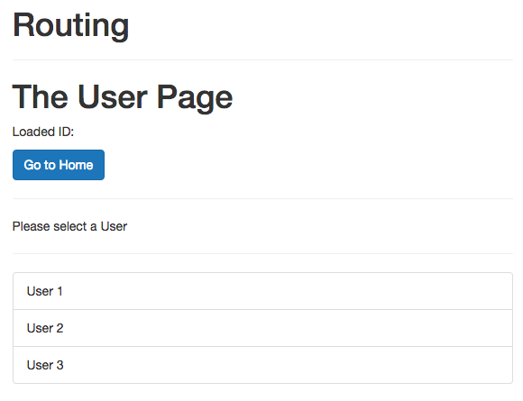
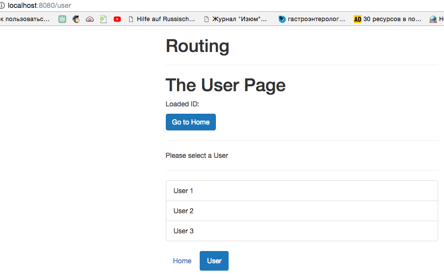

# Multiple Router Views (Named Router Views)

Well, let's say in our case we wanna have our `header` at the bottom of the page in the user area for some reasons. Then in our `App.vue` component we'll no longer include `<app-header>`, instead we'll have a second `<router-view>` where the `app-header` is loaded, though it may be in different positions depending on which `route` we are visiting. 

**App.vue**

```html
<template>
    <div class="container">
        <div class="row">
            <div class="col-xs-12 col-sm-8 col-sm-offset-2 col-md-6 col-md-offset-3">
                <h1>Routing</h1>
                <hr>
                <router-view></router-view>   <!--add more router-views-->
                <router-view></router-view>
                <router-view></router-view>
            </div>
        </div>
    </div>
</template>

<script>
    import Header from './components/Header.vue'
    export default {
        components:{
            appHeader: Header
        }
    }
</script>

<style>
</style>
```

Now we can give names to our `routes`. The middle `router-view` we leave unnamed, this will be the default `router-view` where everything will be loaded. 

**App.vue**

```html
<template>
    <div class="container">
        <div class="row">
            <div class="col-xs-12 col-sm-8 col-sm-offset-2 col-md-6 col-md-offset-3">
                <h1>Routing</h1>
                <hr>
                <router-view name="header-top"></router-view>   <!--add more router-views-->
                <router-view></router-view>
                <router-view name="header-bottom"></router-view>
            </div>
        </div>
    </div>
</template>

<script>
    import Header from './components/Header.vue'
    export default {
        components:{
            appHeader: Header
        }
    }
</script>

<style>
</style>
```

Now, how do we assign names? In the `routes.js` file we can add a new `property` named `components`. This is an `object` and here we have the default `component` which is our `Home` component, and we also have our `header-top` component, which refers to the `named router-view` in the `App.vue` component. And this `header-top` key has to have `Header` as a value, which we should import surely. 

**routes.js**

```js
import User from './components/user/User.vue';
import UserStart from './components/user/UserStart.vue'  
import UserEdit from './components/user/UserEdit.vue';
import UserDetail from './components/user/UserDetail.vue';
import Home from './components/Home.vue';
import Header from './components/Header.vue';       //import Header

export const routes = [
{ path: '', name: 'home', components: { default: Home, 'header-top': Header } },     //add components property
{ path: '/user', component: User, children: [         
{ path: '', component: UserStart },                    
{ path: ':id', component: UserDetail},                
{ path: ':id/edit', component: UserEdit, name: 'userEdit'}           
] }    
];
```
Now in our `User` page we don't see the header with the buttons, because we don't include it yet. 



Well, for the `User` we want to load it at the bottom, therefore we need to add the `components` property for our `user route` as well: where `user` will be the default, and `header-bottom` will be populated. 

**routes.js**

```js
import User from './components/user/User.vue';
import UserStart from './components/user/UserStart.vue'  
import UserEdit from './components/user/UserEdit.vue';
import UserDetail from './components/user/UserDetail.vue';
import Home from './components/Home.vue';
import Header from './components/Header.vue';       

export const routes = [
{ path: '', name: 'home', components: { default: Home, 'header-top': Header } },     
{ path: '/user', components: { default: User, 'header-bottom': Header }, children: [    //add components for the user page       
{ path: '', component: UserStart },                    
{ path: ':id', component: UserDetail},                
{ path: ':id/edit', component: UserEdit, name: 'userEdit'}           
] }    
];
```

Now we have the `header` at the bottom for the `User` routes. 



