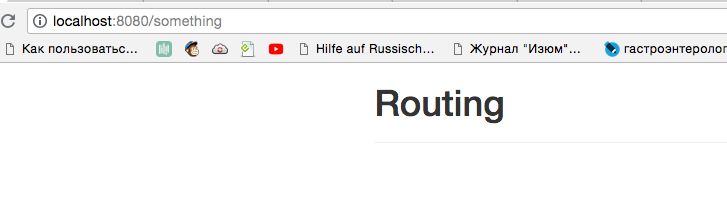

# Redirecting

What if the user enters anything in the `URL`, that is not covered by the app? 



Well, we want ot redirect in some cases, especially in cases like this, when any `route` not covered by our `routes` entered. Two things work together well here, but we can of course also redirect to any specific path. For example: in our `routes.js` file we'll add one more `route` at the end, so that our more specific paths come first, and here we'll setup a `path` of `redirectme`, and we want to setup a redirection, so we add a `redirect` key, this allows us to specify a `path` to which we should redirect the user. 

**routes.js**

```js
import User from './components/user/User.vue';
import UserStart from './components/user/UserStart.vue'  
import UserEdit from './components/user/UserEdit.vue';
import UserDetail from './components/user/UserDetail.vue';
import Home from './components/Home.vue';
import Header from './components/Header.vue';       

export const routes = [
{ path: '', name: 'home', components: { default: Home, 'header-top': Header } },     
{ path: '/user', components: { default: User, 'header-bottom': Header }, children: [    
{ path: '', component: UserStart },                    
{ path: ':id', component: UserDetail},                
{ path: ':id/edit', component: UserEdit, name: 'userEdit'}           
] },
{path: '/redirect-me', redirect: '/user' }    //add one more router
];
```

Now, if we visit `/redirect-me` we'll redirect to `/user`. We can also specify an `object` here, to use the `name routes` for example, to go to `userEdit` for example and then pass some `parameters`.  

**routes.js**

```js
import User from './components/user/User.vue';
import UserStart from './components/user/UserStart.vue'  
import UserEdit from './components/user/UserEdit.vue';
import UserDetail from './components/user/UserDetail.vue';
import Home from './components/Home.vue';
import Header from './components/Header.vue';       

export const routes = [
{ path: '', name: 'home', components: { default: Home, 'header-top': Header } },     
{ path: '/user', components: { default: User, 'header-bottom': Header }, children: [    
{ path: '', component: UserStart },                    
{ path: ':id', component: UserDetail},                
{ path: ':id/edit', component: UserEdit, name: 'userEdit'}           
] },
{path: '/redirect-me', redirect: {name: 'userEdit'} }    //use name routes
];
```