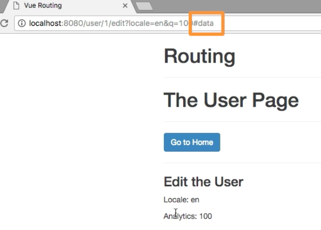

# Passing the Hash Fragment

Sometimes we want to navigate to a specific part of te page we are navigating to. Let's look it at our `UserEdit` page. Let's say we have a `div` here, and below this `div` we have some `extra data` in a paragraph, and this `paragraph` has an `id="data"` let's say. 

**UserEdit**

```html
<template>
<div>
    <h3>Edit the User</h3>
    <p>Locale: {{ $route.query.locale}}</p>
    <p>Analytics: {{ $route.query.q}}</p>
    <div style="height: 700px"></div>  <!--new div here-->
    <p id="data">Some extra Data</p>
</div>
</template>
```

If we navigate in our app, we might want to be able to pass `extra data` `#` hash fragment, and second we wanna simulate the behavior of jumping down. Or maybe generally we wanna control where the page scrolls to, when we navigate. 
First we need to pass the `#` segment. Let's say when we click on `UserDetail`, where we already passed the `query params`, we now pass the third `parameter` here - and this third `parameter` is the fragment we want ot use. 

**UserDetail**
```html
<template>
<div>
    <h3>Some User Details</h3>
    <p>User loaded has ID: {{ $route.params.id }}</p>
     <router-link 
     tag="button" 
     :to="{ name: 'userEdit', params: {id:$route.params.id}, query: {locale: 'en', q: 100} }" 
     class="btn btn-primary">Edit User</router-link>
</div>
</template>
```

Since the attributes we use in the `<router-link>` are already a long list, let's move it to our `script` section in the `data object`, and store this in a separate property, name it `link` let's say, and its value simply be the `object` from the `to=` attribute (we already had).  And we can simply pass `link` to `to=` attribute, it is a dynamic binding. We should add `this.` to our `$route` because now it is inside the `vue instance`. Now we can also pass our `hash` fragment, this is a `string`, for example `'#data'`.

**UserDetail**

```html
<template>
<div>
    <h3>Some User Details</h3>
    <p>User loaded has ID: {{ $route.params.id }}</p>
     <router-link  
     tag="button" 
     :to="link"     
     class="btn btn-primary">Edit User</router-link>  <!--pass 'link' here-->
</div>
</template>

<script>
export default {
    data(){
        return{
            link: {                   //store here 
                name: 'userEdit', 
                params: {id: this.$route.params.id},  //add 'this'
                query: {locale: 'en', q: 100},
                hash: '#data'              //pass hash fragment
                }
        }
    }
}
</script>
```

Now, we'll have `#data` appended to the end of the URL, when we on the `user` page select the "user" and click `edit` button. 



But what we also notice here - it doesn't scroll down, but we want to control the scrolling behavior when we do navigate to another page. Look ==> 021_Controlling the Scroll Behavior