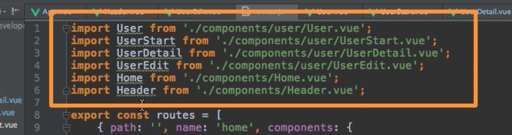
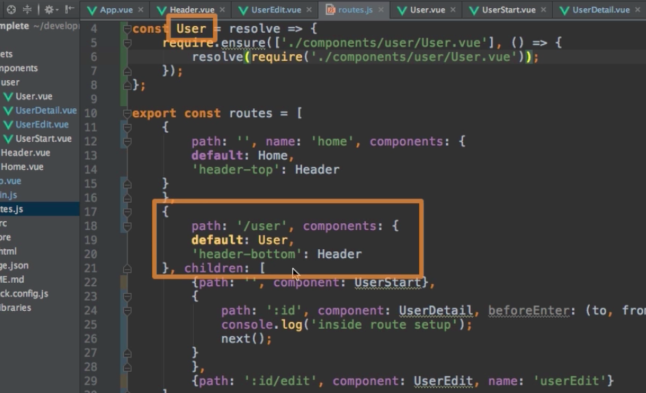

# Loading Routes Lazily
Now in our application there is one thing we can notice: now if we never click on `User` all the code behind this link will never be loaded, we won't use it at all. So, it might be unnecessary to load them at the beginnig of the application, for a bigger application with lots of code and lots of features this might really make a difference. If you are using a setup with `webpack`, when everything is in one file, then this has a disadvantage that limiting the numbers of `http requests` you sent; you might limit it too much cos you bundle there is really big, so you want to find a balance: to have a big all in one bundle and loading stuff you only need only at certain points of time. With webpack we can actually do this. It is called `lazy loading` - it means we only load parts of the application when we need it. 

Well, back to our `routes.js` file, how can we prepare this for lazy loading? Right now everything is loaded eagerly, which means all the time, because we added `import statements` at the top, and everything we import will be included in the bundle, no matter if we use it or not. 



So, we have to transfer `import statements` into anither syntax. Insted it will create several other bundles. First we need to create a `constant` - `User`, here we pass `resolve` as a callback function. And in this function we need to call `require.ensure()` - this is the code a `webpack` will be able to execute to recognise - this takes an `array` and in this `array` we setup the `path` to the `component` we wanna load - and this was the first `argument`. The second `argument` is another `function` where in the body we use the `resolve()` function we passed in as an `argument` to call `require('./components/user/User.vue')` again. 

**routes.js**

```js
import Home from './components/Home.vue';
import Header from './components/Header.vue';

const User = resolve => {             //other syntax for user component
require.ensure(['./components/user/User.vue'], ()=>{        //path to the component
 resolve(require('./components/user/User.vue'));
});    
};

export const routes = [
{ path: '',  name: 'home', components: {default: Home, 'header-top': Header} },
{ path: '/user', components: { default: User, 'header-bottom': Header }, children: [
{ path: '', component: UserStart},
{ path: ':id', component: UserDetail,  beforeEnter: (to,from,next)=>{
    console.log('inside route setup');
    next();
    }},
{ path: ':id/edit', component: UserEdit, name: 'userEdit'}
] },
{path: '/redirect-me', redirect: '/user' },
{ path: '*', redirect: '/' }  
];
``` 

It might seem strange. It basically tells webpack: whenever we want to load something which lives in `./components/user/User.vue`  - and we do want to load this for example once we visit route - using our `User` component here:



so, whenever we do this, execute `resolve(require('./components/user/User.vue'));});` function, which means it resolves the `path` you should really use. Webpack is only load this if we need that file. And it will create appropriate bundles to be loaded at this point of time during the buld process. 

And we can do the same with the other `components`. 

**routes.js**

```js
import Home from './components/Home.vue';
import Header from './components/Header.vue';

const User = resolve => {             
require.ensure(['./components/user/User.vue'], ()=>{        
 resolve(require('./components/user/User.vue'));
});    
};

const UserStart = resolve => {             
require.ensure(['./components/user/UserStart.vue'], ()=>{        
 resolve(require('./components/user/UserStart.vue'));
});    
};

const UserEdit = resolve => {             
require.ensure(['./components/user/UserEdit.vue'], ()=>{        
 resolve(require('./components/user/UserEdit.vue'));
});    
};

const UserDetail = resolve => {             
require.ensure(['./components/user/UserDetail.vue'], ()=>{        
 resolve(require('./components/user/UserDetail.vue'));
});    
};

export const routes = [
{ path: '',  name: 'home', components: {default: Home, 'header-top': Header} },
{ path: '/user', components: { default: User, 'header-bottom': Header }, children: [
{ path: '', component: UserStart},
{ path: ':id', component: UserDetail,  beforeEnter: (to,from,next)=>{
    console.log('inside route setup');
    next();
    }},
{ path: ':id/edit', component: UserEdit, name: 'userEdit'}
] },
{path: '/redirect-me', redirect: '/user' },
{ path: '*', redirect: '/' }  
];
``` 

As a side note: if we want to group certain pieces into one sub-bundle, we can group them by passing an additional `argument` to our `require.ensure()` function, which is the grou name 

**routes.js**

```js
import Home from './components/Home.vue';
import Header from './components/Header.vue';

const User = resolve => {             
require.ensure(['./components/user/User.vue'], ()=>{        
 resolve(require('./components/user/User.vue'));
}, 'user');                                           //add third argument, group name 
};

const UserStart = resolve => {             
require.ensure(['./components/user/UserStart.vue'], ()=>{        
 resolve(require('./components/user/UserStart.vue'));
}, 'user');                                              //add third argument, group name 
};

const UserEdit = resolve => {             
require.ensure(['./components/user/UserEdit.vue'], ()=>{        
 resolve(require('./components/user/UserEdit.vue'));
}, 'user');                                           //add third argument, group name 
};

const UserDetail = resolve => {             
require.ensure(['./components/user/UserDetail.vue'], ()=>{        
 resolve(require('./components/user/UserDetail.vue'));            //add third argument, group name 
}, 'user');    
};

export const routes = [
{ path: '',  name: 'home', components: {default: Home, 'header-top': Header} },
{ path: '/user', components: { default: User, 'header-bottom': Header }, children: [
{ path: '', component: UserStart},
{ path: ':id', component: UserDetail,  beforeEnter: (to,from,next)=>{
    console.log('inside route setup');
    next();
    }},
{ path: ':id/edit', component: UserEdit, name: 'userEdit'}
] },
{path: '/redirect-me', redirect: '/user' },
{ path: '*', redirect: '/' }  
];
``` 
