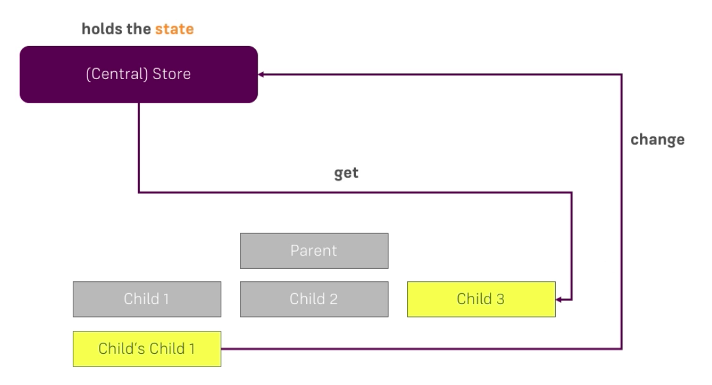

# Understanding "Centralized State"

The `VueX` has the idea of having a central "store", where our `state` is stored, and that is the key - we have one file, let's say, in our application, where we store our `state`. That does not mean that our `components` can't have their own `state`. If we have a `property` in the `component` which is only used in this `component` and only change this `component`, there is no need to put it in the `application state`. But everything what we use in different parts of our application should go in the `application state`. 

With such a `central state` we could access it from one `child (component)` and change it and then in another `component`, where we want to get our `data`, we can simply access it to get the `data`. 

