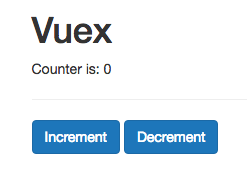
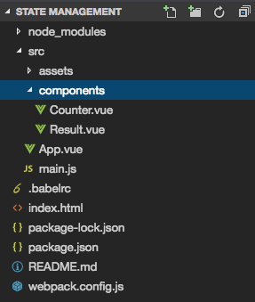

# Using the Centralized State

For the start we have a simple application. 




### Components we have are: 

**Counter.vue**
```html
<template>
    <div>
        <button class="btn btn-primary" @click="increment">Increment</button>
        <button class="btn btn-primary" @click="decrement">Decrement</button>
    </div>
</template>

<script>
    export default {
        methods: {
            increment() {
                this.$emit('updated', 1);
            },
            decrement() {
                this.$emit('updated', -1);
            }
        }
    }
</script>
```

**Result.vue**

```html
<template>
    <p>Counter is: {{ counter }}</p>
</template>

<script>
    export default {
        props: ['counter']
    }
</script>
```

**App.vue**
```html
<template>
    <div class="container">
        <div class="row">
            <div class="col-xs-12 col-sm-8 col-sm-offset-2 col-md-6 col-md-offset-3">
                <h1>Vuex</h1>
                <app-result :counter="counter"></app-result>
                <hr>
                <app-counter @updated="counter += $event"></app-counter>
            </div>
        </div>
    </div>
</template>

<script>
    import Counter from './components/Counter.vue';
    import Result from './components/Result.vue';

    export default {
        data() {
            return {
                counter: 0
            }
        },
        components: {
            appCounter: Counter,
            appResult: Result,
        }
    }
</script>
```
Well, this setup can be ok for a small application. Now `the counter` is inside the `App.vue` file. The goal is to get `the counter` out of the `App.vue` file into a new module of our application, which holds the `central state`. Typically, we should store all VueX related parts in a ceparate folder, which is named "store", it's on the same level as `components`. In this `store` folder we'll create a new file, "store.js" - this is simple js file which should hold our `store`. In order to be able to create such a store we need some helpers from the `VueX` package. Let's install this with `npm install --save vuex`.

Then in the `store.js` file we should import `Vue` and `VueX` - these are two tools we'll need here. And then we can simply tell `Vue` to use `VueX`, to register this plugin. `VueX` is a package that have some additional tools to use for the `state management`. 

**store.js**

```js
import Vue from 'vue';          //import 
import VueX from 'vuex';

Vue.use(VueX);         //register VueX
```

Now we can create new `store`. `store()` is a method where we pass an `object` where we configure thet `store`. Now what do we want to have in this `store`? Well, as the main task is to have a `state` of the application it has a `property named state`, and it has to be named `"state"` !!! for `VueX` to detect it. This `state` property holds the `object` where we may store all the `properties` our application has, like in our case for example `the counter`.  So, now our `counter` is in our `central store`. 

**store.js**

```js
import Vue from 'vue';          
import VueX from 'vuex';

Vue.use(VueX);  

new VueX.Store({                 //create new store
    state: {
         counter: 0           //put the counter in the store 
}
});            
```

Of course we want to use our `store` outside of the `store.js` file, so we should export it, and we'll export it in a `constant` named "store", where we save our `new store` in.  

**store.js**

```js
import Vue from 'vue';          
import VueX from 'vuex';

Vue.use(VueX);  

export const store = new VueX.Store({          //export the store       
    state: {
         counter: 0           
}
});            
```

Now we go to our `main.js` file ind register the `store` in the `root vue instance`, so that we can really use our `store` in the application, cos now having it sitting in the extra file doesn't do anything. Therefore we import the `store` from our just created file. And with `store` imported all we have to do is (like with the router) to register it as a `property` in our `vue instance` 

**main.js**

```js
import Vue from 'vue'
import App from './App.vue'

import {store} from './store/store.js'   //import store 

new Vue({
  el: '#app',
  store: store,            //register the store 
  render: h => h(App)
})
```

Now, we have the acces to the `store`. And how do we access it? Let's first go to the `Counter.vue` file and instead of `emitting the event`, we can now access the `store` with `$store`; `$` signals that it's not the `property` we created instead it comes from VueJS on it own or in this case from VueX; `$store` gives us access to the `central store`, so there we can access our `state` and we know we have a `counter` there - `this.$store.state.counter` - which we increment and decrement. 

**Counter.vue**
```html
<template>
    <div>
        <button class="btn btn-primary" @click="increment">Increment</button>
        <button class="btn btn-primary" @click="decrement">Decrement</button>
    </div>
</template>

<script>
    export default {
        methods: {
            increment() {
                this.$store.state.counter++;             //access the store here 
            },
            decrement() {
                this.$store.state.counter--; 
            }
        }
    }
</script>
```
Now in the `Result.vue` file we can get rid of the `props`, instead we'll add a `computed property` which we'll name "counter", to fit the name we output in the `template` and this should then return `this.$store.state.counter`. And whenever the `counter` changes this should change too, therefore the `template` is updated. 

**Result.vue**

```html
<template>
    <p>Counter is: {{ counter }}</p>
</template>

<script>
    export default {
        computed: {
            counter() {
              return this.$store.state.counter; 
            }
        }
    }
</script>
```
This allows us in the `App.vue` file remove parts where we pass the `props` as well as `listening to the event`, and remove the `data object`. 

**App.vue**
```html
<template>
    <div class="container">
        <div class="row">
            <div class="col-xs-12 col-sm-8 col-sm-offset-2 col-md-6 col-md-offset-3">
                <h1>Vuex</h1>
                <app-result ></app-result>  <!--remove from here-->
                <hr>
                <app-counter ></app-counter>  <!--remove from here-->
            </div>
        </div>
    </div>
</template>

<script>
    import Counter from './components/Counter.vue';
    import Result from './components/Result.vue';

    export default {             //we don't need data here 
        components: {
            appCounter: Counter,
            appResult: Result,
        }
    }
</script>
```