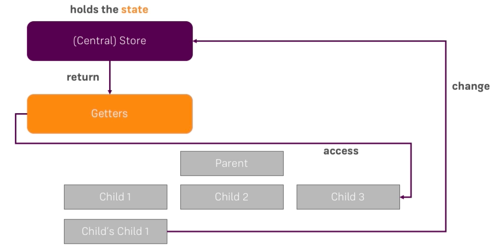

# Understanding Getters

Well, having just the `centralizes store` still has the limits and we'll have to repeat our code though. So, this is not enough if we have for example more complex calculations in different parts of the application. For this case we have a solution: instead of directly accessing the `state` in the `component` where we want to access it, we can create a `getter`. Such a `getter` would get the `state` from the `store` and perform any calculations it should perform, but then we can access this `getter` from our different `components`, hence our `code` is stored in one place. And then we only reach to the `getter` from the pieces of our application.

