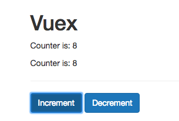

# Using Getters

Well, let's say we have two result files with the same code. But our goal now is not duplicate the code in the app.

**Result.vue**

```html
<template>
    <p>Counter is: {{ counter }}</p>
</template>

<script>
    export default {
       computed: {
            counter() {
              return this.$store.state.counter * 2; 
            }
        }
    }
</script>
```
**AnotherResult**

```html
<template>
    <p>Counter is: {{ counter }}</p>
</template>

<script>
    export default {
       computed: {
            counter() {
              return this.$store.state.counter * 2; 
            }
        }
    }
</script>
```

Let's say we want to store our calculation in the `AnotherResult.vue` file into a `getter`. For that in our `store.js` file we can add a new `property`  - `getters`, should be named just like this. So, `getters` is the `object` where we can set as many `getters` as we want and now we are free to choose any name. We'll name it `doubleCounter` ind this is actually a `function` where we do get the `state` as an `argument`, this is passed automatically by `VueX`, and in the body of this `function` we can do whatever we wanna do with the `state`. So, if our goal is to double the `counter`, then we would need to return `state.counter * 2`. 

**store.js**

```js
import Vue from 'vue';          
import VueX from 'vuex';

Vue.use(VueX);  

export const store = new VueX.Store({              
    state: {
         counter: 0           
},
    getters: {                 //create the getter 
     doubleCounter: state =>{
       return state.counter * 2         
     }
    }
});            
```
Now, with the `getter` in place we need to access the `getter` in the `AnotherResult.vue` and `Result.vue` components. Here we still keep the `counter` in the `computed property` but now we can simply return `this.$store.getters.doubleCounter`. 

**AnotherResult**

```html
<template>
    <p>Counter is: {{ counter }}</p>
</template>

<script>
    export default {
       computed: {
            counter() {
              return this.$store.getters.doubleCounter;     //access the getter 
            }
        }
    }
</script>
```

**Result.vue**

```html
<template>
    <p>Counter is: {{ counter }}</p>
</template>

<script>
    export default {
       computed: {
            counter() {
              return this.$store.getters.doubleCounter;        //access the getter
            }
        }
    }
</script>
```



