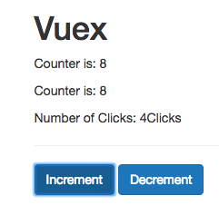
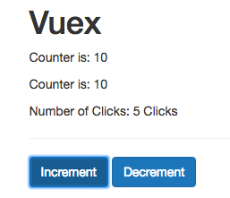
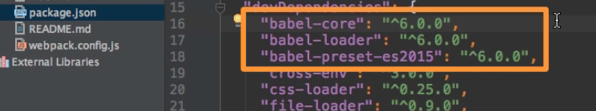

# Mapping Getters to Properties

What is we want to have another `getter`? So, in our `getters` property in the `store` we'll have "stringCounter" property, let's name it this way, where we taka our `state` and return our `state.counter + 'Clicks'` to turn it to a string. 

**store.js**

```js
import Vue from 'vue';          
import VueX from 'vuex';

Vue.use(VueX);  

export const store = new VueX.Store({              
    state: {
         counter: 0           
},
    getters: {                  
        doubleCounter: state =>{
       return state.counter * 2         
     },
       stringCounter: state => {             //set one more getter
         return state.counter + 'Clicks';
       }

    }
});            
```

Let's use this new `getter` in the `AnotherResult.vue` component. Here we'll have one more `paragraph` where we output our `"clicks" computed property`, which we'll create in the script and then return 

**AnotherResult**

```html
<template>
<div>
    <p>Counter is: {{ counter }}</p>
    <p>Number of clicks: {{ clicks }}</p>        <!--output number of clicks-->
</div>
</template>

<script>
    export default {
       computed: {
            counter() {
              return this.$store.getters.doubleCounter;     
            },
            clicks (){
                return this.$store.getters.stringCounter;     //create computed property
            }
        }
    }
</script>
```

Now it works, though we have a propblem. 



The problem is, we have now two `computed properties` to fetch our `state` (to fetch the getters), and if we would add more and more `getters`, we would have to repeat this for every `getter`. it would be more convenient if `VueX` would kind of do this automatically and give us access to all our `getters` so that we could conveniently say "clicks" for example in the `template` and that will automatically execute the right `getter`, without us having set the `computed property` for that. 

Well, `VueX` has a `helper method` we can use for that, the `method` that will create all the `computed properies` we need on its own. For that we need to import `helper function` from `VueX` and this `function` is called `"mapGetters"`. And now we can overwrite our `computed properties` and execute `mapGetters` function. This `function` takes an `array` as an argument, and in this `argument` we specify as `strings` all the `getters` we wanna use in this `component`. 

**Note** We can also pass an `object` and map the `getters` to different names. Example: 
```js
mapGetters ({
    propertyName: 'doubleCounter'
})
```

**AnotherResult**

```html
<template>
<div>
    <p>Counter is: {{ counter }}</p>
    <p>Number of clicks: {{ clicks }}</p>        
</div>
</template>

<script>
    import { mapGetters } from 'vuex';    //import the helper function
    export default {
       computed: mapGetters(['doubleCounter', 'stringCounter']) //use mapGetters
    }
</script>
```

This will in the background automatically create `computed properties` and map them to the `getters` in the `store.js` file. With that we can change our `template` and use "doubleCounter" except "counter". 

**AnotherResult**

```html
<template>
<div>
    <p>Counter is: {{ doubleCounter }}</p> <!--change the template-->
    <p>Number of clicks: {{ stringCounter }}</p>        <!--change the template-->
</div>
</template>

<script>
    import { mapGetters } from 'vuex';    
    export default {
       computed: mapGetters(['doubleCounter', 'stringCounter']) 
    }
</script>
```


It works and we have more beautiful code, but still there is one limitation: what if we want to create our own `computed properties` and mix them with the `getters`? With ES6 we got an easy solution. Let's create a js `object` and put `mapGetters` inside of it. With ES6 we have `spread operator` (`...`). The `...` allow us to tell JS: "pull out all the `properties` and `methods` you have in the `mapGetters object`, pull them all out of there and create separate `key-value pairs` for each of them". This will allow us to add all the `computed properties` into a bigger `object` of `computed properties` and we could still write our own `computed property`. 

**AnotherResult**

```html
<template>
<div>
    <p>Counter is: {{ doubleCounter }}</p> 
    <p>Number of clicks: {{ stringCounter }}</p>        
</div>
</template>

<script>
    import { mapGetters } from 'vuex';    
    export default {
       computed: {                                         //create an object
           ...mapGetters(['doubleCounter', 'stringCounter'])   //use spread operator 
       }
    }
</script>
```
However, if we look at the application we'll see it's broken. The problem is that `...` is unexpected. So, ES6 compilor we are using doesn't recognose that. If we have a look at the `package.json` file we see that we are using `babel` to compile ES6 to ES5 code, and the presets we loaded here don't cover the `spread operator` syntax. 



Well, we can simply add this package to get this functionality to work. We can install this: `npm install --save-dev babel-preset-stage-2`. With that added we now have to go to the `babelrc` file and there we have to add a new `entry` for this `array of presets`, it is simply called "stage-2". 

**babelrc**

```js
{
  "presets": [
    ["es2015", { "modules": false }],
    ["stage-2"]    //add new entry
  ]
}
```