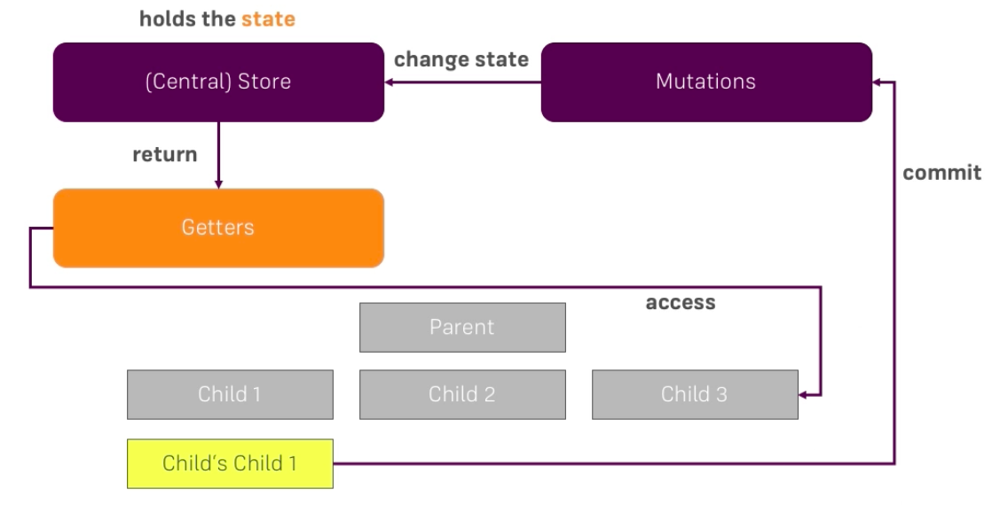

# Understanding Mutations

Like with the `getters` we also could have a problem when changing our `store` or when changing our state. Now we are doing this directly from the `components`: we access our `state` and we manipulate it. That can get a problem if we get multiple `components` manipulating our `state` it gets hard to track which `component` added to the `state` at which point of time and so on. A better way is to use `mutations` concept for setting the `store`. These `mutations` change the `state`, `mutations` are committed, so we basically commit such `mutation` from one point of our application and then this will update the `state` and then all the `components` listening through `getters` will automatically recieve the updated `state`. 

