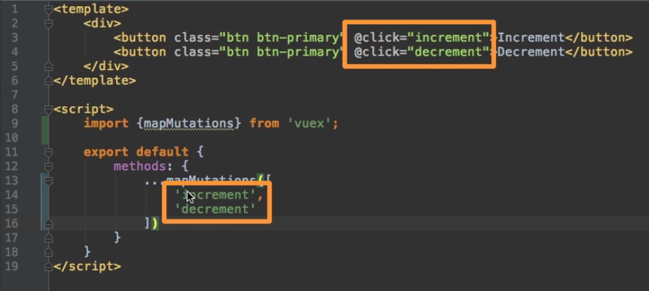
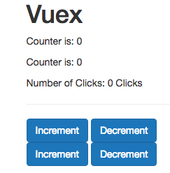

# Using Mutations

So. we want to use `mutations` to change our `state`. Let's go to `store.js` file and add some `mutations` - this is the `object` with the `methods` we can execute. For example let's add `increment mutation`, it takes the `state` as input (like getters) and in the body of the `function` we change the `state`; the same we'll do for `decremet mutation`.  

**store.js**

```js
import Vue from 'vue';          
import VueX from 'vuex';

Vue.use(VueX);  

export const store = new VueX.Store({              
    state: {
         counter: 0           
},
    getters: {                  
        doubleCounter: state =>{
       return state.counter * 2         
     },
       stringCounter: state => {             
         return state.counter + 'Clicks';
       }
    },
    mutations: {                //add mutations 
       increment: state => {
          state.counter ++;
       },
       decrement: state => {
          state.counter --;
       },
    }
});            
```
Now we centralised this functionality. Now we have only one place where we do call increment and decrement, in our `Counter.vue` component, but for example if we would call this from multiple `components` then we would have the advantage of having a central place (`mutations`). Let's simulate this, by creating one more `component` named `"AnotherCounter.vue"`. Basically it copies the code from `Counter.vue`. And in `App.vue` file we also need to import `AnotherCounter` and register it. 

**App.vue**

```html
<template>
    <div class="container">
        <div class="row">
            <div class="col-xs-12 col-sm-8 col-sm-offset-2 col-md-6 col-md-offset-3">
                <h1>Vuex</h1>
                <app-result></app-result>
                <app-another-result></app-another-result>
                <hr>
                <app-counter></app-counter>
                <app-another-counter></app-another-counter>  <!--add to the template-->
            </div>
        </div>
    </div>
</template>

<script>
    import Counter from './components/Counter.vue';
    import AnotherCounter from './components/AnotherCounter.vue';  //import here 
    import Result from './components/Result.vue';
    import AnotherResult from './components/AnotherResult.vue';


    export default {
        components: {
            appCounter: Counter,
            appResult: Result,
            appAnotherResult: AnotherResult,
            appAnotherCounter: AnotherCounter        //register here 
        }
    }
</script>
```
We could use the `mutation` in the `Counter.vue` by accessing the `store` like before and then commit a `mutation` and then the name of the `mutation` as a **string**. `VueX` will search for the `method` named `increment` in the `store.js mutations object`, execute this `method` and pass the `data` automatically. 

**Counter.vue**

```html
<template>
    <div>
        <button class="btn btn-primary" @click="increment">Increment</button>
        <button class="btn btn-primary" @click="decrement">Decrement</button>
    </div>
</template>

<script>
    export default {
        methods: {
            increment() {
                this.$store.commit('increment')         //use mutation here 
            },
            decrement() {
                this.$store.commit('decrement') 
            }
        }
    }
</script>
```

As with `getters` we have the same problem - we repeat the code. So, we also can map `mutations` to get rid of this problem. First we have to import this `helper method`. And then we can either replace all our `methods` with `mapMutations`, but since we propably wanna have our own `methods` mixed with `mutations`, the better way is to use `...` separator.

**Counter.vue**

```html
<template>
    <div>
        <button class="btn btn-primary" @click="increment">Increment</button>
        <button class="btn btn-primary" @click="decrement">Decrement</button>
    </div>
</template>

<script>
    import {mapMutations} from 'vuex'       //import map mutations 
    export default {
        methods: {
            ...mapMutations([
                'increment',
                'decrement'
            ])
        }
    }
</script>
```

This way calling `methods` in the `template` will automatically work, since this is the same names. 



 