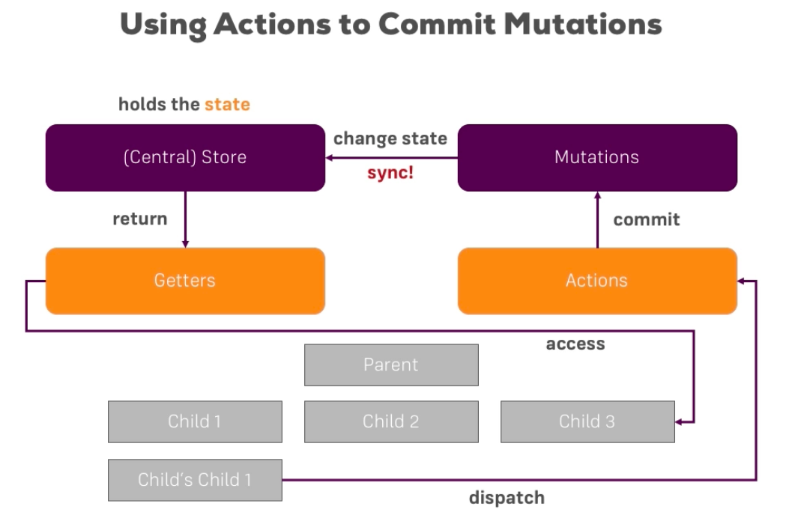

# How Actions Improve Mutations

Well, we can use `mutations` and `asynchronous tasks` if we put an extra piece betweenn our `component` where we want to trigger something and our `mutation` where we want to change the state. This extra piece is an `action` - this is basically an extra `function` where we may run asynchronous tasks, and in this `action` which we dispatch from the `component`, we then commit the `mutation`, and we only commit the `mutation` once the asynchronous task is done. This has one main benefit - we can tregger an `action` in our `component`, then we reach out the server, it takes some miliseconds, and no changes commited, the `state` hasn't been changed yet, only when this `asynchronous function` is finished we commit the `mutation` and we change the `state` in our `store`. 

