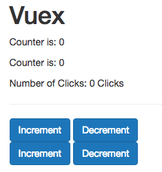

# Using Actions

Let's say in our `counter` app, when we click the `buttons`, we wanna wait before we actually update the counter.


For that we can add `actions` to our `store.js` as a property in our `store`. And this `actions` property will hold our `methods` which are our `actions`: let's say `increment`(we can choose any name) and `increment` takes `context` as an `argument` (context will be passed by VueJS automatically), and `context` gives access to `commit()` method, where we then can commit `increment`. This `context` object we actually pass to our `action` has the `commit()` method, cos it has a lot of methods and properties of our `store`. It's not exactly the same as our `store`, we have the access to our `store` all the features it has, but not all features. We also need to add `asyncIncrement` action (for `AnotherCounter.vue`), and it should also get the `commit()` method, and here we wanna set the Timeout and wait for one second, and then in the `callback` of the `timeout()` we wanna call `commit('increment')`. 

**store.js**
```js
import Vue from 'vue';          
import Vuex from 'vuex';

Vue.use(Vuex);  

export const store = new Vuex.Store({                
    state: {
         counter: 0
    },
    getters: {                
            doubleCounter: state => {
              return state.counter * 2         
            },
            stringCounter: state => {             
                return state.counter + ' Clicks';
              }
           },
           mutations: {
            increment: state => {
               state.counter ++;
            },
            decrement: state => {
              state.counter --;
           },
         },
         actions:  {                   //add actions here 
            increment: context => {
              context.commit('increment')
            },
            decrement: context => {
              context.commit('decrement')
            },
            asyncIncrement: ({commit}) =>{         //here is the alternative way of writing actions
              setTimeout ( () => {
                  commit('increment');
              },1000)
            },
            asyncDecrement: ({commit}) =>{         
              setTimeout ( () => {
                  commit('decrement');
              },1000)
            }
         }      
});     
```
Now. when we have these new `actions` we ned to use them, in `Counter.vue` component in our case. And also we will have to replace `mapMutations` method in the `Counter.vue` component with some way of getting access to our `actions`, because we no longer want to use `mutations` directly in the `components` instead we now always want to use `actions`. Just to keep in mind - we need this just for `asynchronous tasks`, for other tasks we can still use `mutations` and directly commit them from the `components`.   VueJS also has `mapActions` as a useful tool.  

**Counter**

```html
<template>
    <div>
        <button class="btn btn-primary" @click="increment">Increment</button>
        <button class="btn btn-primary" @click="decrement">Decrement</button>
    </div>
</template>

<script>
  import {mapActions} from 'vuex'       //change to map actions here 
    export default {
        methods: {
            ...mapActions([             //change to map actions here 
                'increment',
                'decrement'
            ])
        }
    }
</script>
```
