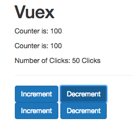

# Mapping Actions to Methods

It's important to understand what `mapActions` does behind the scenes. So, we are mapping to the `increment` and `decrement` actions and this will create two additional `methods` for us. Well, we use `mapActions` to get access to our `actions` but in the end this `mapActions` function gives us `increment()` method, where we can call `this.$store.dispatch('increment')`. `increment()` could of course take a `value` like `by` argument,which then we can pass to `increment` to tell how much to increase the counter. And then in the `template` we can call `increment` for let's say 100, to increase it by 100 in each click, instead of increasing by one. 

**Counter**

```html
<template>
    <div>
        <button class="btn btn-primary" @click="increment(100)">Increment</button>  <!--call increment with the value-->
        <button class="btn btn-primary" @click="decrement">Decrement</button>
    </div>
</template>

<script>
  import {mapActions} from 'vuex'       
    export default {
        methods: {
            ...mapActions([            
                'increment',            //map increment
                'decrement'            //map decrement
            ]),
            increment(by){            //add increment method 
                this.$store.dispatch('increment', by)
            }
        }
    }
</script>
```

Thankfully, VueJS create this `increment` method automatically for us, and we can pass just the `value` when we call `increment` in the template. 

**Counter**
```html
<template>
    <div>
        <button class="btn btn-primary" @click="increment(100)">Increment</button>  <!--call increment with the value-->
        <button class="btn btn-primary" @click="decrement(50)">Decrement</button>
    </div>
</template>

<script>
  import {mapActions} from 'vuex'       
    export default {
        methods: {
            ...mapActions([            
                'increment',            //map increment
                'decrement'            //map decrement
            ]),
        }
    }
</script>
```

Then in `store.js` where we call our `action`, we can pass the second `argument` called `payload`. And then we can simply pass this into the `mutation`, because it turns out `mutations` also not only get the `state` but as a second `argument` they may as well get the `payload`, so we can then increment by `payload`. 

**store.js**
```js
import Vue from 'vue';          
import Vuex from 'vuex';

Vue.use(Vuex);  

export const store = new Vuex.Store({                
    state: {
         counter: 0
    },
    getters: {                
            doubleCounter: state => {
              return state.counter * 2         
            },
            stringCounter: state => {             
                return state.counter + ' Clicks';
              }
           },
           mutations: {
            increment: (state, payload) => {    //add payload for mutations
               state.counter += payload;       //increment by payload 
            },
            decrement: (state, payload) => {
              state.counter -= payload;
           },
         },
         actions:  {                   
            increment: ({commit}, payload) => {      //add payload to action
              commit('increment', payload);
            },
            decrement: ({commit}, payload) => {
              commit('decrement', payload);
            },
            asyncIncrement: ({commit}) =>{         
              setTimeout ( () => {
                  commit('increment');
              },1000)
            },
            asyncDecrement: ({commit}) =>{         
              setTimeout ( () => {
                  commit('decrement');
              },1000)
            }
         }      
});     
```



This is how we can pass a `payload`. What is we wanna pass more than one `argument`, simply add multiple `arguments` when calling `method` in the template - doesn't work. Let's say in `AnotherCounter` component where we have `asyncIncrement` and `asyncDecrement` actions, we want to set the size by what we want to increase and decrease the counter and as a `second argument` we also want to pass the duration of `asynchronous task`. What we can do here is to pass an `object` as an `argument`, and in this `object` we can add as many `properires` as we want. E.G `by` property to set the step by what we want to increase the counter and the `duration` property, and do the same for decrement. 

**AnotherCounter**

```html
<template>
    <div>
        <button class="btn btn-primary" @click="asyncIncrement( {by: 50, duration: 500 } )">Increment</button> <!--pass an object as an argument-->
        <button class="btn btn-primary" @click="asyncDecrement( {by: 50, duration: 500 } )">Decrement</button>
    </div>
</template>

<script>
  import {mapActions} from 'vuex'       
    export default {
        methods: {
            ...mapActions([
                'asyncIncrement',
                'asyncDecrement'
            ])
        }
    }
</script>
``` 
Surely we need to adjust our `actions` in our `store.js` and use the `payload` as the second `argument` and then we can add `payload.by` to the `commit()` method, and set `payload.duration` to the `setTimeout()`, 

**store.js**
```js
import Vue from 'vue';          
import Vuex from 'vuex';

Vue.use(Vuex);  

export const store = new Vuex.Store({                
    state: {
         counter: 0
    },
    getters: {                
            doubleCounter: state => {
              return state.counter * 2         
            },
            stringCounter: state => {             
                return state.counter + ' Clicks';
              }
           },
           mutations: {
            increment: (state, payload) => {    //add payload for mutations
               state.counter += payload;       //increment by payload 
            },
            decrement: (state, payload) => {
              state.counter -= payload;
           },
         },
         actions:  {                   
            increment: ({commit}, payload) => {      //add payload to action
              commit('increment', payload);
            },
            decrement: ({commit}, payload) => {
              commit('decrement', payload);
            },
            asyncIncrement: ({commit}, payload) =>{         //add payload to action
              setTimeout ( () => {
                  commit('increment', payload.by);        //commit payload and the step
              },payload.duration)                       //set the duration
            },
            asyncDecrement: ({commit}, payload) =>{         
              setTimeout ( () => {
                  commit('decrement', payload.by);
              },payload.duration)
            }
         }      
});     
```