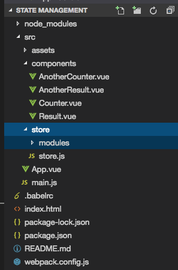

# Modularizing the State Management

Let's have a look at how we can structure our `Vuex` related code, namely the code in `store.js` file, with different files. For this we first need to use so called `modules`. Let's create `modules` folder.  



The idea behind `modules` is that in our `store` we may have certain parts which belong to different parts of our application, for example in our case - `the counter`. The counter, getters and actions belong to our `Counter.vue` file, our `Result.vue` file and so on. But the `value` in our example is only used in our `App,vue` file. 

To illustrate the `modules` idea let's in the `modules` folder create `counter.js` file and `value.js` file. In the `counter.js` we will create a `constant` named "state" and that is an `object`. Now we remove the `counter` from the `state` in the `store.js` file and put it here in the `counter.js` file. Then again in our `store` we get some `getters` related to the `counter`, cut them and create a new `constant` in our `counter.js` file - `getters`, where we'll have our `getters` inside. We can do the same for our `mutations` and `actions`. Next we need to export it all in a `default object` so that we have only one export in the whole file. And this object has the `state`, `getters`, `mutations` and `actions`. With that we export an `object` with all `counter` related Vuex code. 

**counter.js**
```js
const state = {       //create state const 
counter : 0
};

const getters = {                 //create getters const 
    doubleCounter: state => {
              return state.counter * 2         
            },
            stringCounter: state => {             
                return state.counter + ' Clicks';
              },
};

const mutations = {                 //create mutations const 
            increment: (state, payload) => {
               state.counter += payload;
            },
            decrement: (state, payload) => {
              state.counter -= payload;
           },

};

const actions = {                //create actions const 
         increment: ({ commit }, payload) => {
            console.log('increment', payload)
            commit('increment', payload);
          },
          decrement: ({commit}, payload) => {
            commit('decrement', payload)
          },
          asyncIncrement: ( {commit}, payload) => {         
            setTimeout (() => {
              commit('increment', payload.by);
          },payload.duration)
        },
          asyncDecrement: ({commit}, payload) => {         
            setTimeout (() => {
                commit('decrement', payload.by);
            },payload.duration)
          }
};

export default {
    state,
    getters,
    mutations,
    actions
}
```
In the `store.js` file we'll leave the `value` part Vuex code for now. We could outsource it in the `value.js` file, but for now we just leave it here. However since we outsorced so many Vuex part related to the `counter` that we need now somehow to merge it in the central `store.js` file, because one thing doesn't change - we have one central store. So, to merge it in the `store.js` back, we need to use a new `property` "modules" and here we add all the `modules` we have. First we need to import `modules` to the central `store.js`, and then register it in `modules` property. 

**store.js**
```js
import Vue from 'vue';          
import Vuex from 'vuex';
import counter from './modules/counter'  //import counter 

Vue.use(Vuex);  

export const store = new Vuex.Store({                
    state: {
         value: 0
    },
    getters: {  
              value: state => {               
                return state.value; 
             }
           },
    mutations:{
           updateValue: (state, payload) =>{        
            state.value = payload;
             }
         },
    actions:  {
          updateValue: ({commit}, payload)=>{        
            commit('updateValue', payload);
        }
       },
    modules: {
         counter         //: counter (the name and value are equal)
    }     
});     
```