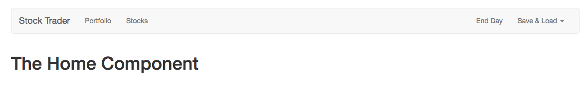

# Adding a Header and Navigation

The logical next step now is to implement a `header`, so we'll got some links to `routes` instead of manually type it in the URL. To add a `header` we'll use bootstrap header and adjust it a bit. 

We want to have here our `brand` - "Stock Trader", and it should be the `router-link` instead of `anchor tag`, cos we wanna manage this through `VueJS`, we'll root it `to=` our `Home page`. Then we'll have navigation to our main `component`: portfolio and stocks which also should be `router-link`. Then navbar to the right with the `End Day` and dropdown menu `Save & Load`. Right now this dropdown will not work, we'll work on that later. 

**Header.vue**
```html
<template>
    <nav class="navbar navbar-default">
        <div class="container-fluid">
            <div class="navbar-header">
                <router-link to="/" class="navbar-brand">Stock  Trader</router-link> <!--brand here-->
            </div>

            <div class="collapse navbar-collapse">
                <ul class="nav navbar-nav">
                    <router-link to="/portfolio" activeClass="active" tag="li"><a>Portfolio</a></router-link>
                    <router-link to="/stocks" activeClass="active" tag="li"><a>Stocks</a></router-link>
                </ul>
                
                <ul class="nav navbar-nav navbar-right">
                    <li><a href="#" >End Day</a></li>
                    <li class="dropdown">
                        <a
                                href="#"
                                class="dropdown-toggle"
                                data-toggle="dropdown"
                                role="button"
                                aria-haspopup="true"
                                aria-expanded="false">Save & Load <span class="caret"></span></a>
                        <ul class="dropdown-menu">
                            <li><a href="#" @click="saveData">Save Data</a></li>
                            <li><a href="#" @click="loadData">Load Data</a></li>
                        </ul>
                    </li>
                </ul>
            </div><!-- /.navbar-collapse -->
        </div><!-- /.container-fluid -->
    </nav>
</template>
```

Now we can add this `header` in our `App.vue` file, we need first to import it, register it locally and use it in the template. 

**App.vue**
```html
<template>
<div class="container">
        <app-header></app-header> <!--add header-->
        <div class="row">
            <div class="col-xs-12">
        <router-view></router-view>
        </div>
     </div>
 </div>
</template>

<script>
    import Header from './components/Header.vue' //import header
    export default {
       components: {              //register header
           appHeader: Header
       }
    }
</script>

<style>
body{
    padding: 30px;
}
</style>
```

