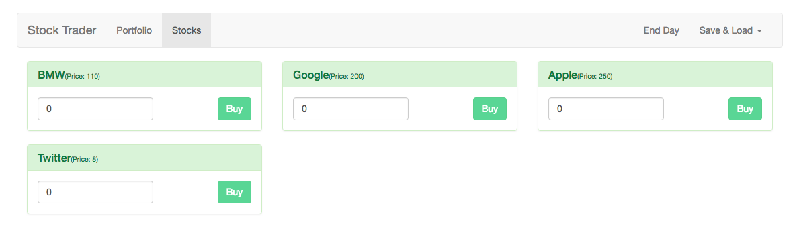

# Setting Up the Vuex State Management

First let's install `vuex` using `npm install --save vuex`, and this will give us access to `vuex`. With that setup let's create a new folder to our `source` folder, name it `store` and in this folder we'll create `store.js` file. Here we surely need to import `vue` and `vuex`, so that we could access these two packages. Then we could use our `vuex`. And then we can start setting up our own `store`. We will export this `export default new Vuex.Store()` and this gets an `argument` where we configure the `store`. 

**store.js**
```js
import Vue from 'vue';
import Vuex from 'vuex';

Vue.use(Vuex);

export default new Vuex.Store ({    //we have the store without the state here

})
```

Concerning the `state` in our `store`, we'll create two `modules` for our application: one for the `portfolio` and one for the `stocks`. Each of these `modules` will have their own `state` , and that's why we don't have `global state` in our `store`, because we will map the `stocks` which are available to the `Stocks module` we are going to create and the `Funds` for example will belong to our `Portfolio`. 

So, for that in the `store` folder let's create a `mudules` folder. In `modules` folder we'll have `stocks.js` file and `portfolio.js` file. 

In the `stocks.js` file we will create our new `state` which is an `object`, where we basically have an `array` of stocks. 

**stocks.js**
```js
const state={
    stocks: []
}
```

Now how do we want to manage the `state`? What do we need? Let's start with the `mutations` to understand how we possibly can change our `stocks`. The first `mutation` is that we need to set our `stocks` and the second: they need to be randomised when we click "End Day" and want to recalculate prices. We'll use a string as a `name` of the `mutation`. The first `mutation` we'll name `SET_STOCKS` and this is the `method` where we get our `state` and we know we'll also get the `stocks`, as we know we'll pass the `stocks` as a `payload` for the `mutation`. Then we say `state.stocks = stocks`, cos we know we'll get `new stocks` passed as an `argument`. As a second `mutation` we have `random stocks`, where we get the existing `state` and here we want to randomise stocks, let's work on this later. 

**stocks.js**
```js
const state={
    stocks: []
};

const mutations={      //create mutations
    'SET_STOCKS' (state, stocks){
        state.stocks = stocks;
    },
    'RND_STOCKS' (state){
       
    }
}
```

For now let's add some `actions`. What `actions` do we need? We wanna be able to `buy a stock`, which will be a `method` where we get `context object`, but we only need the `commit function`, and the `order`. In `buyStock` method we want to `commit()` a certain `mutation`, but the `mutation` from the `portfolio.js` file, we'll work on that later. We also have `setStocks` action where we want to run `commit()` on `SET_STOCKS`, and then we also need to pass some `data` here. 

**stocks.js**
```js
const state={
    stocks: []
};

const mutations={
    'SET_STOCKS' (state, stocks){
        state.stocks = stocks;
    },
    'RND_STOCKS' (state){
       
    }
};

const actions={       //create actions 
 buyStock: ({ commit }, order) => {
    commit();
 },
 setStocks: ({commit}) =>{
     commit('SET_STOCKS')
 }
}
```

Which `data` is that and where do we get it from?  Right now we have `stocks` in our `Stocks.vue` file, and that's not the ideal place. We could get them from the `server` in the internet. We are going to create some dummy source for that. We'll create `data folder` in the src folder, and in there we;ll cteate `stocks.js` file, where we simply want to export the default `array`, and this `array` will hold our `stock items`, which we'll delete from our `Stocks.vue` file.  

**stockes.js**
```js
export default [         //add stock items
    {id: 1, name: 'BMW', price: 110},
    {id: 2, name: 'Google', price: 200},
    {id: 3, name: 'Apple', price: 250},
    {id: 4, name: 'Twitter', price: 8},
]
```

With that setup we can import this to the `stocks.js` file in the `mudules`, and these are the stokes data we can pass as a second argument to `commit()`. We also need the `action` to randomise the stocks 

**stocks.js/modules**
```js
import stocks from '../..data/stocks';    //import here

const state={
    stocks: []
};

const mutations={
    'SET_STOCKS' (state, stocks){
        state.stocks = stocks;
    },
    'RND_STOCKS' (state){
       
    }
};

const actions={
 buyStock: ({ commit }, order) => {
    commit();
 },
 setStocks: ({commit}) =>{
     commit('SET_STOCKS', stocks)      //add stocks data 
 },
 randomizeStocks: ({commit}) => {
     commit('RND_STOCKS');
 }
}
```
Finally it's time to setup some `getters`, in the `stocks` getter we'll return `state.stocks`, of cource reffering to the `stocks array` we setup in the `const state` in this file. Then it's time to export it all in one `object` 

**stocks.js/modules**
```js
import stocks from '../..data/stocks';    

const state={
    stocks: []
};

const mutations={
    'SET_STOCKS' (state, stocks){
        state.stocks = stocks;
    },
    'RND_STOCKS' (state){
       
    }
};

const actions = {
 buyStock: ({ commit }, order) => {
    commit();
 },
 setStocks: ({commit}) =>{
     commit('SET_STOCKS', stocks)      
 },
 randomizeStocks: ({commit}) => {
     commit('RND_STOCKS');
 }
};

const getters = {        //create getters
 stocks: state => {
     return state.stocks;
 }
};

export default {
    state,
    mutations,
    getters,
    actions
}
```

With that we can go to our main `store.js` file and import the `mudule` we created. And in the `new VueStore` we add modules and stocks. 

**store.js**
```js
import Vue from 'vue';
import Vuex from 'vuex';

import stocks from './modules/stocks';    //import 

Vue.use(Vuex);

export default new Vuex.Store({     //add module to the store
    modules: {
        stocks 
    }
})
```

And as the final step we need to add this `store` to the `main.js` file.
**main.js**
```js
import Vue from 'vue';
import VueRouter from 'vue-router';
import App from './App.vue';
import {routes} from './routes.js';
import store from './store/store';     //import store 

Vue.use(VueRouter);

const router = new VueRouter({
  routes,
  mode: 'history'
});

new Vue({
  el: '#app',
  router,
  store, //add to the vue instance
  render: h => h(App)
})
```

Now we need to initialize our `stock`. In the `App.vue` file in the `created()` method, cos that is where our `root instance` finished initialising.

**App.vue**
```html
<template>
<div class="container">
        <app-header></app-header> 
        <div class="row">
            <div class="col-xs-12">
               <transition name="slide" mode="out-in">
                    <router-view></router-view>
                </transition>
        </div>
     </div>
 </div>
</template>

<script>
    import Header from './components/Header.vue'
    export default {
       components: {
           appHeader: Header
       },
       created(){
           this.$store.dispatch('setStocks')
       }
    }
</script>

<style>
body{
    padding: 30px;
}
</style>
```

After this we can go to the `Stocks.vue` file and here we need a `stcks array` to loop through and we can use our `getter` for that. We can add the `computed property` to get our `getter` 

**Stocks.vue**
```html
<template>
<div>
    
     <app-stock v-for="(stock, index) in stocks" :key="index" :stock="stock"></app-stock>
</div>

</template>

<script>
import Stock from './Stock.vue';

export default {

 components:{
     appStock: Stock
 },
 computed: {              //create computed to get the getter 
     stocks(){
         return this.$store.getters.stocks;
     }
 }
}
</script>
``` 
