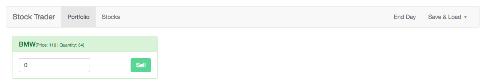

# Connecting the Portfolio with Vuex

With the `individual stock` setup in the `Portfolio.vue` file we want to get all our `stocks` here. In the default object here we'll have `computed properties` and here we'll setup our `gerrets`. Actually we are interested in only one `getter`, lets's import ` mapGetters` first, and then in `computed` we'll call `mapGetters()`. As `argument` we could pass an `array` to map `stockPortfolio` which is the name of the `getter` in `portfolio.js` module, but in case in want to use different name in this file, for example 'stocks', then we'll pass in the `mapGetters` an `object`, then we map this name to the name in the `store` which is `stockPortfolio`. All that is left - we need to add `local portfolio stock` component, which we should import and register locally, and finally loop through all the `stocks` in the `template`.  We loop `v-for="stock in stocks"`, stocks now referring to our `getters`. and surelu we'll add `:stock` as a `prop`. 

**Portfolio.vue**
```html
<template>
<div>
    <app-stock v-for="(stock, index) in stocks" :key="index" :stock="stock"></app-stock> <!--loop and add prop-->
</div>
</template>

<script>
import {mapGetters} from 'vuex';  //import map getters
import Stock from './Stock.vue';  //import Stock from portfolio component

export default {
  computed:{
      ...mapGetters({
          stocks: 'stockPortfolio'
      })
  },
  components:{
    appStock: Stock //register here 
  }
}
</script>
```

For now if we buy some stocks, we'll see it in the `portfolio`. But the `sell button` is still not working. 



