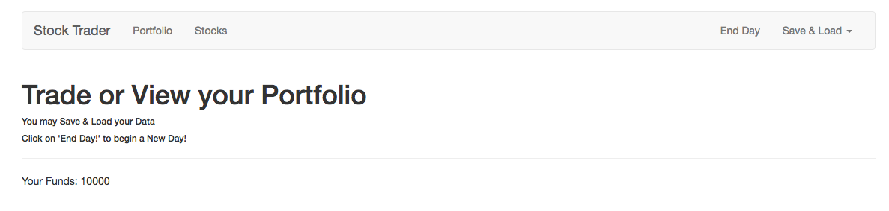
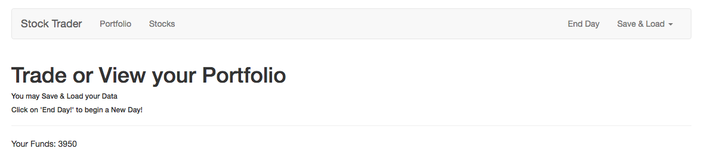
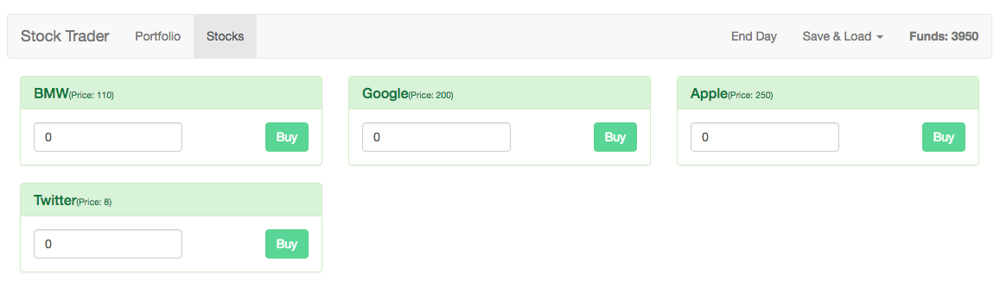

# Displaying the Funds

Let's display how much `funds` we have and let's check if they updated correctly. Once we implemented the `funds` we also need to be sure that we are able to but more than we afford. Let's start with displaying `funds`. Where do we display `funds`? In the `Home` page. Here we'll have a `paragraph` where we'll output the `funds`. But we don't have access to them yet, so let's add a `script part` fo the file where we'll export the default object, and setup a `computed property`, we'll name it `funds` and in there we'll access our `store`, then `getters` and then the `funds` to get our `funds`. 

**Home.vue**
```html
<template>
<div>
    <h1>Trade or View your Portfolio</h1>
    <h6>You may Save & Load your Data</h6>
    <h6>Click on 'End Day!' to begin a New Day!</h6>
    <hr>
    <p>Your Funds: {{ funds }}</p>
</div>
</template>

<script>
export default{
    computed:{
     funds(){
         return this.$store.getters.funds;      //get the funds 
     }
    }
}
</script>
```

Now we can see our `funds: 10000`. 



And it updates if we buy or sell stocks. 



Now with that in place let's also display it in the `Header` and let's make sure that we check our `funds` when buying stocks, as well as the `quantity` when selling them. Let's start by adding `funds` to the `header`. And here we want to display `funds` after the two links before the dropdown. We'll add a `<strong>` element where we say : Funds: {{funds}}. And we surely need to load the `funds` in the script. Let's use `computed` for this. 

**Header.vue**
```html
<template>
    <nav class="navbar navbar-default">
        <div class="container-fluid">
            <div class="navbar-header">
                <router-link to="/" class="navbar-brand">Stock Trader</router-link>
            </div>

            <div class="collapse navbar-collapse">
                <ul class="nav navbar-nav">
                    <router-link to="/portfolio" activeClass="active" tag="li"><a>Portfolio</a></router-link>
                    <router-link to="/stocks" activeClass="active" tag="li"><a>Stocks</a></router-link>
                </ul>
                <strong class="navbar-text navbar-right">Funds: {{ funds }}</strong> <!--display funds here-->
                <ul class="nav navbar-nav navbar-right">
                    <li><a href="#" >End Day</a></li>
                    <li class="dropdown">
                        <a
                                href="#"
                                class="dropdown-toggle"
                                data-toggle="dropdown"
                                role="button"
                                aria-haspopup="true"
                                aria-expanded="false">Save & Load <span class="caret"></span></a>
                        <ul class="dropdown-menu">
                            <li><a href="#" >Save Data</a></li>
                            <li><a href="#" >Load Data</a></li>
                        </ul>
                    </li>
                </ul>
            </div><!-- /.navbar-collapse -->
        </div><!-- /.container-fluid -->
    </nav>
</template>

<script>
export default{
  computed:{
      funds(){
          return this.$store.getters.funds; 
      }
  }
}
</script>
```

Looks good, we have our `funds` displayed on the very right side of our `header`.



