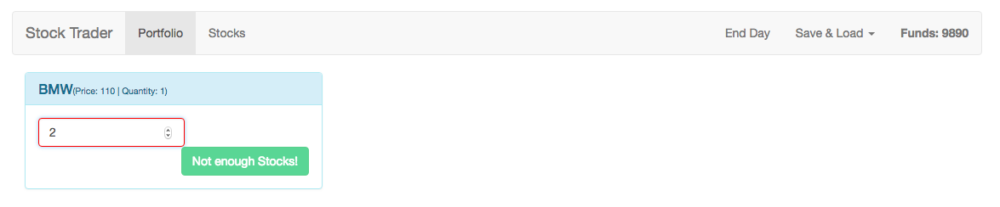

# Adding some Order Checks

So, now we wanna make sure that we don't sell more `funds` than we have, or buy more than we can afford. In order to do so we need some checks, let's start with the checks for buying stocks. In the `Stock.vue` file of the `stock component` in order to check we'll a dd a new `computed property` and in there the name of the `property` we wanna add, inside the new `computed property` which is a function we wanna return `this.quantity`- referring to the quantity we entered in the `input field`- times `this.stock.price > this.funds` (stocks passed to this component). So we do check if the `quantity` we plan to buy multiplied by the `price of the stock` is greater than `funds`; this will return `true` or `false`. With this we can go to our `button` and disable it if `insuffisientFunds()` is true. 

**Stock.vue/stocks**
```html
<template>
<div class="col-sm-6 col-md-4">
    <div class="panel panel-success">
    <div class="panel-heading">
        <h3 class="panel-title">{{stock.name}}<small>(Price: {{stock.price}})</small></h3>
    </div> 
    <div class="panel-body">
        <div class="pull-left">
           <input type="number" class="form-control" placeholder="Quantity" v-model.number="quantity">
      </div> 
      <div class="pull-right">
           <button class="btn btn-success" @click="buyStock" :disabled="insufficientFunds ||quantity <= 0 || !Number.isInteger(quantity)">Buy</button> <!--disable button if insufficient funds-->
      </div>
    </div>
    </div> 

</div>
</template>

<script>
export default{
     props: ['stock'],
    data() {
        return {
            quantity: 0
        }
    },
    computed: {            //add computed here
     insufficientFunds(){
        return this.quantity * this.stock.price > this.funds;
     }
    },
    methods:{
        buyStock(){
          const order ={
              stockId: this.stock.id,
              stockPrice: this.stock.price, 
              quantity: this.quantity 
        };
        
        this.$store.dispatch('buyStock', order);
        this.quantity = 0;
        }
    }
}
</script>
``` 

Now of course `funds` are not available yet, to make them available  we need to add a `computed property` for that. And we also want to update the text the `button` shows, we'll use interpolation for this and inside we want to check if `insufficientFunds` is `true` then we know we don't have enough so we'll print "Insufficient Funds" in this case, otherwise we'll print "Buy". 

**Stock.vue/stocks**
```html
<template>
<div class="col-sm-6 col-md-4">
    <div class="panel panel-success">
    <div class="panel-heading">
        <h3 class="panel-title">{{stock.name}}<small>(Price: {{stock.price}})</small></h3>
    </div> 
    <div class="panel-body">
        <div class="pull-left">
           <input type="number" class="form-control" placeholder="Quantity" v-model.number="quantity">
      </div> 
      <div class="pull-right">
           <button class="btn btn-success" @click="buyStock" :disabled="insufficientFunds ||quantity <= 0 || !Number.isInteger(quantity)">{{ insufficientFunds ? 'Insufficient Funds' : 'Buy' }}</button> <!--update the button-->
      </div>
    </div>
    </div> 

</div>
</template>

<script>
export default{
     props: ['stock'],
    data() {
        return {
            quantity: 0
        }
    },
    computed: { 
     funds(){         //makes funds available here
         return this.$store.getters.funds;
     },
     insufficientFunds(){
        return this.quantity * this.stock.price > this.funds;
     }
    },
    methods:{
        buyStock(){
          const order ={
              stockId: this.stock.id,
              stockPrice: this.stock.price, 
              quantity: this.quantity 
        };
        
        this.$store.dispatch('buyStock', order);
        this.quantity = 0;
        }
    }
}
</script>
``` 


We also can put the red border around the `input` in case we buy more stocks. For that let's add a dynamic class "danger" which depends on `insufficientFunds` too. And we need to create the `class` in the `<style>` section and `scope` it to this `component`. 

**Stock.vue/stocks**
```html
<template>
<div class="col-sm-6 col-md-4">
    <div class="panel panel-success">
    <div class="panel-heading">
        <h3 class="panel-title">{{stock.name}}<small>(Price: {{stock.price}})</small></h3>
    </div> 
    <div class="panel-body">
        <div class="pull-left">
           <input type="number" class="form-control" placeholder="Quantity" v-model.number="quantity" :class="{danger: insufficientFunds}"> <!--add a red border-->
      </div> 
      <div class="pull-right">
           <button class="btn btn-success" @click="buyStock" :disabled="insufficientFunds ||quantity <= 0 || !Number.isInteger(quantity)">{{ insufficientFunds ? 'Insufficient Funds' : 'Buy' }}</button> 
      </div>
    </div>
    </div> 

</div>
</template>

<script>
export default{
     props: ['stock'],
    data() {
        return {
            quantity: 0
        }
    },
    computed: { 
     funds(){         
         return this.$store.getters.funds;
     },
     insufficientFunds(){
        return this.quantity * this.stock.price > this.funds;
     }
    },
    methods:{
        buyStock(){
          const order ={
              stockId: this.stock.id,
              stockPrice: this.stock.price, 
              quantity: this.quantity 
        };
        
        this.$store.dispatch('buyStock', order);
        this.quantity = 0;
        }
    }
}
</script>

<style scoped> 
 .danger{                    /*create danger class*/
     border: 1px solid red;
 }
</style>
``` 


Now we also want to be sure that we can't sell more than we have. So, we go to our `Stock.vue` file in the `portfolio component` we'll use kind of similar check. We'll add a `computed` to add a new `property` which  is called "insufficientQuantity", there we'll return `this.quantity` referring to the quantity in the `input field` and check if it's greater than the `quantity` in our `stock`. So, if we'll try to sell more than we have we'll disable the `button` to prevent this action. And in such a case we also want to change the `button text`, and finally the same style as prevously. 

**Stock.vue/portfolio**

```html
<template>
<div class="col-sm-6 col-md-4">
    <div class="panel panel-info">
    <div class="panel-heading">
        <h3 class="panel-title">{{stock.name}}<small>(Price: {{stock.price}} | Quantity: {{stock.quantity}})</small></h3>
    </div> 
    <div class="panel-body">
        <div class="pull-left">
           <input type="number" class="form-control" placeholder="Quantity" v-model.number="quantity" :class="{danger: insufficientQuantity}">
      </div> 
      <div class="pull-right">
           <button class="btn btn-success" @click="sellStock" :disabled="insufficientQuantity ||quantity <= 0 || !Number.isInteger(quantity)">{{ insufficientQuantity ? 'Not enough Stocks!' : 'Sell'}}</button>  <!--check insufficient quantity here-->
      </div>
    </div>
    </div> 

</div>
</template>

<script>
import {mapActions} from 'vuex'

export default{
     props: ["stock"],
    data() {
        return {
            quantity: 0
        }
    },
    computed:{
      insufficientQuantity(){
        return this.quantity > this.stock.quantity  //check the quantity here
      }
    },
    methods:{
         ...mapActions({
             placeSellOrder: 'sellStock'
         }),
     sellStock(){
        const order = {
            stockId: this.stock.id,
            stockPrice: this.stock.price,
            quantity: this.quantity
        };
        this.placeSellOrder(order)
        this.quantity = 0;
        }
    }
}
</script>

<style scoped> 
 .danger{                    /*create danger class*/
     border: 1px solid red;
 }
</style>
```


