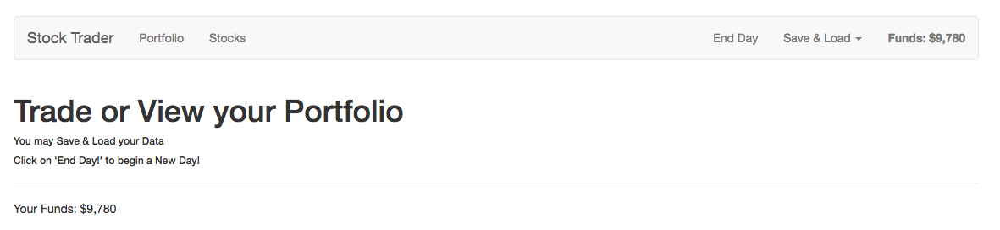

# Making Funds Look Nicer with Filters

Let's add some filters to change our `funds'` appearance. Therefore we go to our `main.js` file and create a `global filter` cos we are going to use it in two different places: `the header` and `the home` components. And we can create a new `filter` with `Vue.filter()`. Let's name it `currency` and this is a `function` where we get the `value` and then in the body of the `function` we wanna return the `transformed value`- it should have `$` at the begginning and then `value` and `toLocaleString` method. 

**main.js**
```js
import Vue from 'vue';
import VueRouter from 'vue-router';
import App from './App.vue';
import {routes} from './routes.js';
import store from './store/store';

Vue.use(VueRouter);

Vue.filter('currency', (value) => {           //create filter here 
    return '$' + value.toLocaleString();
});

const router = new VueRouter({
  routes,
  mode: 'history'
});

new Vue({
  el: '#app',
  router,
  store,
  render: h => h(App)
})
```

Now we can go to our `Header` and after `funds` displayed in the template add `currency` - the name of the filter we just created. And do the same on the `Home` page. 

**Header**
```html
<template>
    <nav class="navbar navbar-default">
        <div class="container-fluid">
            <div class="navbar-header">
                <router-link to="/" class="navbar-brand">Stock Trader</router-link>
            </div>

            <div class="collapse navbar-collapse">
                <ul class="nav navbar-nav">
                    <router-link to="/portfolio" activeClass="active" tag="li"><a>Portfolio</a></router-link>
                    <router-link to="/stocks" activeClass="active" tag="li"><a>Stocks</a></router-link>
                </ul>
                 <strong class="navbar-text navbar-right">Funds: {{ funds | currency }}</strong>  <!--add filter here-->
                <ul class="nav navbar-nav navbar-right">
                    <li><a href="#" >End Day</a></li>
                    <li class="dropdown">
                        <a
                                href="#"
                                class="dropdown-toggle"
                                data-toggle="dropdown"
                                role="button"
                                aria-haspopup="true"
                                aria-expanded="false">Save & Load <span class="caret"></span></a>
                        <ul class="dropdown-menu">
                            <li><a href="#" >Save Data</a></li>
                            <li><a href="#" >Load Data</a></li>
                        </ul>
                    </li>
                </ul>
            </div><!-- /.navbar-collapse -->
        </div><!-- /.container-fluid -->
    </nav>
</template>

<script>

export default{
  computed:{
      funds(){
          return this.$store.getters.funds; 
      }
  }
}

</script>
```

**Home.vue**
```html
<template>
<div>
    <h1>Trade or View your Portfolio</h1>
    <h6>You may Save & Load your Data</h6>
    <h6>Click on 'End Day!' to begin a New Day!</h6>
    <hr>
    <p>Your Funds: {{ funds | currency }}</p>  <!--add filter-->
</div>
</template>

<script>
export default{
    computed:{
     funds(){
         return this.$store.getters.funds;       
     }
    }
}
</script>
```



