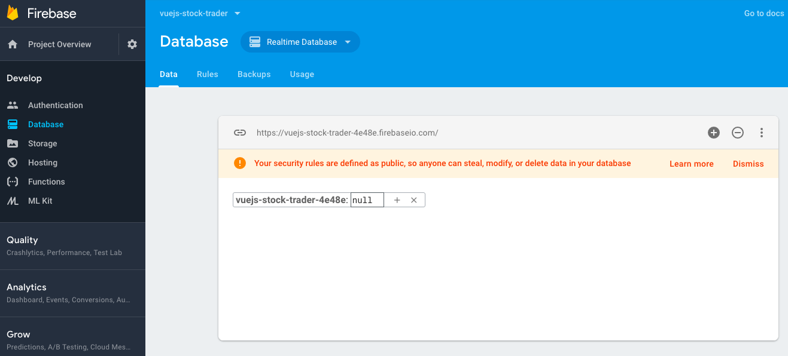

# Setting up vue-resource and Firebase

Let's add `http functionality` by firts installing `vue-resource` - `npm install --save vue-resource`, and then import it in the `main.js` file and use it. 

**main.js**
```js
import Vue from 'vue';
import VueRouter from 'vue-router';
import App from './App.vue';
import {routes} from './routes.js';
import store from './store/store';
import VueResource from 'vue-resource';  //import here 

Vue.use(VueRouter);
Vue.use(VueResource);   //use vue-resource

Vue.filter('currency', (value) => {
  return '$' + value.toLocaleString();
});

const router = new VueRouter({
  routes,
  mode: 'history'
});

new Vue({
  el: '#app',
  router,
  store,
  render: h => h(App)
})
```

Now we need to setup our bacend. We'll use `Firebase`, so we go to the console, create a new project. Inside the project the first thing we'll use is the `database` and copy the URL from there `https://vuejs-stock-trader-4e48e.firebaseio.com/`.



Now in `main.js` we'll setup the main URL we are always reaching to; `Vue.http.options` and on the options we'll set our `root URL` to the URL we just copied. With that we are sure that all `requests` will be sent to this link and then we can add the `path` we need to this link.

**main.js**
```js
import Vue from 'vue';
import VueRouter from 'vue-router';
import App from './App.vue';
import {routes} from './routes.js';
import store from './store/store';
import VueResource from 'vue-resource';  

Vue.use(VueRouter);
Vue.use(VueResource);   

Vue.http.options.root = 'https://vuejs-stock-trader-4e48e.firebaseio.com';

Vue.filter('currency', (value) => {
  return '$' + value.toLocaleString();
});

const router = new VueRouter({
  routes,
  mode: 'history'
});

new Vue({
  el: '#app',
  router,
  store,
  render: h => h(App)
})
```