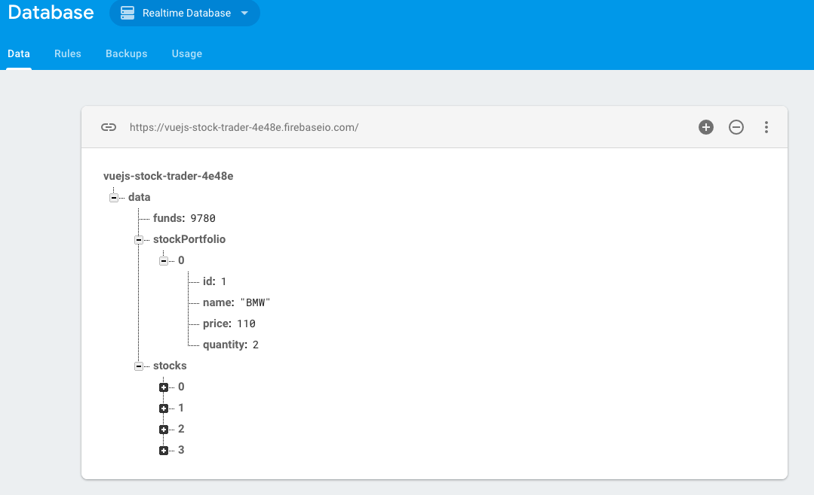

# Saving Data (PUT Request)

In our `Header.vue` file we have two `buttons`: `save data` and `load data`. First we can add a `click listner` to the `save data` button and add the `method` it will listen to, `saveData()`. We'll not use `mutations` for saving data, cos actually this action doesn't change the `state`. Instead we can basically store our `data` in a `constant` and create an `object` which includes all the `data` we need: `funds`, `stockPortfolio`, `overall stocks`, and then we can simply get this `data` with `this.$store.getters...`.  So, we are getting all the `data` from our `store` and save it in the `data constant` we created. And now we can pass this `constant` as a request. We'll use `put()` and we wanna put `data.json` that is the node we want to create and then we'll send `data` as an argument. 

**Header.vue**
```html
<template>
    <nav class="navbar navbar-default">
        <div class="container-fluid">
            <div class="navbar-header">
                <router-link to="/" class="navbar-brand">Stock Trader</router-link>
            </div>

            <div class="collapse navbar-collapse">
                <ul class="nav navbar-nav">
                    <router-link to="/portfolio" activeClass="active" tag="li"><a>Portfolio</a></router-link>
                    <router-link to="/stocks" activeClass="active" tag="li"><a>Stocks</a></router-link>
                </ul>
                 <strong class="navbar-text navbar-right">Funds: {{ funds | currency }}</strong>
                <ul class="nav navbar-nav navbar-right">
                    <li><a href="#" @click="endDay">End Day</a></li>
                    <li class="dropdown"
                    :class="{open: isDropdownOpen}"
                    @click="isDropdownOpen = !isDropdownOpen">
                        <a
                                href="#"
                                class="dropdown-toggle"
                                data-toggle="dropdown"
                                role="button"
                                aria-haspopup="true"
                                aria-expanded="false">Save & Load <span class="caret"></span></a>
                        <ul class="dropdown-menu">
                            <li><a href="#" @click="saveData">Save Data</a></li> <!--add click listner-->
                            <li><a href="#" >Load Data</a></li>
                        </ul>
                    </li>
                </ul>
            </div><!-- /.navbar-collapse -->
        </div><!-- /.container-fluid -->
    </nav>
</template>

<script>
import {mapActions} from 'vuex'; 

export default{
    data(){            
      return {
       isDropdownOpen: false
      }
    },
  computed:{
      funds(){
          return this.$store.getters.funds; 
      }
  },
  methods:{     
      ...mapActions([
          'randomizeStocks'
      ]),     
   endDay(){
      this.randomizeStocks();
   },
   saveData(){        //create save data method 
    const data = {
            funds: this.$store.getters.funds,
            stockPortfolio: this.$store.getters.stockPortfolio,
            stocks: this.$store.getters.stocks
                };
    this.$http.put('data.json', data);                   //put request
   }
  }
}

</script>
```




