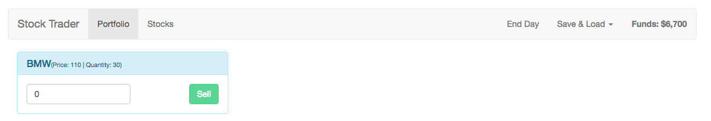

# Testing and Bug Fixes

Remember. we still have in the `Header` our `loadData()` method, and here now we need to call `loadData` action. To do this we first need to get access to it, we already have `mapActions` and in there we also map our `loadData` action from `actions.js` file. And not to have a problem we now need to rename `loadData()` cos the name we have now for both: method the `load data button` listens to and the `action`. To prevent this let's map this a bit other way, and name the `action` "fetchData" and map it to `loadData` action.  This allows us to call `loadData(){this.fetchData()}`. 

**Header.vue**
```html
<template>
    <nav class="navbar navbar-default">
        <div class="container-fluid">
            <div class="navbar-header">
                <router-link to="/" class="navbar-brand">Stock Trader</router-link>
            </div>

            <div class="collapse navbar-collapse">
                <ul class="nav navbar-nav">
                    <router-link to="/portfolio" activeClass="active" tag="li"><a>Portfolio</a></router-link>
                    <router-link to="/stocks" activeClass="active" tag="li"><a>Stocks</a></router-link>
                </ul>
                 <strong class="navbar-text navbar-right">Funds: {{ funds | currency }}</strong>
                <ul class="nav navbar-nav navbar-right">
                    <li><a href="#" @click="endDay">End Day</a></li>
                    <li class="dropdown"
                    :class="{open: isDropdownOpen}"
                    @click="isDropdownOpen = !isDropdownOpen">
                        <a
                                href="#"
                                class="dropdown-toggle"
                                data-toggle="dropdown"
                                role="button"
                                aria-haspopup="true"
                                aria-expanded="false">Save & Load <span class="caret"></span></a>
                        <ul class="dropdown-menu">
                            <li><a href="#" @click="saveData">Save Data</a></li>
                            <li><a href="#" @click="loadData">Load Data</a></li>
                        </ul>
                    </li>
                </ul>
            </div><!-- /.navbar-collapse -->
        </div><!-- /.container-fluid -->
    </nav>
</template>

<script>
import {mapActions} from 'vuex'; 

export default{
    data(){           
      return {
       isDropdownOpen: false
      }
    },
  computed:{
      funds(){
          return this.$store.getters.funds; 
      }
  },
  methods:{     
      ...mapActions({
          randomizeStocks: 'randomizeStocks',
          fetchData: 'loadData'    //map load data action
      }),     
   endDay(){
      this.randomizeStocks();
   },
   saveData(){
       const data = {
                    funds: this.$store.getters.funds,
                    stockPortfolio: this.$store.getters.stockPortfolio,
                    stocks: this.$store.getters.stocks
                };
                this.$http.put('data.json', data);
   },
  loadData(){
     this.fetchData();  //call fetchData
}
  }
}

</script>
```

Now to make it work we need to import `action` from `actions.js` to `store.js` and add it to the `new Vuex.Store`. 

**store.js**
```js
import Vue from 'vue';
import Vuex from 'vuex';

import stocks from './modules/stocks';
import portfolio from './modules/portfolio';


import * as actions from './actions';   //import


Vue.use(Vuex);

export default new Vuex.Store({
    actions,      //add to the store
    modules: {
        stocks,
        portfolio
    }
});
```

Now if we push `load data` button the `portfolio` will be updated. 



