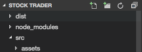
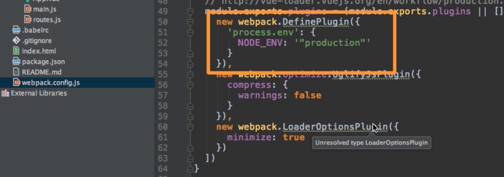
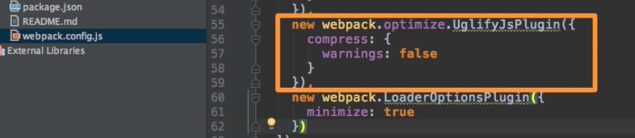

# Preparing for Deployment

With running `npm run build` command we prepare a project for `deployment`. This will give us a new folder, the `dist` folder, which holds `build.js` file, the file we need to `deploy` together with our `index.html` file to make our application work on a `server`. 

In `webpack simple` template, as well as in the other templates, created by `Vue-cli` everithyng is alredy configured to be deployment ready. In case we don't use the templates lets look at the `webpack.config.js` file. The important part here is the `DefinePlugin`. 

Here we basically set the `mode` to `production`, which will strip out some additional warnings VueJs would throw otherwise, this will reduce the file size because we don't need the warnings anymore, and it also makes sure that our `deployed application` doesn't give some possibly meaningful warnings to the visitiors of the app.  

Then we also have `OptimizePlugin` which minifies everything, which means shortens the words, makes everything more compact. 

