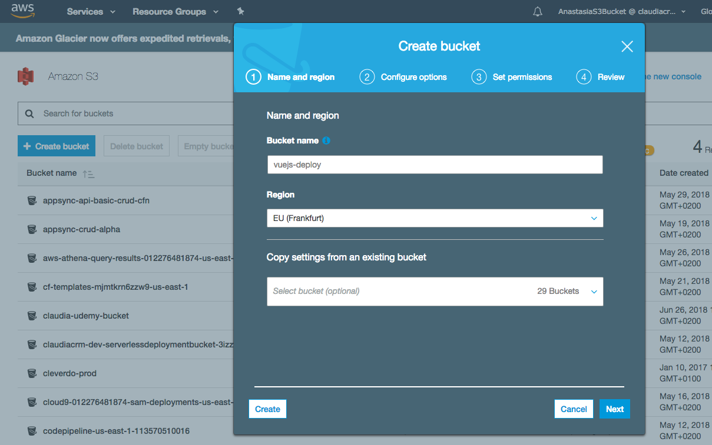
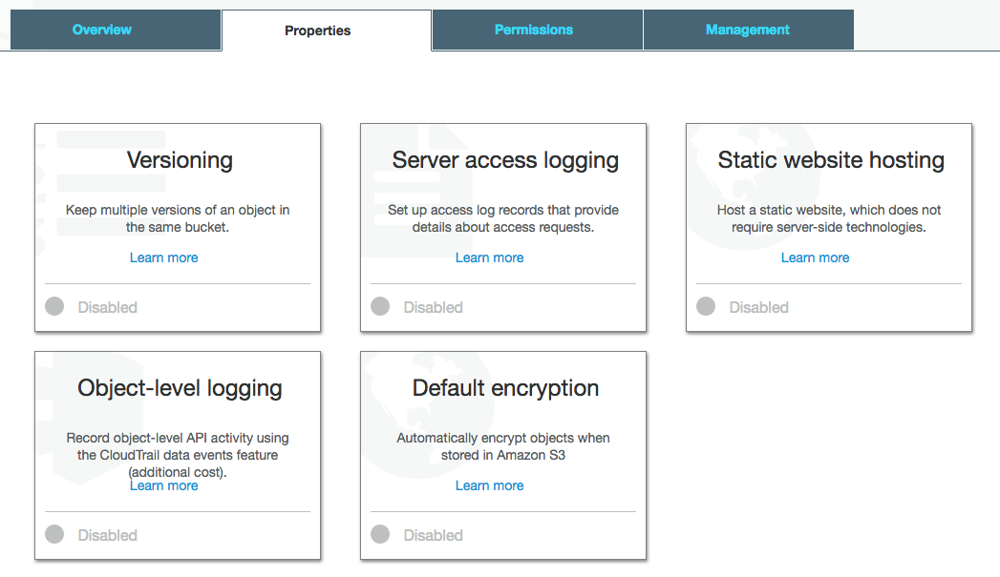
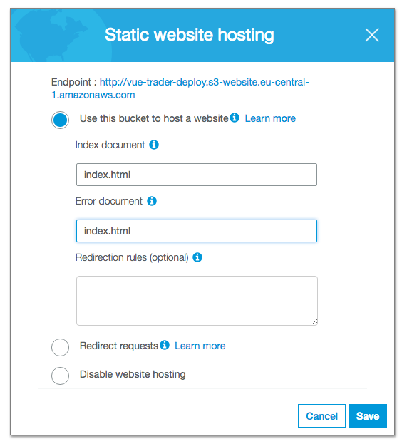
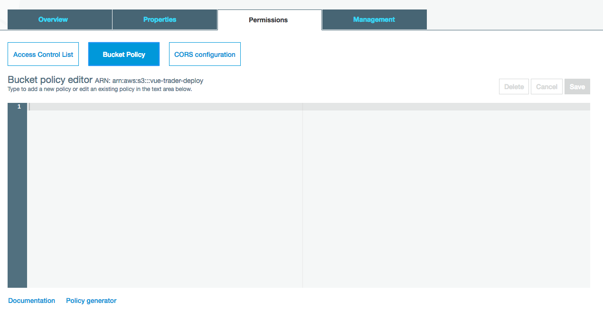
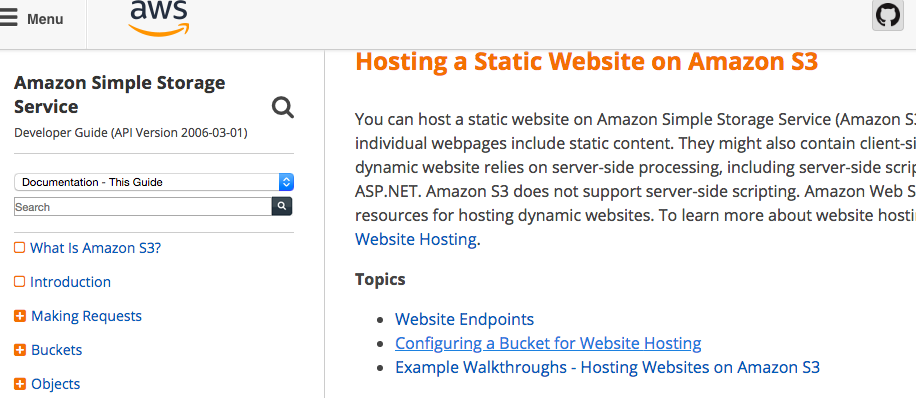
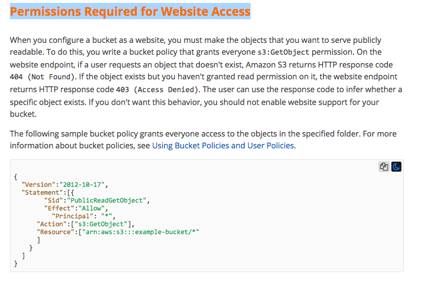
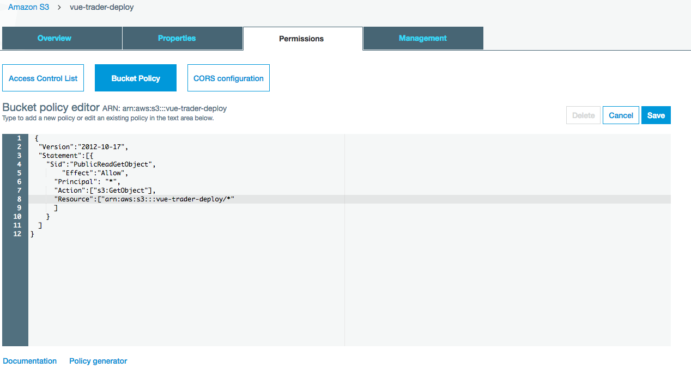
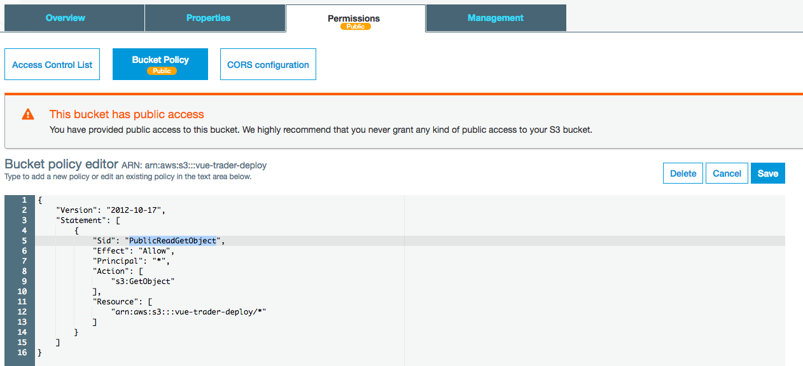
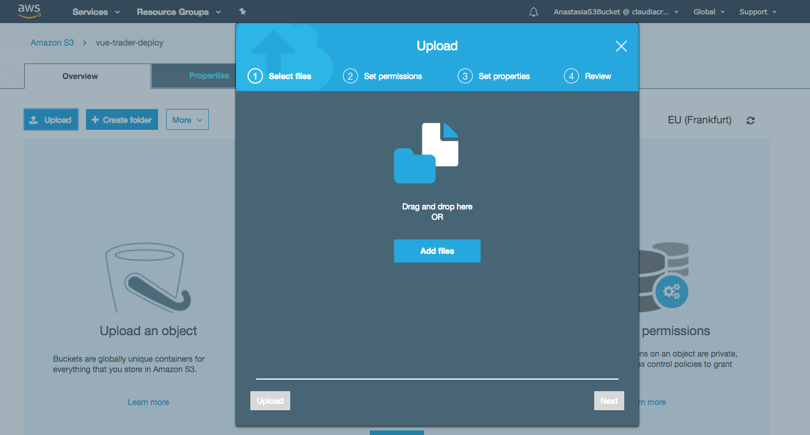
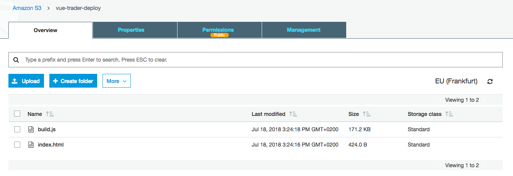

# Deploying the App (AWS S3)

AWS - Amazon Web Services. We'll use `S3` which is `cloud storage service` and it also allows us to host `single page` applications, static applications where you don't need to run any server side code. So, we'll create a new `bucket` and give it a name. 

There are a couple of things we need to setup here to enable it to `website hosting`, most important is `static website hosting`, and we need to enable it. 

In the `index document` input will be the `index.html` file, as in the `error document input`. **Important:** we need to setup the `error document input` to make sure that in case of `404 error` we are getting back our `index.html`, otherwise the `routes` we have in our `frontend application` willnot be recognised.

Now we also need to add `permisions` to make sure people are able to view our page. So, we go to `permisions` and open `bucket policy`.

And for the policy to use we google for `aws static webpage` and at the end of the article we'll see `configure your buckets` step, which gives us the `Permissions Required for Website Access` we should copy into our `bucket policy`. 

In the `resource` part of the `permision code` we need to change the `example.bucket` to our `bucket` - `vue-trader-deploy` in our case. 

For deploying the webpage we'll need to create `index.html` file, and we already did this. And now we may upload the files we wanna upload here. For that we go to our `bucket` and click `upload`. 

And now we go to our project and take `index.html` file and `build.js` file from the `dist folder`. 

Then it's better to create a `dist folder` and put there the `build.js` file. Go to properties of the `bucket` and click `endpoint` to open the domain. 
