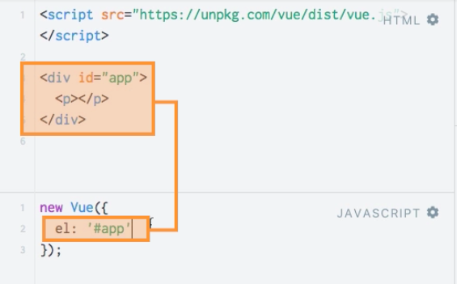

# Getting Started

We start at [vuejs.org](https://vuejs.org/) - an official home page, and install `Vuejs`. The easiest way is to do it through CDN.

**HTML**

```html
<script src=="https://cdn.jsdelivr.net/npm/vue/dist/vue.js"></script>
<div id="app">
<p></p>
</div>
```

In order to manipulate the `html` template we need to create in JS a new `Vue instance`. `Vue instance` is the core of each `Vue` application, of each of piece of code you wanna use `Vuejs` in. We create such instances and then these instances have one major job - controle theis own template of code of `html code` which they render to the screen. In order to do this we need to pass an `argument` in our `Vue()` constructor `function`. The `argument` is a JS `object`. And there we have one very important `property` `Vuejs` will recognise - an `element`. `El` takes a string as a `value`. And with this `string` we setup which part of our html code should be under controle of our `vue instance`. Under control here means - we can change it through `vue instance`. 

**JS**

```js
new Vue ({
el : '#app'
})
```


Now in order to output something we need some data. `Vuejs` has a special property for this - the `data` property. And this is an `object`. And there we store all the data we wanna use in this `vue instance`. 

**JS**

```js
new Vue ({
el : '#app'
data : {
    title : 'Hello World!'
}
})
```

In `html` we should add a special syntax to let `vuejs` recognise the thing we wanna do - this are double curly braces `{{}}`. Vuejs will automatically log into this `data` object : "*Look at this `object`, find the `title` property an oputput it here*". 

**HTML**

```html
<script src=="https://cdn.jsdelivr.net/npm/vue/dist/vue.js"></script>
<div id="app">
<p>{{title}}</p>
</div>
```


