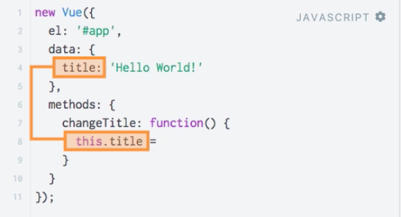

# Extending the Vuejs Application

Lets add `input` to our html. We wanna allow the user to type something and then update our `title`. We can do this by adding a command (instructions which Vuejs will recignise), this is called a `directive`. The `directive` tells the Vuejs - in our example (we use `v-on`) - please, listen to this event. The `event` we pass as an `argument`. And  `arguments`  are passed to `directives` by adding a `:` and then the name of the `argument`. In our case this is `input` event. then we assign a `value` to it, and between the quotation marks we would now write a code which we wanna execute whenever this gets updated. In our case we wanna call a `method` - `"changeTitle"`. This `method` doesn't exist yes. Now we should create it in our `vue instance`.


**HTML**

```html
<script src="https://cdn.jsdelivr.net/npm/vue/dist/vue.js"></script>
<div id="app">
<input type="text" v-on:input="changeTitle">
<p>{{title}}</p>
</div>
```

Vuejs also has a `methods` property. `Methods` is an `object`, and here we can simply setup all the `methods` we wanna use in our template or from within our `vue instance`. So, our `method` (a `function` in an object) and we use the `this` keyword. `This` keyword is referring to the `object` to the top of `vue instance` automatically. It's important to keep in mind - we got access to all the `properties` stored in `data` and also all the methods stored in `methods` by accessing them by `this` keyword and then the name. 

**JS**

```js
new Vue ({
el : '#app'
data : {
    title : 'Hello World!'
}
methods : {
    changeTitle: function (){
        this.title = 
    }
}
})
```



Now we wanna assign the `value` entered into the `input`. Thankfully, as in Vanilla JS there is an `event` object being created automatically for us. This is nothing to do with Vuejs, this is just the Vanilla JS and how the DOM works. We get this `event` object which also stores the target of the `event`, which of course will be our `input` field. So, this `event` object whic was created automatically by JS, is passed to this `method` automatically by Vuejs. This `event` object has a `target` property, and we know that that `target` will be the `input` field holding the `value` the user entered - `this.title = event.target.value`. 

**JS**

```js
new Vue ({
el : '#app'
data : {
    title : 'Hello World!'
}
methods : {
    changeTitle: function (event){
        this.title = event.target.value; 
    }
}
})
```