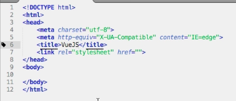
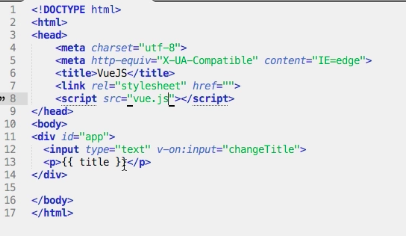
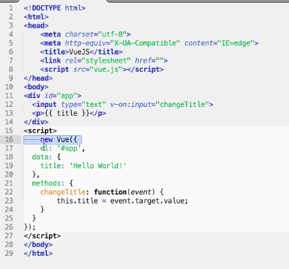

# Setup VueJS Locally

You can [download VueJs](https://vuejs.org/v2/guide/installation.html) to use it locally. 
So, we download it, store it in any file and open up our favourite editor. We setup our default `html` sceletton. 

And then we have to go to `JS fiddle`, copy all the `html code` and paste into `body` section. 

And we also add our script with the `vue-instance`. And save `html` file in the same folder where `VueJs` lives. 

