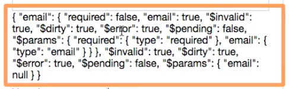

# Adding a Validator

Let's say we wanna make sure that our `email adress` in the `signup.vue` file is not empty and that is also a valid `email address`. We first of all need to unlock the `vuelidate` package, and for that we should go to our `main.js` file where we start the application and import `vuelidate` from `vuelidate package`. As the next step we'll use our `vue package` itself with the `Vue.use()` to use the `vuelidate` package. With that we can now use `vuelidate` features in our `computnents` and `instances`. 

**main.js**
```js
import Vue from 'vue'
import App from './App.vue'
import axios from 'axios'
import Vuelidate from 'vuelidate'   //import 

import router from './router'
import store from './store'

Vue.use(Vuelidate);   //use here


axios.defaults.baseURL = 'https://vuejs-validation-89edc.firebaseio.com'
// axios.defaults.headers.common['Authorization'] = 'fasfdsa'
axios.defaults.headers.get['Accepts'] = 'application/json'

const reqInterceptor = axios.interceptors.request.use(config => {
  console.log('Request Interceptor', config)
  return config
})
const resInterceptor = axios.interceptors.response.use(res => {
  console.log('Response Interceptor', res)
  return res
})

axios.interceptors.request.eject(reqInterceptor)
axios.interceptors.response.eject(resInterceptor)

new Vue({
  el: '#app',
  router,
  store,
  render: h => h(App)
})
```

Now we can add a `special property` to the `component` - `validations`- in the script object. And now in `validations` we can setup validations we wanna use in our form. For that we'll use some `keys` to identify our `form controls`, and here is **important** this has to be named "email", it has to have the same name as the `property` we are binding to with `v-model`, that's required by `vuelidate`. So, we name the `property` "email" and email then takes an `object` where we configure the `validators` we want to register for this `control`. And for that we need to import some `validators` cos the `vuelidate package` allows us to create our own `validators` also ships with the more common ones, so, we can import them from `vuelidate/lib/validators` - from this package we can install some `validators`, the full list of `validators` can be found on the [vuelidate documentation page](https://monterail.github.io/vuelidate/#sub-builtin-validators). We are interested in two `validators`: the `required validator` which checks if the field is not empty, and the `email validator` which checks if it's a valid email address. Now we can assign these two `validatiors` to our `email control property`. And we do this by simply adding then as `properties`. Now these two `validators` are registered for the `email`. Now we can connect the `email validation rule` we setup in js code with `validations property` to our `template`. To connect it we register the `input event`, in here we can access special `$v` property, it is exposed by the `vuelidate package`; `$v` gives us acces to the `validators`. On `$v` we can access any `validation rule` or control we setup, in our case "email", on this we can access a `method` which is `$touch()`. `$touch()` is a `method` which is automatically exposed and added by the `vuelidate package`. 

**signup.vue**
```html
<template>
  <div id="signup">
    <div class="signup-form">
      <form @submit.prevent="onSubmit">
        <div class="input">
          <label for="email">Mail</label>
          <input
                  type="email"
                  id="email"
                  @input="$v.email.$touch()"         
                  v-model="email">    <!--register input event-->
        </div>
        <div class="input">
          <label for="age">Your Age</label>
          <input
                  type="number"
                  id="age"
                  v-model.number="age">
        </div>
        <div class="input">
          <label for="password">Password</label>
          <input
                  type="password"
                  id="password"
                  v-model="password">
        </div>
        <div class="input">
          <label for="confirm-password">Confirm Password</label>
          <input
                  type="password"
                  id="confirm-password"
                  v-model="confirmPassword">
        </div>
        <div class="input">
          <label for="country">Country</label>
          <select id="country" v-model="country">
            <option value="usa">USA</option>
            <option value="india">India</option>
            <option value="uk">UK</option>
            <option value="germany">Germany</option>
          </select>
        </div>
        <div class="hobbies">
          <h3>Add some Hobbies</h3>
          <button @click="onAddHobby" type="button">Add Hobby</button>
          <div class="hobby-list">
            <div
                    class="input"
                    v-for="(hobbyInput, index) in hobbyInputs"
                    :key="hobbyInput.id">
              <label :for="hobbyInput.id">Hobby #{{ index }}</label>
              <input
                      type="text"
                      :id="hobbyInput.id"
                      v-model="hobbyInput.value">
              <button @click="onDeleteHobby(hobbyInput.id)" type="button">X</button>
            </div>
          </div>
        </div>
        <div class="input inline">
          <input type="checkbox" id="terms" v-model="terms">
          <label for="terms">Accept Terms of Use</label>
        </div>
        <div class="submit">
          <button type="submit">Submit</button>
        </div>
      </form>
    </div>
  </div>
</template>

<script>
  import {required, email} from 'vuelidate/lib/validators'       //import validators
  export default {
    data () {
      return {
        email: '',
        age: null,
        password: '',
        confirmPassword: '',
        country: 'usa',
        hobbyInputs: [],
        terms: false
      }
    },
    validations: {        //create validations property here
       email:{
        required,      //assign validators as properties; it's the shorthand for required: required
        email
       }
    }, 
    methods: {
      onAddHobby () {
        const newHobby = {
          id: Math.random() * Math.random() * 1000,
          value: ''
        }
        this.hobbyInputs.push(newHobby)
      },
      onDeleteHobby (id) {
        this.hobbyInputs = this.hobbyInputs.filter(hobby => hobby.id !== id)
      },
      onSubmit () {
        const formData = {
          email: this.email,
          age: this.age,
          password: this.password,
          confirmPassword: this.confirmPassword,
          country: this.country,
          hobbies: this.hobbyInputs.map(hobby => hobby.value),
          terms: this.terms
        }
        console.log(formData)
        this.$store.dispatch('signup', formData)
      }
    }
  }
</script>

<style scoped>
  .signup-form {
    width: 400px;
    margin: 30px auto;
    border: 1px solid #eee;
    padding: 20px;
    box-shadow: 0 2px 3px #ccc;
  }

  .input {
    margin: 10px auto;
  }

  .input label {
    display: block;
    color: #4e4e4e;
    margin-bottom: 6px;
  }

  .input.inline label {
    display: inline;
  }

  .input input {
    font: inherit;
    width: 100%;
    padding: 6px 12px;
    box-sizing: border-box;
    border: 1px solid #ccc;
  }

  .input.inline input {
    width: auto;
  }

  .input input:focus {
    outline: none;
    border: 1px solid #521751;
    background-color: #eee;
  }

  .input select {
    border: 1px solid #ccc;
    font: inherit;
  }

  .hobbies button {
    border: 1px solid #521751;
    background: #521751;
    color: white;
    padding: 6px;
    font: inherit;
    cursor: pointer;
  }

  .hobbies button:hover,
  .hobbies button:active {
    background-color: #8d4288;
  }

  .hobbies input {
    width: 90%;
  }

  .submit button {
    border: 1px solid #521751;
    color: #521751;
    padding: 10px 20px;
    font: inherit;
    cursor: pointer;
  }

  .submit button:hover,
  .submit button:active {
    background-color: #521751;
    color: white;
  }

  .submit button[disabled],
  .submit button[disabled]:hover,
  .submit button[disabled]:active {
    border: 1px solid #ccc;
    background-color: transparent;
    color: #ccc;
    cursor: not-allowed;
  }
</style>
```
That is what `$v` holds: 



