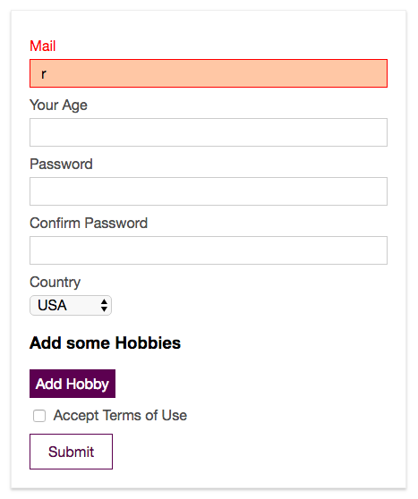
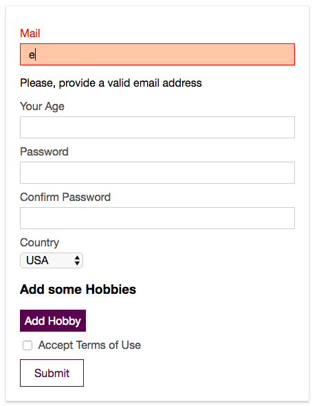

# Adding Validation - UI Feedback

Let's work on the `user exparience`. Let's style our `input` differently if it is invalid. For this we'll conditionally add a `class` to the `div` which hold the `label` and the `input` itself. We'll bind a `class` to the `div` with `:class` and we wanna bind it to a js `object` where we set the `invalid` property if `$v.email.$error` is true. Then in order to see smth we also need to prepare some `invalid style`. For that in the `<style>` we'll add a new style below all `input styles` we alredy have. We'll put `.input` class which the `div` has then `.input.invalid` - invalid is the next class - then any `input` which is nested inside of this should have a certain `border` and a `background color`. We also want to style the `label` differently `.input.invalid label {}` and there we wanna style the `text color` 

**signup.vue**
```html
<template>
  <div id="signup">
    <div class="signup-form">
      <form @submit.prevent="onSubmit">
        <div class="input" :class="{invalid: $v.email.$error}">  <!--bind a class-->
          <label for="email">Mail</label>
          <input
                  type="email"
                  id="email"
                  @input="$v.email.$touch()"         
                  v-model="email">    
        </div>
        <div class="input">
          <label for="age">Your Age</label>
          <input
                  type="number"
                  id="age"
                  v-model.number="age">
        </div>
        <div class="input">
          <label for="password">Password</label>
          <input
                  type="password"
                  id="password"
                  v-model="password">
        </div>
        <div class="input">
          <label for="confirm-password">Confirm Password</label>
          <input
                  type="password"
                  id="confirm-password"
                  v-model="confirmPassword">
        </div>
        <div class="input">
          <label for="country">Country</label>
          <select id="country" v-model="country">
            <option value="usa">USA</option>
            <option value="india">India</option>
            <option value="uk">UK</option>
            <option value="germany">Germany</option>
          </select>
        </div>
        <div class="hobbies">
          <h3>Add some Hobbies</h3>
          <button @click="onAddHobby" type="button">Add Hobby</button>
          <div class="hobby-list">
            <div
                    class="input"
                    v-for="(hobbyInput, index) in hobbyInputs"
                    :key="hobbyInput.id">
              <label :for="hobbyInput.id">Hobby #{{ index }}</label>
              <input
                      type="text"
                      :id="hobbyInput.id"
                      v-model="hobbyInput.value">
              <button @click="onDeleteHobby(hobbyInput.id)" type="button">X</button>
            </div>
          </div>
        </div>
        <div class="input inline">
          <input type="checkbox" id="terms" v-model="terms">
          <label for="terms">Accept Terms of Use</label>
        </div>
        <div class="submit">
          <button type="submit">Submit</button>
        </div>
      </form>
    </div>
  </div>
</template>

<script>
  import {required, email} from 'vuelidate/lib/validators'       
  export default {
    data () {
      return {
        email: '',
        age: null,
        password: '',
        confirmPassword: '',
        country: 'usa',
        hobbyInputs: [],
        terms: false
      }
    },
    validations: {        
       email:{
        required,      
        email
       }
    }, 
    methods: {
      onAddHobby () {
        const newHobby = {
          id: Math.random() * Math.random() * 1000,
          value: ''
        }
        this.hobbyInputs.push(newHobby)
      },
      onDeleteHobby (id) {
        this.hobbyInputs = this.hobbyInputs.filter(hobby => hobby.id !== id)
      },
      onSubmit () {
        const formData = {
          email: this.email,
          age: this.age,
          password: this.password,
          confirmPassword: this.confirmPassword,
          country: this.country,
          hobbies: this.hobbyInputs.map(hobby => hobby.value),
          terms: this.terms
        }
        console.log(formData)
        this.$store.dispatch('signup', formData)
      }
    }
  }
</script>

<style scoped>
  .signup-form {
    width: 400px;
    margin: 30px auto;
    border: 1px solid #eee;
    padding: 20px;
    box-shadow: 0 2px 3px #ccc;
  }

  .input {
    margin: 10px auto;
  }

  .input label {
    display: block;
    color: #4e4e4e;
    margin-bottom: 6px;
  }

  .input.inline label {
    display: inline;
  }

  .input input {
    font: inherit;
    width: 100%;
    padding: 6px 12px;
    box-sizing: border-box;
    border: 1px solid #ccc;
  }

  .input.inline input {
    width: auto;
  }

  .input input:focus {
    outline: none;
    border: 1px solid #521751;
    background-color: #eee;
  }

  .input select {
    border: 1px solid #ccc;
    font: inherit;
  }

   .input.invalid label{      /*set style for the invalid label here*/
      color: red
  }

  .input.invalid input{      /*set style for the invalid input here*/
      border: 1px solid red;
      background-color: #ffc9aa
  }

  .hobbies button {
    border: 1px solid #521751;
    background: #521751;
    color: white;
    padding: 6px;
    font: inherit;
    cursor: pointer;
  }

  .hobbies button:hover,
  .hobbies button:active {
    background-color: #8d4288;
  }

  .hobbies input {
    width: 90%;
  }

  .submit button {
    border: 1px solid #521751;
    color: #521751;
    padding: 10px 20px;
    font: inherit;
    cursor: pointer;
  }

  .submit button:hover,
  .submit button:active {
    background-color: #521751;
    color: white;
  }

  .submit button[disabled],
  .submit button[disabled]:hover,
  .submit button[disabled]:active {
    border: 1px solid #ccc;
    background-color: transparent;
    color: #ccc;
    cursor: not-allowed;
  }
</style>
```

Now we give the user some visual feedback of the invalid input. 


We can also add an `error message`. So, below the `email input` we could add a `paragraph` where we say: Please, provide a valid email address. And then we could check if we wanna show this with `v-if`. And we can either show it if `$v.email.$error` is `true` - in any error case -  or  if it's an invalid email `!$v.emil.email`. As well as we can add more messages, e.g "This field must not be empty", and bind it with the `required` validator. 

**signup.vue**
```html
<template>
  <div id="signup">
    <div class="signup-form">
      <form @submit.prevent="onSubmit">
        <div class="input" :class="{invalid: $v.email.$error}"> 
          <label for="email">Mail</label>
          <input
                  type="email"
                  id="email"
                  @input="$v.email.$touch()"         
                  v-model="email">   
                  <p v-if="!$v.email.email">Please, provide a valid email address</p> <!--add message here-->
                  <p v-if="!$v.email.required">This field must not be empty</p>
        </div>
        <div class="input">
          <label for="age">Your Age</label>
          <input
                  type="number"
                  id="age"
                  v-model.number="age">
        </div>
        <div class="input">
          <label for="password">Password</label>
          <input
                  type="password"
                  id="password"
                  v-model="password">
        </div>
        <div class="input">
          <label for="confirm-password">Confirm Password</label>
          <input
                  type="password"
                  id="confirm-password"
                  v-model="confirmPassword">
        </div>
        <div class="input">
          <label for="country">Country</label>
          <select id="country" v-model="country">
            <option value="usa">USA</option>
            <option value="india">India</option>
            <option value="uk">UK</option>
            <option value="germany">Germany</option>
          </select>
        </div>
        <div class="hobbies">
          <h3>Add some Hobbies</h3>
          <button @click="onAddHobby" type="button">Add Hobby</button>
          <div class="hobby-list">
            <div
                    class="input"
                    v-for="(hobbyInput, index) in hobbyInputs"
                    :key="hobbyInput.id">
              <label :for="hobbyInput.id">Hobby #{{ index }}</label>
              <input
                      type="text"
                      :id="hobbyInput.id"
                      v-model="hobbyInput.value">
              <button @click="onDeleteHobby(hobbyInput.id)" type="button">X</button>
            </div>
          </div>
        </div>
        <div class="input inline">
          <input type="checkbox" id="terms" v-model="terms">
          <label for="terms">Accept Terms of Use</label>
        </div>
        <div class="submit">
          <button type="submit">Submit</button>
        </div>
      </form>
    </div>
  </div>
</template>

<script>
  import {required, email} from 'vuelidate/lib/validators'       
  export default {
    data () {
      return {
        email: '',
        age: null,
        password: '',
        confirmPassword: '',
        country: 'usa',
        hobbyInputs: [],
        terms: false
      }
    },
    validations: {        
       email:{
        required,      
        email
       }
    }, 
    methods: {
      onAddHobby () {
        const newHobby = {
          id: Math.random() * Math.random() * 1000,
          value: ''
        }
        this.hobbyInputs.push(newHobby)
      },
      onDeleteHobby (id) {
        this.hobbyInputs = this.hobbyInputs.filter(hobby => hobby.id !== id)
      },
      onSubmit () {
        const formData = {
          email: this.email,
          age: this.age,
          password: this.password,
          confirmPassword: this.confirmPassword,
          country: this.country,
          hobbies: this.hobbyInputs.map(hobby => hobby.value),
          terms: this.terms
        }
        console.log(formData)
        this.$store.dispatch('signup', formData)
      }
    }
  }
</script>

<style scoped>
  .signup-form {
    width: 400px;
    margin: 30px auto;
    border: 1px solid #eee;
    padding: 20px;
    box-shadow: 0 2px 3px #ccc;
  }

  .input {
    margin: 10px auto;
  }

  .input label {
    display: block;
    color: #4e4e4e;
    margin-bottom: 6px;
  }

  .input.inline label {
    display: inline;
  }

  .input input {
    font: inherit;
    width: 100%;
    padding: 6px 12px;
    box-sizing: border-box;
    border: 1px solid #ccc;
  }

  .input.inline input {
    width: auto;
  }

  .input input:focus {
    outline: none;
    border: 1px solid #521751;
    background-color: #eee;
  }

  .input select {
    border: 1px solid #ccc;
    font: inherit;
  }

   .input.invalid label{      
      color: red
  }

  .input.invalid input{      
      border: 1px solid red;
      background-color: #ffc9aa
  }

  .hobbies button {
    border: 1px solid #521751;
    background: #521751;
    color: white;
    padding: 6px;
    font: inherit;
    cursor: pointer;
  }

  .hobbies button:hover,
  .hobbies button:active {
    background-color: #8d4288;
  }

  .hobbies input {
    width: 90%;
  }

  .submit button {
    border: 1px solid #521751;
    color: #521751;
    padding: 10px 20px;
    font: inherit;
    cursor: pointer;
  }

  .submit button:hover,
  .submit button:active {
    background-color: #521751;
    color: white;
  }

  .submit button[disabled],
  .submit button[disabled]:hover,
  .submit button[disabled]:active {
    border: 1px solid #ccc;
    background-color: transparent;
    color: #ccc;
    cursor: not-allowed;
  }
</style>
```



