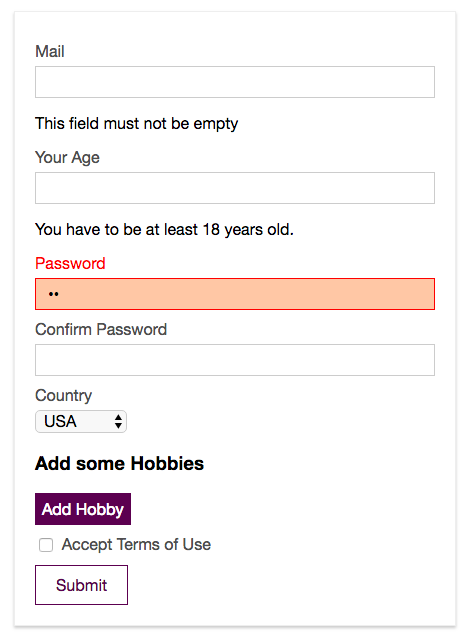
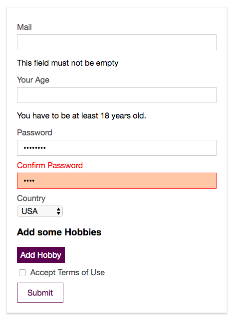

# Validating Passwords for Equality

Let's work on the `password validation`. This is kind of special, cos passwords should be equal. In the `validations property` let's create a new control and name it "password". We definitely  want this to be required, so we'll use `required validator`, and we also want to be sure e.g it has a minimum length. For that let's import `minLength` validator, and then use this `minLenght()` function, where we need to pass the length, e.g at least six caracters. Then we should check if it's valid or not, we'll bind a `div` in which `password input` lives with the class - `:class="{invalid: $v.password.$error}"`. Now we need to connect the `password control` to the `password input` in the template, we'll do this with `@blur` event. 

**signup.vue**
```html
<template>
  <div id="signup">
    <div class="signup-form">
      <form @submit.prevent="onSubmit">
        <div class="input" :class="{invalid: $v.email.$error}"> 
          <label for="email">Mail</label>
          <input
                  type="email"
                  id="email"
                  @blur="$v.email.$touch()"        
                  v-model="email">    
                  <p v-if="!$v.email.email">Please, provide a valid email address</p> 
                  <p v-if="!$v.email.required">This field must not be empty</p>
        </div>
        <div class="input" :class="{invalid: $v.age.$error}"> 
          <label for="age">Your Age</label>
          <input
                  type="number"
                  id="age"
                  @blur="$v.age.$touch()"     
                  v-model.number="age">  
                  <p>You have to be at least {{ $v.age.$params.minVal.min}} years old.</p>  
        </div>
        <div class="input" :class="{invalid: $v.password.$error}">  <!--check if valid-->
          <label for="password">Password</label>
          <input
                  type="password"
                  id="password"
                  @blur="$v.password.$touch()"  
                  v-model="password"><!--connect to the control-->
        </div>
        <div class="input">
          <label for="confirm-password">Confirm Password</label>
          <input
                  type="password"
                  id="confirm-password"
                  v-model="confirmPassword">
        </div>
        <div class="input">
          <label for="country">Country</label>
          <select id="country" v-model="country">
            <option value="usa">USA</option>
            <option value="india">India</option>
            <option value="uk">UK</option>
            <option value="germany">Germany</option>
          </select>
        </div>
        <div class="hobbies">
          <h3>Add some Hobbies</h3>
          <button @click="onAddHobby" type="button">Add Hobby</button>
          <div class="hobby-list">
            <div
                    class="input"
                    v-for="(hobbyInput, index) in hobbyInputs"
                    :key="hobbyInput.id">
              <label :for="hobbyInput.id">Hobby #{{ index }}</label>
              <input
                      type="text"
                      :id="hobbyInput.id"
                      v-model="hobbyInput.value">
              <button @click="onDeleteHobby(hobbyInput.id)" type="button">X</button>
            </div>
          </div>
        </div>
        <div class="input inline">
          <input type="checkbox" id="terms" v-model="terms">
          <label for="terms">Accept Terms of Use</label>
        </div>
        <div class="submit">
          <button type="submit">Submit</button>
        </div>
      </form>
    </div>
  </div>
</template>

<script>
  import {required, email, numeric, minValue, minLength} from 'vuelidate/lib/validators'  //import minLenght   
  export default {
    data () {
      return {
        email: '',
        age: null,
        password: '',
        confirmPassword: '',
        country: 'usa',
        hobbyInputs: [],
        terms: false
      }
    },
    validations: {        
       email:{
        required,      
        email
       },
       age: {      
        required,     
        numeric,
        minVal: minValue(18)    
       },
       password:{          //create password control
         required,
         minLen: minLength(6)    //pass the length 
       }
    }, 
    methods: {
      onAddHobby () {
        const newHobby = {
          id: Math.random() * Math.random() * 1000,
          value: ''
        }
        this.hobbyInputs.push(newHobby)
      },
      onDeleteHobby (id) {
        this.hobbyInputs = this.hobbyInputs.filter(hobby => hobby.id !== id)
      },
      onSubmit () {
        const formData = {
          email: this.email,
          age: this.age,
          password: this.password,
          confirmPassword: this.confirmPassword,
          country: this.country,
          hobbies: this.hobbyInputs.map(hobby => hobby.value),
          terms: this.terms
        }
        console.log(formData)
        this.$store.dispatch('signup', formData)
      }
    }
  }
</script>

<style scoped>
  .signup-form {
    width: 400px;
    margin: 30px auto;
    border: 1px solid #eee;
    padding: 20px;
    box-shadow: 0 2px 3px #ccc;
  }

  .input {
    margin: 10px auto;
  }

  .input label {
    display: block;
    color: #4e4e4e;
    margin-bottom: 6px;
  }

  .input.inline label {
    display: inline;
  }

  .input input {
    font: inherit;
    width: 100%;
    padding: 6px 12px;
    box-sizing: border-box;
    border: 1px solid #ccc;
  }

  .input.inline input {
    width: auto;
  }

  .input input:focus {
    outline: none;
    border: 1px solid #521751;
    background-color: #eee;
  }

  .input select {
    border: 1px solid #ccc;
    font: inherit;
  }

   .input.invalid label{      
      color: red
  }

  .input.invalid input{      
      border: 1px solid red;
      background-color: #ffc9aa
  }

  .hobbies button {
    border: 1px solid #521751;
    background: #521751;
    color: white;
    padding: 6px;
    font: inherit;
    cursor: pointer;
  }

  .hobbies button:hover,
  .hobbies button:active {
    background-color: #8d4288;
  }

  .hobbies input {
    width: 90%;
  }

  .submit button {
    border: 1px solid #521751;
    color: #521751;
    padding: 10px 20px;
    font: inherit;
    cursor: pointer;
  }

  .submit button:hover,
  .submit button:active {
    background-color: #521751;
    color: white;
  }

  .submit button[disabled],
  .submit button[disabled]:hover,
  .submit button[disabled]:active {
    border: 1px solid #ccc;
    background-color: transparent;
    color: #ccc;
    cursor: not-allowed;
  }
</style>
```



But we also wanna make sure that the second `password enter` equals to the first one. For that to our `validations` we should add one more control `confirmPassword`.  There we could also specify `required` and `minLength`, but this is not really necessary, instead we'll use a special `built-in validator` which is called `sameAs`. First we import it, then in the `confirmPassword` field we need to call `sameAs` as a `function` and to this function we can pass two types of `data`: the first is the `property name` of the `data object`, firts we'll pass `password`. Surely we'll add `@blur` event and check if it's valid. There is the second option though: we call `sameAs()` but we don't pass the `property name`, instead we can pass a `function` which recieves one `argument` which is `vue-instance` of this component, we'll name it `vm`, in the function body we can simply return the `property` we want to compare with the `value` of `confirmPassword`. This is espacially useful if we not only want to check against a certain `value` but for example we wanna check if this the old password plus "b" at the end - `return vm.password + 'b'` - which might make sence in some use cases. 

**signup.vue**
```html
<template>
  <div id="signup">
    <div class="signup-form">
      <form @submit.prevent="onSubmit">
        <div class="input" :class="{invalid: $v.email.$error}"> 
          <label for="email">Mail</label>
          <input
                  type="email"
                  id="email"
                  @blur="$v.email.$touch()"        
                  v-model="email">    
                  <p v-if="!$v.email.email">Please, provide a valid email address</p> 
                  <p v-if="!$v.email.required">This field must not be empty</p>
        </div>
        <div class="input" :class="{invalid: $v.age.$error}"> 
          <label for="age">Your Age</label>
          <input
                  type="number"
                  id="age"
                  @blur="$v.age.$touch()"     
                  v-model.number="age">  
                  <p>You have to be at least {{ $v.age.$params.minVal.min}} years old.</p>  
        </div>
        <div class="input" :class="{invalid: $v.password.$error}"> 
          <label for="password">Password</label>
          <input
                  type="password"
                  id="password"
                  @blur="$v.password.$touch()"  
                  v-model="password">
        </div>
        <div class="input">
          <label for="confirm-password">Confirm Password</label>
          <input
                  type="password"
                  id="confirm-password"
                  v-model="confirmPassword">
        </div>
        <div class="input">
          <label for="country">Country</label>
          <select id="country" v-model="country">
            <option value="usa">USA</option>
            <option value="india">India</option>
            <option value="uk">UK</option>
            <option value="germany">Germany</option>
          </select>
        </div>
        <div class="hobbies">
          <h3>Add some Hobbies</h3>
          <button @click="onAddHobby" type="button">Add Hobby</button>
          <div class="hobby-list">
            <div
                    class="input"
                    v-for="(hobbyInput, index) in hobbyInputs"
                    :key="hobbyInput.id">
              <label :for="hobbyInput.id">Hobby #{{ index }}</label>
              <input
                      type="text"
                      :id="hobbyInput.id"
                      v-model="hobbyInput.value">
              <button @click="onDeleteHobby(hobbyInput.id)" type="button">X</button>
            </div>
          </div>
        </div>
        <div class="input inline">
          <input type="checkbox" id="terms" v-model="terms">
          <label for="terms">Accept Terms of Use</label>
        </div>
        <div class="submit">
          <button type="submit">Submit</button>
        </div>
      </form>
    </div>
  </div>
</template>

<script>
  import {required, email, numeric, minValue, minLength, sameAs} from 'vuelidate/lib/validators'   //import sameAs 
  export default {
    data () {
      return {
        email: '',
        age: null,
        password: '',
        confirmPassword: '',
        country: 'usa',
        hobbyInputs: [],
        terms: false
      }
    },
    validations: {        
       email:{
        required,      
        email
       },
       age: {      
        required,     
        numeric,
        minVal: minValue(18)    
       },
       password:{         
         required,
         minLen: minLength(6)    
       },
       confirmPassword:{       //create confirm password control
        sameAs: sameAs('password')   //pass password property
       //sameAs: sameAs(vm=>{       //second option
      //   return vm.password
       })
       }
    }, 
    methods: {
      onAddHobby () {
        const newHobby = {
          id: Math.random() * Math.random() * 1000,
          value: ''
        }
        this.hobbyInputs.push(newHobby)
      },
      onDeleteHobby (id) {
        this.hobbyInputs = this.hobbyInputs.filter(hobby => hobby.id !== id)
      },
      onSubmit () {
        const formData = {
          email: this.email,
          age: this.age,
          password: this.password,
          confirmPassword: this.confirmPassword,
          country: this.country,
          hobbies: this.hobbyInputs.map(hobby => hobby.value),
          terms: this.terms
        }
        console.log(formData)
        this.$store.dispatch('signup', formData)
      }
    }
  }
</script>

<style scoped>
  .signup-form {
    width: 400px;
    margin: 30px auto;
    border: 1px solid #eee;
    padding: 20px;
    box-shadow: 0 2px 3px #ccc;
  }

  .input {
    margin: 10px auto;
  }

  .input label {
    display: block;
    color: #4e4e4e;
    margin-bottom: 6px;
  }

  .input.inline label {
    display: inline;
  }

  .input input {
    font: inherit;
    width: 100%;
    padding: 6px 12px;
    box-sizing: border-box;
    border: 1px solid #ccc;
  }

  .input.inline input {
    width: auto;
  }

  .input input:focus {
    outline: none;
    border: 1px solid #521751;
    background-color: #eee;
  }

  .input select {
    border: 1px solid #ccc;
    font: inherit;
  }

   .input.invalid label{      
      color: red
  }

  .input.invalid input{      
      border: 1px solid red;
      background-color: #ffc9aa
  }

  .hobbies button {
    border: 1px solid #521751;
    background: #521751;
    color: white;
    padding: 6px;
    font: inherit;
    cursor: pointer;
  }

  .hobbies button:hover,
  .hobbies button:active {
    background-color: #8d4288;
  }

  .hobbies input {
    width: 90%;
  }

  .submit button {
    border: 1px solid #521751;
    color: #521751;
    padding: 10px 20px;
    font: inherit;
    cursor: pointer;
  }

  .submit button:hover,
  .submit button:active {
    background-color: #521751;
    color: white;
  }

  .submit button[disabled],
  .submit button[disabled]:hover,
  .submit button[disabled]:active {
    border: 1px solid #ccc;
    background-color: transparent;
    color: #ccc;
    cursor: not-allowed;
  }
</style>
```
