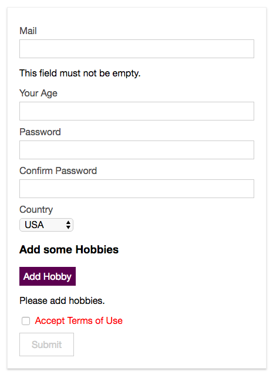

# Using the Required-Unless Validator

Let's look at the `checkbox` "Accept Terms of Use" and let's do two things: we wanna make sure that it is `required` but only if, let's say, the counrty is not for example India. So, we have the `required unless` condition. Let's start with creating a new rule in our `validations`, let's name it "terms", and use there the `required` validator. With that setup we can go to the `template` and there on the `checkbox input` we want to listen to `@change` event which is fired when we click the input, and trigger `$v.terms.$touch()`. To the wrapping `div` we'll add a `class` where we check if it's valid - `:class="{invalid: $v.terms.$invalid}"`. Here we'll use `$invalid` to mark it as "invalid" right from the start when the user loads the page, so this is obvious we need to check it.  

**signup.vue**
```html
<template>
  <div id="signup">
    <div class="signup-form">
      <form @submit.prevent="onSubmit">
        <div class="input" :class="{invalid: $v.email.$error}"> 
          <label for="email">Mail</label>
          <input
                  type="email"
                  id="email"
                  @blur="$v.email.$touch()"        
                  v-model="email">    
                  <p v-if="!$v.email.email">Please, provide a valid email address</p> 
                  <p v-if="!$v.email.required">This field must not be empty</p>
        </div>
        <div class="input" :class="{invalid: $v.age.$error}"> 
          <label for="age">Your Age</label>
          <input
                  type="number"
                  id="age"
                  @blur="$v.age.$touch()"     
                  v-model.number="age">  
                  <p v-if="!$v.age.minVal">You have to be at least {{ $v.age.$params.minVal.min}} years old.</p>  
        </div>
        <div class="input" :class="{invalid: $v.password.$error}"> 
          <label for="password">Password</label>
          <input
                  type="password"
                  id="password"
                  @blur="$v.password.$touch()"  
                  v-model="password">
        </div>
        <div class="input" :class="{invalid: $v.confirmPassword.$error}">
          <label for="confirm-password">Confirm Password</label>
          <input
                  type="password"
                  id="confirm-password"
                  @blur="$v.confirmPassword.$touch()"  
                  v-model="confirmPassword">
        </div>
        <div class="input">
          <label for="country">Country</label>
          <select id="country" v-model="country">
            <option value="usa">USA</option>
            <option value="india">India</option>
            <option value="uk">UK</option>
            <option value="germany">Germany</option>
          </select>
        </div>
        <div class="hobbies">
          <h3>Add some Hobbies</h3>
          <button @click="onAddHobby" type="button">Add Hobby</button>
          <div class="hobby-list">
            <div
                    class="input"
                    v-for="(hobbyInput, index) in hobbyInputs"
                    :key="hobbyInput.id">
              <label :for="hobbyInput.id">Hobby #{{ index }}</label>
              <input
                      type="text"
                      :id="hobbyInput.id"
                      v-model="hobbyInput.value">
              <button @click="onDeleteHobby(hobbyInput.id)" type="button">X</button>
            </div>
          </div>
        </div>
        <div class="input inline" :class="{invalid: $v.terms.$invalid}">   <!--check if valid-->
          <input type="checkbox" 
          id="terms" 
          @change="$v.terms.$touch()"               
          v-model="terms">    <!--use @change here-->
          <label for="terms">Accept Terms of Use</label>
        </div>
        <div class="submit">
          <button type="submit">Submit</button>
        </div>
      </form>
    </div>
  </div>
</template>

<script>
  import {required, email, numeric, minValue, minLength, sameAs} from 'vuelidate/lib/validators'   
  export default {
    data () {
      return {
        email: '',
        age: null,
        password: '',
        confirmPassword: '',
        country: 'usa',
        hobbyInputs: [],
        terms: false
      }
    },
    validations: {        
       email:{
        required,      
        email
       },
       age: {      
        required,     
        numeric,
        minVal: minValue(18)    
       },
       password:{         
         required,
         minLen: minLength(6)    
       },
       confirmPassword:{       
        sameAs: sameAs('password')  
       //sameAs: sameAs(vm=>{       
      //   return vm.password
       //})
       },
       terms: {            //create the rule for required-unless
        required
       }
    }, 
    methods: {
      onAddHobby () {
        const newHobby = {
          id: Math.random() * Math.random() * 1000,
          value: ''
        }
        this.hobbyInputs.push(newHobby)
      },
      onDeleteHobby (id) {
        this.hobbyInputs = this.hobbyInputs.filter(hobby => hobby.id !== id)
      },
      onSubmit () {
        const formData = {
          email: this.email,
          age: this.age,
          password: this.password,
          confirmPassword: this.confirmPassword,
          country: this.country,
          hobbies: this.hobbyInputs.map(hobby => hobby.value),
          terms: this.terms
        }
        console.log(formData)
        this.$store.dispatch('signup', formData)
      }
    }
  }
</script>

<style scoped>
  .signup-form {
    width: 400px;
    margin: 30px auto;
    border: 1px solid #eee;
    padding: 20px;
    box-shadow: 0 2px 3px #ccc;
  }

  .input {
    margin: 10px auto;
  }

  .input label {
    display: block;
    color: #4e4e4e;
    margin-bottom: 6px;
  }

  .input.inline label {
    display: inline;
  }

  .input input {
    font: inherit;
    width: 100%;
    padding: 6px 12px;
    box-sizing: border-box;
    border: 1px solid #ccc;
  }

  .input.inline input {
    width: auto;
  }

  .input input:focus {
    outline: none;
    border: 1px solid #521751;
    background-color: #eee;
  }

  .input select {
    border: 1px solid #ccc;
    font: inherit;
  }

   .input.invalid label{      
      color: red
  }

  .input.invalid input{      
      border: 1px solid red;
      background-color: #ffc9aa
  }

  .hobbies button {
    border: 1px solid #521751;
    background: #521751;
    color: white;
    padding: 6px;
    font: inherit;
    cursor: pointer;
  }

  .hobbies button:hover,
  .hobbies button:active {
    background-color: #8d4288;
  }

  .hobbies input {
    width: 90%;
  }

  .submit button {
    border: 1px solid #521751;
    color: #521751;
    padding: 10px 20px;
    font: inherit;
    cursor: pointer;
  }

  .submit button:hover,
  .submit button:active {
    background-color: #521751;
    color: white;
  }

  .submit button[disabled],
  .submit button[disabled]:hover,
  .submit button[disabled]:active {
    border: 1px solid #ccc;
    background-color: transparent;
    color: #ccc;
    cursor: not-allowed;
  }
</style>
```

Now, let's use `requiredUnless` validator, and first of all we need to import it. And this allows us to connect it with some other `value`, for now we assign `requiredUnless` as a value, this is a `function`, for this `function` we recieve access to `vue-instance` and in the body of the function we can return `true` or `false`. If we return `true` the checkbox will always be treated as `correct` no matter what the user does. If we return `false` it will always be treated as `invalid`. Of course, hardcoding `true/false` doesn't make much sense. And we can now check if `vm`(vue-instance) and then the name of the dropdown, "country" in our case we bind to a `property name - country`, so if `country` is not equal to "India" for exampl = `vm.country === 'india'`. 

**signup.vue**
```html
<template>
  <div id="signup">
    <div class="signup-form">
      <form @submit.prevent="onSubmit">
        <div class="input" :class="{invalid: $v.email.$error}"> 
          <label for="email">Mail</label>
          <input
                  type="email"
                  id="email"
                  @blur="$v.email.$touch()"        
                  v-model="email">    
                  <p v-if="!$v.email.email">Please, provide a valid email address</p> 
                  <p v-if="!$v.email.required">This field must not be empty</p>
        </div>
        <div class="input" :class="{invalid: $v.age.$error}"> 
          <label for="age">Your Age</label>
          <input
                  type="number"
                  id="age"
                  @blur="$v.age.$touch()"     
                  v-model.number="age">  
                  <p v-if="!$v.age.minVal">You have to be at least {{ $v.age.$params.minVal.min}} years old.</p>  
        </div>
        <div class="input" :class="{invalid: $v.password.$error}"> 
          <label for="password">Password</label>
          <input
                  type="password"
                  id="password"
                  @blur="$v.password.$touch()"  
                  v-model="password">
        </div>
        <div class="input" :class="{invalid: $v.confirmPassword.$error}">
          <label for="confirm-password">Confirm Password</label>
          <input
                  type="password"
                  id="confirm-password"
                  @blur="$v.confirmPassword.$touch()"  
                  v-model="confirmPassword">
        </div>
        <div class="input">
          <label for="country">Country</label>
          <select id="country" v-model="country">
            <option value="usa">USA</option>
            <option value="india">India</option>
            <option value="uk">UK</option>
            <option value="germany">Germany</option>
          </select>
        </div>
        <div class="hobbies">
          <h3>Add some Hobbies</h3>
          <button @click="onAddHobby" type="button">Add Hobby</button>
          <div class="hobby-list">
            <div
                    class="input"
                    v-for="(hobbyInput, index) in hobbyInputs"
                    :key="hobbyInput.id">
              <label :for="hobbyInput.id">Hobby #{{ index }}</label>
              <input
                      type="text"
                      :id="hobbyInput.id"
                      v-model="hobbyInput.value">
              <button @click="onDeleteHobby(hobbyInput.id)" type="button">X</button>
            </div>
          </div>
        </div>
        <div class="input inline" :class="{invalid: $v.terms.$invalid}">   <!--check if valid-->
          <input type="checkbox" 
          id="terms" 
          @change="$v.terms.$touch()"               
          v-model="terms">    <!--use @change here-->
          <label for="terms">Accept Terms of Use</label>
        </div>
        <div class="submit">
          <button type="submit">Submit</button>
        </div>
      </form>
    </div>
  </div>
</template>

<script>
  import {required, email, numeric, minValue, minLength, sameAs, requirdUnless} from 'vuelidate/lib/validators' //import requiredUnless  
  export default {
    data () {
      return {
        email: '',
        age: null,
        password: '',
        confirmPassword: '',
        country: 'usa',
        hobbyInputs: [],
        terms: false
      }
    },
    validations: {        
       email:{
        required,      
        email
       },
       age: {      
        required,     
        numeric,
        minVal: minValue(18)    
       },
       password:{         
         required,
         minLen: minLength(6)    
       },
       confirmPassword:{       
        sameAs: sameAs('password')  
       //sameAs: sameAs(vm=>{       
      //   return vm.password
       //})
       },
       terms: {            //create the rule for required-unless
        required: requiredUnless(vm=>{
            return vm.country === 'india'
        }) 
       }
    }, 
    methods: {
      onAddHobby () {
        const newHobby = {
          id: Math.random() * Math.random() * 1000,
          value: ''
        }
        this.hobbyInputs.push(newHobby)
      },
      onDeleteHobby (id) {
        this.hobbyInputs = this.hobbyInputs.filter(hobby => hobby.id !== id)
      },
      onSubmit () {
        const formData = {
          email: this.email,
          age: this.age,
          password: this.password,
          confirmPassword: this.confirmPassword,
          country: this.country,
          hobbies: this.hobbyInputs.map(hobby => hobby.value),
          terms: this.terms
        }
        console.log(formData)
        this.$store.dispatch('signup', formData)
      }
    }
  }
</script>

<style scoped>
  .signup-form {
    width: 400px;
    margin: 30px auto;
    border: 1px solid #eee;
    padding: 20px;
    box-shadow: 0 2px 3px #ccc;
  }

  .input {
    margin: 10px auto;
  }

  .input label {
    display: block;
    color: #4e4e4e;
    margin-bottom: 6px;
  }

  .input.inline label {
    display: inline;
  }

  .input input {
    font: inherit;
    width: 100%;
    padding: 6px 12px;
    box-sizing: border-box;
    border: 1px solid #ccc;
  }

  .input.inline input {
    width: auto;
  }

  .input input:focus {
    outline: none;
    border: 1px solid #521751;
    background-color: #eee;
  }

  .input select {
    border: 1px solid #ccc;
    font: inherit;
  }

   .input.invalid label{      
      color: red
  }

  .input.invalid input{      
      border: 1px solid red;
      background-color: #ffc9aa
  }

  .hobbies button {
    border: 1px solid #521751;
    background: #521751;
    color: white;
    padding: 6px;
    font: inherit;
    cursor: pointer;
  }

  .hobbies button:hover,
  .hobbies button:active {
    background-color: #8d4288;
  }

  .hobbies input {
    width: 90%;
  }

  .submit button {
    border: 1px solid #521751;
    color: #521751;
    padding: 10px 20px;
    font: inherit;
    cursor: pointer;
  }

  .submit button:hover,
  .submit button:active {
    background-color: #521751;
    color: white;
  }

  .submit button[disabled],
  .submit button[disabled]:hover,
  .submit button[disabled]:active {
    border: 1px solid #ccc;
    background-color: transparent;
    color: #ccc;
    cursor: not-allowed;
  }
</style>
```


