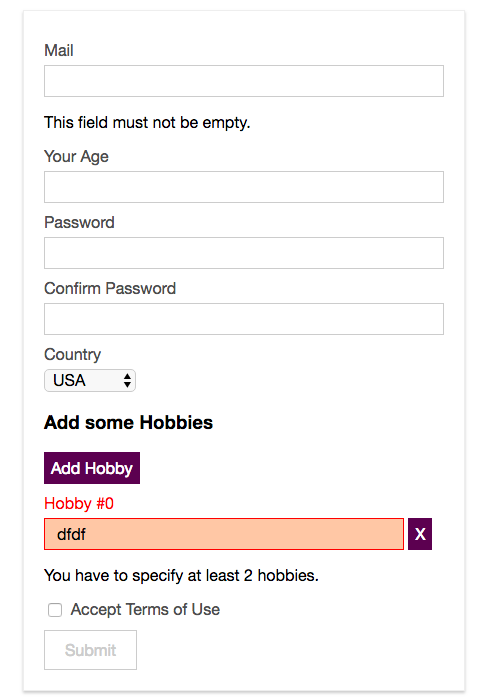
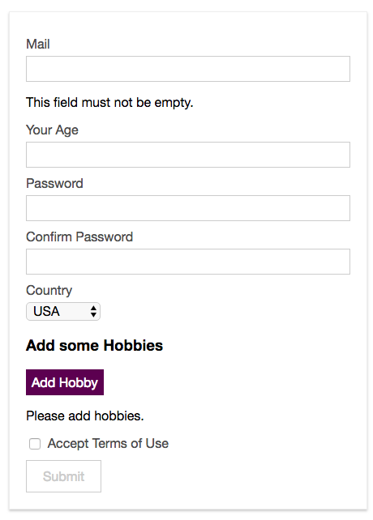

# Validating Arrays

Let's now work on the `array` where we validate `hobbies`. First of all in the `validations property` we'll create a new `key` and we choose the name of the key the same as we bind to with `v-model`, in our case `hobbyInputs`. In the key `hobbyInputs` object we can define some `validators` which are applied to the whole `array`: `minLength`. Then we also can add a special `property` - `$each` - this is kind of the placeholder for all the dynamic elements we can add to the `array`.  So, `$each` then also holds js `object` and in there we can reference the `data` in our `hobbyInputs = []`. Here we actually storing new elements which we get with our `onAddHobby()` method, and it's the `value property` in this `method` which will be bound via `v-model` to the `hobbyInput` inside the `div class="input"`, which we get via the `v-for` loop. So, in the `$each` object we put `value` we bind to, and this `value` is also an `object` defines validation rules, so we add `validators` here: `required` and `minLength`. 

**signup.vue**
```html
<template>
  <div id="signup">
    <div class="signup-form">
      <form @submit.prevent="onSubmit">
        <div class="input" :class="{invalid: $v.email.$error}"> 
          <label for="email">Mail</label>
          <input
                  type="email"
                  id="email"
                  @blur="$v.email.$touch()"        
                  v-model="email">    
                  <p v-if="!$v.email.email">Please, provide a valid email address</p> 
                  <p v-if="!$v.email.required">This field must not be empty</p>
        </div>
        <div class="input" :class="{invalid: $v.age.$error}"> 
          <label for="age">Your Age</label>
          <input
                  type="number"
                  id="age"
                  @blur="$v.age.$touch()"     
                  v-model.number="age">  
                  <p v-if="!$v.age.minVal">You have to be at least {{ $v.age.$params.minVal.min}} years old.</p>  
        </div>
        <div class="input" :class="{invalid: $v.password.$error}"> 
          <label for="password">Password</label>
          <input
                  type="password"
                  id="password"
                  @blur="$v.password.$touch()"  
                  v-model="password">
        </div>
        <div class="input" :class="{invalid: $v.confirmPassword.$error}">
          <label for="confirm-password">Confirm Password</label>
          <input
                  type="password"
                  id="confirm-password"
                  @blur="$v.confirmPassword.$touch()"  
                  v-model="confirmPassword">
        </div>
        <div class="input">
          <label for="country">Country</label>
          <select id="country" v-model="country">
            <option value="usa">USA</option>
            <option value="india">India</option>
            <option value="uk">UK</option>
            <option value="germany">Germany</option>
          </select>
        </div>
        <div class="hobbies">
          <h3>Add some Hobbies</h3>
          <button @click="onAddHobby" type="button">Add Hobby</button>
          <div class="hobby-list">
            <div
                    class="input"
                    v-for="(hobbyInput, index) in hobbyInputs"
                    :key="hobbyInput.id">
              <label :for="hobbyInput.id">Hobby #{{ index }}</label>
              <input
                      type="text"
                      :id="hobbyInput.id"
                      v-model="hobbyInput.value">  <!--value of newHobby is bound here-->
              <button @click="onDeleteHobby(hobbyInput.id)" type="button">X</button>
            </div>
          </div>
        </div>
        <div class="input inline" :class="{invalid: $v.terms.$invalid}">   
          <input type="checkbox" 
          id="terms" 
          @change="$v.terms.$touch()"               
          v-model="terms">    
          <label for="terms">Accept Terms of Use</label>
        </div>
        <div class="submit">
          <button type="submit">Submit</button>
        </div>
      </form>
    </div>
  </div>
</template>

<script>
  import {required, email, numeric, minValue, minLength, sameAs, requirdUnless} from 'vuelidate/lib/validators' 
  export default {
    data () {
      return {
        email: '',
        age: null,
        password: '',
        confirmPassword: '',
        country: 'usa',
        hobbyInputs: [],
        terms: false
      }
    },
    validations: {        
       email:{
        required,      
        email
       },
       age: {      
        required,     
        numeric,
        minVal: minValue(18)    
       },
       password:{         
         required,
         minLen: minLength(6)    
       },
       confirmPassword:{       
        sameAs: sameAs('password')  
       //sameAs: sameAs(vm=>{       
      //   return vm.password
       //})
       },
       terms: {            
        required: requiredUnless(vm=>{
            return vm.country === 'india'
        }) 
       },
       hobbyInputs:{    //create hobby inputs control
        minLen: minLength(2),
        $each: {
           value:{       //use value of the array we loop through
            required,       //use validatior
            minLen: minLength(5)    //use validatior
           }
        }
       }  
    }, 
    methods: {
      onAddHobby () {
        const newHobby = {
          id: Math.random() * Math.random() * 1000,
          value: ''
        }
        this.hobbyInputs.push(newHobby)
      },
      onDeleteHobby (id) {
        this.hobbyInputs = this.hobbyInputs.filter(hobby => hobby.id !== id)
      },
      onSubmit () {
        const formData = {
          email: this.email,
          age: this.age,
          password: this.password,
          confirmPassword: this.confirmPassword,
          country: this.country,
          hobbies: this.hobbyInputs.map(hobby => hobby.value),
          terms: this.terms
        }
        console.log(formData)
        this.$store.dispatch('signup', formData)
      }
    }
  }
</script>

<style scoped>
  .signup-form {
    width: 400px;
    margin: 30px auto;
    border: 1px solid #eee;
    padding: 20px;
    box-shadow: 0 2px 3px #ccc;
  }

  .input {
    margin: 10px auto;
  }

  .input label {
    display: block;
    color: #4e4e4e;
    margin-bottom: 6px;
  }

  .input.inline label {
    display: inline;
  }

  .input input {
    font: inherit;
    width: 100%;
    padding: 6px 12px;
    box-sizing: border-box;
    border: 1px solid #ccc;
  }

  .input.inline input {
    width: auto;
  }

  .input input:focus {
    outline: none;
    border: 1px solid #521751;
    background-color: #eee;
  }

  .input select {
    border: 1px solid #ccc;
    font: inherit;
  }

   .input.invalid label{      
      color: red
  }

  .input.invalid input{      
      border: 1px solid red;
      background-color: #ffc9aa
  }

  .hobbies button {
    border: 1px solid #521751;
    background: #521751;
    color: white;
    padding: 6px;
    font: inherit;
    cursor: pointer;
  }

  .hobbies button:hover,
  .hobbies button:active {
    background-color: #8d4288;
  }

  .hobbies input {
    width: 90%;
  }

  .submit button {
    border: 1px solid #521751;
    color: #521751;
    padding: 10px 20px;
    font: inherit;
    cursor: pointer;
  }

  .submit button:hover,
  .submit button:active {
    background-color: #521751;
    color: white;
  }

  .submit button[disabled],
  .submit button[disabled]:hover,
  .submit button[disabled]:active {
    border: 1px solid #ccc;
    background-color: transparent;
    color: #ccc;
    cursor: not-allowed;
  }
</style>
```

Now we need to connect it.  In the `array` in the template we first of all need to hook up our `input` with `@blur="$v.hobbyInputs.$each"` and then on the `$each` we pass the `index of the element` we are currently add - `@blur="$v.hobbyInputs.$each[index]"`, we get the `index` from `v-for` where we extracting it as a second `argument`, this is the element we now want to `touch()`, so, there we need to touch the `value` element - `@blur="$v.hobbyInputs.$each[index].value.touch()"`. To check if it is valid or not we, as usual, add a class to the `div` which wraps the `hobby input` - `:class="{invalid: $v.hobbyInputs.$each[index].$error}"`.   We add validation for the `array` as a whole, but whole array is not synchronised with `v-model`. What we can do is to output some helper text below our `list of hobbies`:  `<p>You have to specify at least {{ }} hobbies.</p>`. This should only be shown if `v-if="!$v.hobbyInputs.minLen"`, and of course we want to output the amount of hobbies with - `{{ $v.hobbyInputs.$params.minLen.min }}`. As the last step let's add also `required validator` to the `hobbyInputs` control, to the overall array to make sure we are not allowed to add `0` hobbies. And complete this by adding one more `error message` "Please, add hobbies." this should be shown if the user entered non hobby at all -`v-if="!$v.hobbyInputs.required"`. 

**signup.vue**
```html
<template>
  <div id="signup">
    <div class="signup-form">
      <form @submit.prevent="onSubmit">
        <div class="input" :class="{invalid: $v.email.$error}"> 
          <label for="email">Mail</label>
          <input
                  type="email"
                  id="email"
                  @blur="$v.email.$touch()"        
                  v-model="email">    
                  <p v-if="!$v.email.email">Please, provide a valid email address</p> 
                  <p v-if="!$v.email.required">This field must not be empty</p>
        </div>
        <div class="input" :class="{invalid: $v.age.$error}"> 
          <label for="age">Your Age</label>
          <input
                  type="number"
                  id="age"
                  @blur="$v.age.$touch()"     
                  v-model.number="age">  
                  <p v-if="!$v.age.minVal">You have to be at least {{ $v.age.$params.minVal.min}} years old.</p>  
        </div>
        <div class="input" :class="{invalid: $v.password.$error}"> 
          <label for="password">Password</label>
          <input
                  type="password"
                  id="password"
                  @blur="$v.password.$touch()"  
                  v-model="password">
        </div>
        <div class="input" :class="{invalid: $v.confirmPassword.$error}">
          <label for="confirm-password">Confirm Password</label>
          <input
                  type="password"
                  id="confirm-password"
                  @blur="$v.confirmPassword.$touch()"  
                  v-model="confirmPassword">
        </div>
        <div class="input">
          <label for="country">Country</label>
          <select id="country" v-model="country">
            <option value="usa">USA</option>
            <option value="india">India</option>
            <option value="uk">UK</option>
            <option value="germany">Germany</option>
          </select>
        </div>
        <div class="hobbies">
          <h3>Add some Hobbies</h3>
          <button @click="onAddHobby" type="button">Add Hobby</button>
          <div class="hobby-list">
            <div
                    class="input"
                    v-for="(hobbyInput, index) in hobbyInputs"
                    :class="{invalid: $v.hobbyInputs.$each[index].$error}" 
                    :key="hobbyInput.id">  <!--check if valid with :class-->
              <label :for="hobbyInput.id">Hobby #{{ index }}</label>
              <input
                      type="text"
                      :id="hobbyInput.id"
                      @blur="$v.hobbyInputs.$each[index].value.$touch()"
                      v-model="hobbyInput.value">  <!--value of newHobby is bound here-->  <!--connect input here-->
              <button @click="onDeleteHobby(hobbyInput.id)" type="button">X</button>
            </div>
             <p v-if="!$v.hobbyInputs.minLen">You have to specify at least {{ $v.hobbyInputs.$params.minLen.min }} hobbies.</p>  <!--output a message here-->
             <p v-if="!$v.hobbyInputs.required">Please add hobbies.</p> <!--output a message here-->
          </div>
        </div>
        <div class="input inline" :class="{invalid: $v.terms.$invalid}">   
          <input type="checkbox" 
          id="terms" 
          @change="$v.terms.$touch()"               
          v-model="terms">    
          <label for="terms">Accept Terms of Use</label>
        </div>
        <div class="submit">
          <button type="submit">Submit</button>
        </div>
      </form>
    </div>
  </div>
</template>

<script>
  import {required, email, numeric, minValue, minLength, sameAs, requirdUnless} from 'vuelidate/lib/validators' 
  export default {
    data () {
      return {
        email: '',
        age: null,
        password: '',
        confirmPassword: '',
        country: 'usa',
        hobbyInputs: [],
        terms: false
      }
    },
    validations: {        
       email:{
        required,      
        email
       },
       age: {      
        required,     
        numeric,
        minVal: minValue(18)    
       },
       password:{         
         required,
         minLen: minLength(6)    
       },
       confirmPassword:{       
        sameAs: sameAs('password')  
       //sameAs: sameAs(vm=>{       
      //   return vm.password
       //})
       },
       terms: {            
        required: requiredUnless(vm=>{
            return vm.country === 'india'
        }) 
       },
       hobbyInputs:{   
        required,    //add required here 
        minLen: minLength(2),  //criteria ahould be at least 2
        $each: {
           value:{       
            required,       
            minLen: minLength(5)    
           }
        }
       }  
    }, 
    methods: {
      onAddHobby () {
        const newHobby = {
          id: Math.random() * Math.random() * 1000,
          value: ''
        }
        this.hobbyInputs.push(newHobby)
      },
      onDeleteHobby (id) {
        this.hobbyInputs = this.hobbyInputs.filter(hobby => hobby.id !== id)
      },
      onSubmit () {
        const formData = {
          email: this.email,
          age: this.age,
          password: this.password,
          confirmPassword: this.confirmPassword,
          country: this.country,
          hobbies: this.hobbyInputs.map(hobby => hobby.value),
          terms: this.terms
        }
        console.log(formData)
        this.$store.dispatch('signup', formData)
      }
    }
  }
</script>

<style scoped>
  .signup-form {
    width: 400px;
    margin: 30px auto;
    border: 1px solid #eee;
    padding: 20px;
    box-shadow: 0 2px 3px #ccc;
  }

  .input {
    margin: 10px auto;
  }

  .input label {
    display: block;
    color: #4e4e4e;
    margin-bottom: 6px;
  }

  .input.inline label {
    display: inline;
  }

  .input input {
    font: inherit;
    width: 100%;
    padding: 6px 12px;
    box-sizing: border-box;
    border: 1px solid #ccc;
  }

  .input.inline input {
    width: auto;
  }

  .input input:focus {
    outline: none;
    border: 1px solid #521751;
    background-color: #eee;
  }

  .input select {
    border: 1px solid #ccc;
    font: inherit;
  }

   .input.invalid label{      
      color: red
  }

  .input.invalid input{      
      border: 1px solid red;
      background-color: #ffc9aa
  }

  .hobbies button {
    border: 1px solid #521751;
    background: #521751;
    color: white;
    padding: 6px;
    font: inherit;
    cursor: pointer;
  }

  .hobbies button:hover,
  .hobbies button:active {
    background-color: #8d4288;
  }

  .hobbies input {
    width: 90%;
  }

  .submit button {
    border: 1px solid #521751;
    color: #521751;
    padding: 10px 20px;
    font: inherit;
    cursor: pointer;
  }

  .submit button:hover,
  .submit button:active {
    background-color: #521751;
    color: white;
  }

  .submit button[disabled],
  .submit button[disabled]:hover,
  .submit button[disabled]:active {
    border: 1px solid #ccc;
    background-color: transparent;
    color: #ccc;
    cursor: not-allowed;
  }
</style>
```



